# 20 Diagramas UML de Práctica - Modelado de Sistemas

## 1. Sistema de Biblioteca - Herencia y Asociaciones

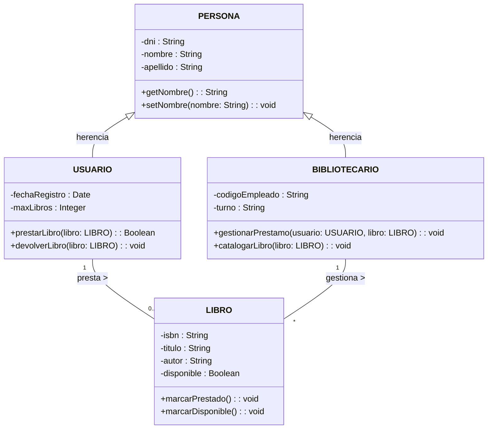
```mermaid
classDiagram
    class PERSONA {
        -dni : String
        -nombre : String
        -apellido : String
        +getNombre() : String
        +setNombre(nombre: String) : void
    }
    
    class USUARIO {
        -fechaRegistro : Date
        -maxLibros : Integer
        +prestarLibro(libro: LIBRO) : Boolean
        +devolverLibro(libro: LIBRO) : void
    }
    
    class BIBLIOTECARIO {
        -codigoEmpleado : String
        -turno : String
        +gestionarPrestamo(usuario: USUARIO, libro: LIBRO) : void
        +catalogarLibro(libro: LIBRO) : void
    }
    
    class LIBRO {
        -isbn : String
        -titulo : String
        -autor : String
        -disponible : Boolean
        +marcarPrestado() : void
        +marcarDisponible() : void
    }
    
    PERSONA <|-- USUARIO : herencia
    PERSONA <|-- BIBLIOTECARIO : herencia
    USUARIO "1" -- "0..5" LIBRO : presta >
    BIBLIOTECARIO "1" -- "*" LIBRO : gestiona >
```

**Conceptos:** Herencia, asociaciones con multiplicidad, visibilidad de atributos.

## 2. Sistema de Vehículos - Composición y Agregación

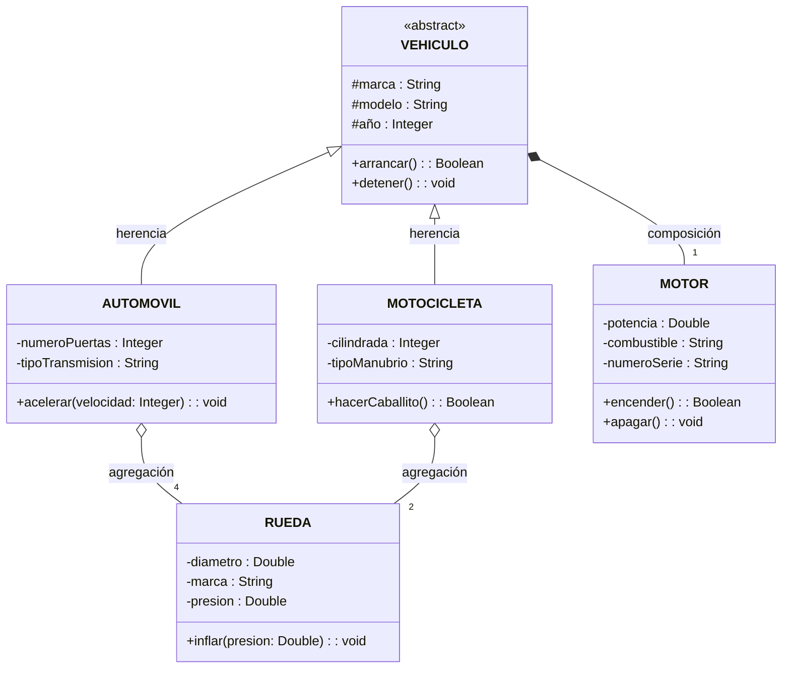
```mermaid
classDiagram
    class VEHICULO {
        <<abstract>>
        #marca : String
        #modelo : String
        #año : Integer
        +arrancar() : Boolean
        +detener() : void
    }
    
    class AUTOMOVIL {
        -numeroPuertas : Integer
        -tipoTransmision : String
        +acelerar(velocidad: Integer) : void
    }
    
    class MOTOCICLETA {
        -cilindrada : Integer
        -tipoManubrio : String
        +hacerCaballito() : Boolean
    }
    
    class MOTOR {
        -potencia : Double
        -combustible : String
        -numeroSerie : String
        +encender() : Boolean
        +apagar() : void
    }
    
    class RUEDA {
        -diametro : Double
        -marca : String
        -presion : Double
        +inflar(presion: Double) : void
    }
    
    VEHICULO <|-- AUTOMOVIL : herencia
    VEHICULO <|-- MOTOCICLETA : herencia
    VEHICULO *-- "1" MOTOR : composición
    AUTOMOVIL o-- "4" RUEDA : agregación
    MOTOCICLETA o-- "2" RUEDA : agregación
```

**Conceptos:** Clase abstracta, composición (diamante lleno), agregación (diamante vacío).

## 3. Sistema Bancario - Interfaces y Polimorfismo

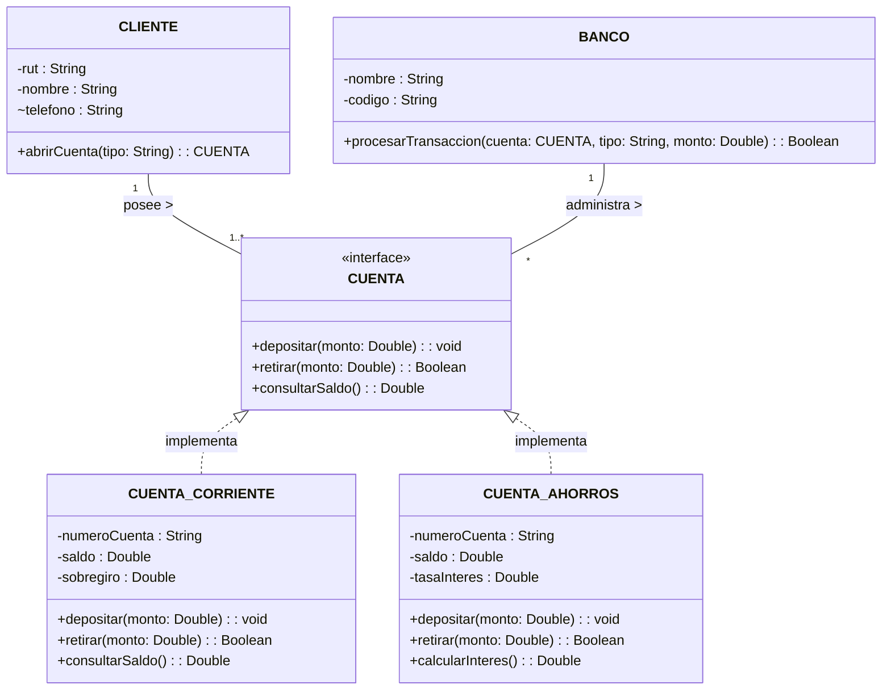
```mermaid
classDiagram
    class CUENTA {
        <<interface>>
        +depositar(monto: Double) : void
        +retirar(monto: Double) : Boolean
        +consultarSaldo() : Double
    }
    
    class CUENTA_CORRIENTE {
        -numeroCuenta : String
        -saldo : Double
        -sobregiro : Double
        +depositar(monto: Double) : void
        +retirar(monto: Double) : Boolean
        +consultarSaldo() : Double
    }
    
    class CUENTA_AHORROS {
        -numeroCuenta : String
        -saldo : Double
        -tasaInteres : Double
        +depositar(monto: Double) : void
        +retirar(monto: Double) : Boolean
        +calcularInteres() : Double
    }
    
    class CLIENTE {
        -rut : String
        -nombre : String
        ~telefono : String
        +abrirCuenta(tipo: String) : CUENTA
    }
    
    class BANCO {
        -nombre : String
        -codigo : String
        +procesarTransaccion(cuenta: CUENTA, tipo: String, monto: Double) : Boolean
    }
    
    CUENTA <|.. CUENTA_CORRIENTE : implementa
    CUENTA <|.. CUENTA_AHORROS : implementa
    CLIENTE "1" -- "1..*" CUENTA : posee >
    BANCO "1" -- "*" CUENTA : administra >
```

**Conceptos:** Interfaces (línea punteada), implementación, visibilidad package (~).

## 4. Sistema de E-commerce - Asociaciones Múltiples

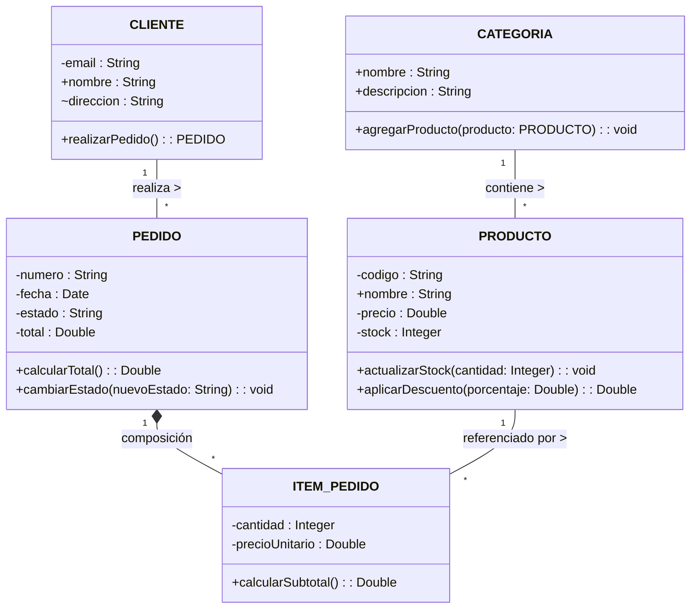
```mermaid
classDiagram
    class PRODUCTO {
        -codigo : String
        +nombre : String
        -precio : Double
        -stock : Integer
        +actualizarStock(cantidad: Integer) : void
        +aplicarDescuento(porcentaje: Double) : Double
    }
    
    class CATEGORIA {
        +nombre : String
        +descripcion : String
        +agregarProducto(producto: PRODUCTO) : void
    }
    
    class PEDIDO {
        -numero : String
        -fecha : Date
        -estado : String
        -total : Double
        +calcularTotal() : Double
        +cambiarEstado(nuevoEstado: String) : void
    }
    
    class CLIENTE {
        -email : String
        +nombre : String
        ~direccion : String
        +realizarPedido() : PEDIDO
    }
    
    class ITEM_PEDIDO {
        -cantidad : Integer
        -precioUnitario : Double
        +calcularSubtotal() : Double
    }
    
    CATEGORIA "1" -- "*" PRODUCTO : contiene >
    CLIENTE "1" -- "*" PEDIDO : realiza >
    PEDIDO "1" *-- "*" ITEM_PEDIDO : composición
    PRODUCTO "1" -- "*" ITEM_PEDIDO : referenciado por >
```

**Conceptos:** Clases de asociación, composición, múltiples asociaciones.

## 5. Sistema Educativo - Herencia Múltiple (Conceptual)

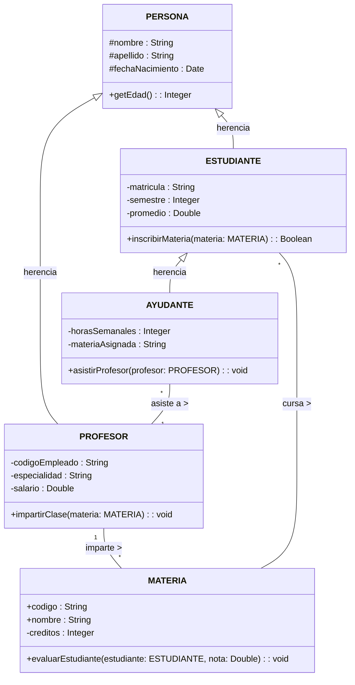
```mermaid
classDiagram
    class PERSONA {
        #nombre : String
        #apellido : String
        #fechaNacimiento : Date
        +getEdad() : Integer
    }
    
    class ESTUDIANTE {
        -matricula : String
        -semestre : Integer
        -promedio : Double
        +inscribirMateria(materia: MATERIA) : Boolean
    }
    
    class PROFESOR {
        -codigoEmpleado : String
        -especialidad : String
        -salario : Double
        +impartirClase(materia: MATERIA) : void
    }
    
    class AYUDANTE {
        -horasSemanales : Integer
        -materiaAsignada : String
        +asistirProfesor(profesor: PROFESOR) : void
    }
    
    class MATERIA {
        +codigo : String
        +nombre : String
        -creditos : Integer
        +evaluarEstudiante(estudiante: ESTUDIANTE, nota: Double) : void
    }
    
    PERSONA <|-- ESTUDIANTE : herencia
    PERSONA <|-- PROFESOR : herencia
    ESTUDIANTE <|-- AYUDANTE : herencia
    PROFESOR "1" -- "*" MATERIA : imparte >
    ESTUDIANTE "*" -- "*" MATERIA : cursa >
    AYUDANTE "*" -- "1" PROFESOR : asiste a >
```

**Conceptos:** Herencia múltiple conceptual, asociaciones many-to-many.

## 6. Sistema de Hospital - Especialización

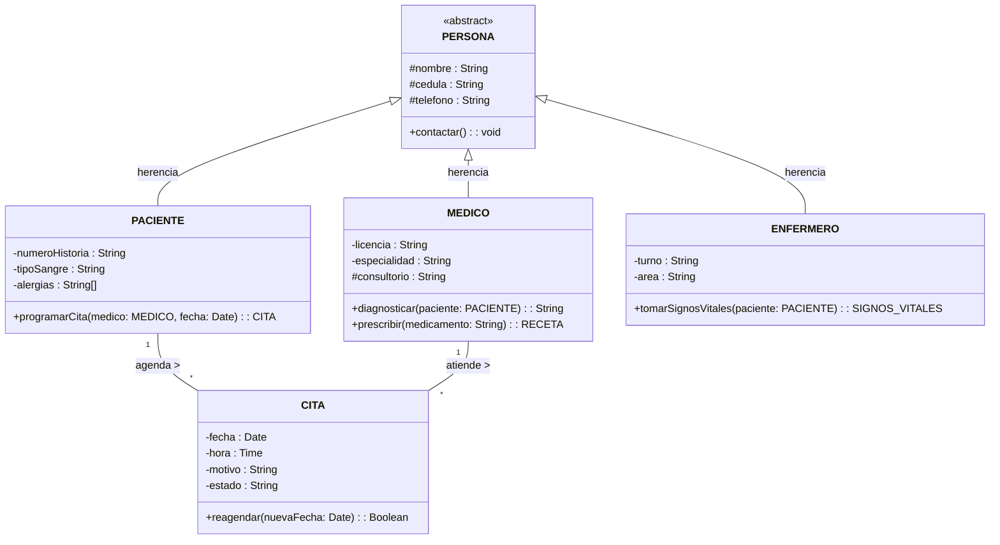
```mermaid
classDiagram
    class PERSONA {
        <<abstract>>
        #nombre : String
        #cedula : String
        #telefono : String
        +contactar() : void
    }
    
    class PACIENTE {
        -numeroHistoria : String
        -tipoSangre : String
        -alergias : String[]
        +programarCita(medico: MEDICO, fecha: Date) : CITA
    }
    
    class MEDICO {
        -licencia : String
        -especialidad : String
        #consultorio : String
        +diagnosticar(paciente: PACIENTE) : String
        +prescribir(medicamento: String) : RECETA
    }
    
    class ENFERMERO {
        -turno : String
        -area : String
        +tomarSignosVitales(paciente: PACIENTE) : SIGNOS_VITALES
    }
    
    class CITA {
        -fecha : Date
        -hora : Time
        -motivo : String
        -estado : String
        +reagendar(nuevaFecha: Date) : Boolean
    }
    
    PERSONA <|-- PACIENTE : herencia
    PERSONA <|-- MEDICO : herencia
    PERSONA <|-- ENFERMERO : herencia
    PACIENTE "1" -- "*" CITA : agenda >
    MEDICO "1" -- "*" CITA : atiende >
```

**Conceptos:** Clase abstracta, especialización, asociaciones temporales.

## 7. Sistema de Juegos - Patrones de Diseño

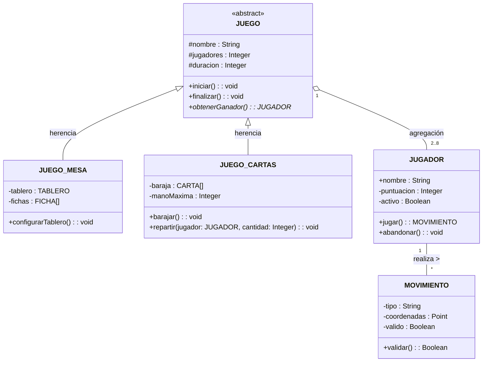
```mermaid
classDiagram
    class JUEGO {
        <<abstract>>
        #nombre : String
        #jugadores : Integer
        #duracion : Integer
        +iniciar() : void
        +finalizar() : void
        +obtenerGanador() : JUGADOR*
    }
    
    class JUEGO_MESA {
        -tablero : TABLERO
        -fichas : FICHA[]
        +configurarTablero() : void
    }
    
    class JUEGO_CARTAS {
        -baraja : CARTA[]
        -manoMaxima : Integer
        +barajar() : void
        +repartir(jugador: JUGADOR, cantidad: Integer) : void
    }
    
    class JUGADOR {
        +nombre : String
        -puntuacion : Integer
        -activo : Boolean
        +jugar() : MOVIMIENTO
        +abandonar() : void
    }
    
    class MOVIMIENTO {
        -tipo : String
        -coordenadas : Point
        -valido : Boolean
        +validar() : Boolean
    }
    
    JUEGO <|-- JUEGO_MESA : herencia
    JUEGO <|-- JUEGO_CARTAS : herencia
    JUEGO "1" o-- "2..8" JUGADOR : agregación
    JUGADOR "1" -- "*" MOVIMIENTO : realiza >
```

**Conceptos:** Template Method pattern, agregación con multiplicidad variable.

## 8. Sistema de Transporte Público - Estados

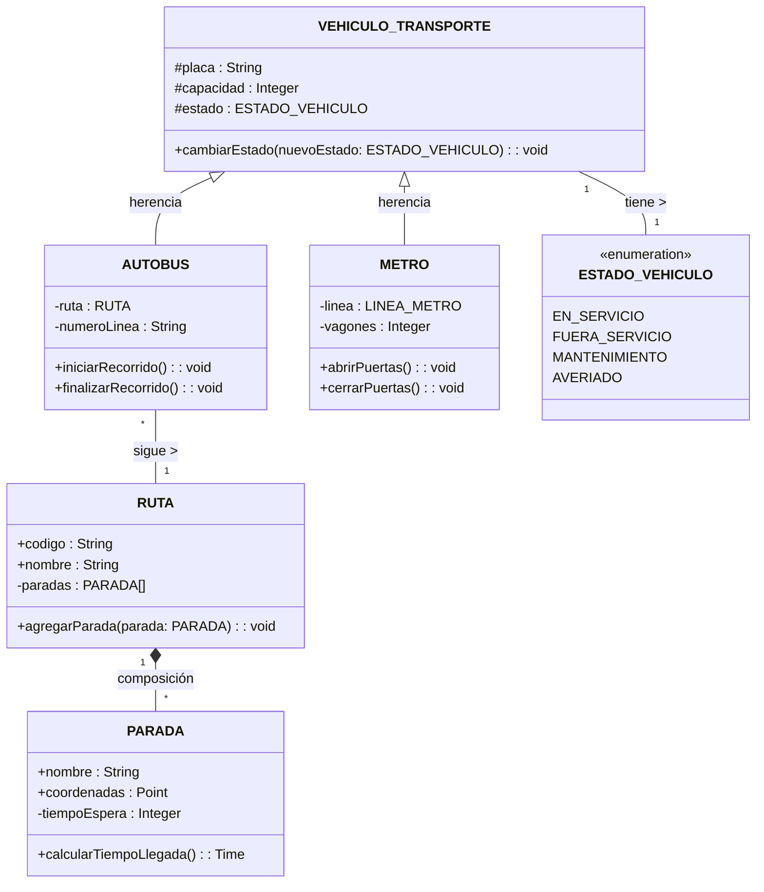
```mermaid
classDiagram
    class VEHICULO_TRANSPORTE {
        #placa : String
        #capacidad : Integer
        #estado : ESTADO_VEHICULO
        +cambiarEstado(nuevoEstado: ESTADO_VEHICULO) : void
    }
    
    class AUTOBUS {
        -ruta : RUTA
        -numeroLinea : String
        +iniciarRecorrido() : void
        +finalizarRecorrido() : void
    }
    
    class METRO {
        -linea : LINEA_METRO
        -vagones : Integer
        +abrirPuertas() : void
        +cerrarPuertas() : void
    }
    
    class RUTA {
        +codigo : String
        +nombre : String
        -paradas : PARADA[]
        +agregarParada(parada: PARADA) : void
    }
    
    class PARADA {
        +nombre : String
        +coordenadas : Point
        -tiempoEspera : Integer
        +calcularTiempoLlegada() : Time
    }
    
    class ESTADO_VEHICULO {
        <<enumeration>>
        EN_SERVICIO
        FUERA_SERVICIO  
        MANTENIMIENTO
        AVERIADO
    }
    
    VEHICULO_TRANSPORTE <|-- AUTOBUS : herencia
    VEHICULO_TRANSPORTE <|-- METRO : herencia
    AUTOBUS "*" -- "1" RUTA : sigue >
    RUTA "1" *-- "*" PARADA : composición
    VEHICULO_TRANSPORTE "1" -- "1" ESTADO_VEHICULO : tiene >
```

**Conceptos:** Enumeraciones, estados, composición vs agregación.

## 9. Sistema de Streaming - Observer Pattern

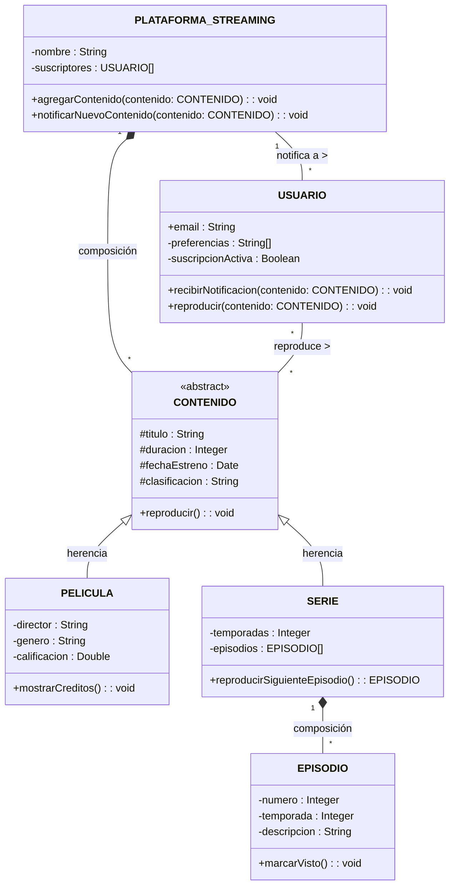
```mermaid
classDiagram
    class PLATAFORMA_STREAMING {
        -nombre : String
        -suscriptores : USUARIO[]
        +agregarContenido(contenido: CONTENIDO) : void
        +notificarNuevoContenido(contenido: CONTENIDO) : void
    }
    
    class USUARIO {
        +email : String
        -preferencias : String[]
        -suscripcionActiva : Boolean
        +recibirNotificacion(contenido: CONTENIDO) : void
        +reproducir(contenido: CONTENIDO) : void
    }
    
    class CONTENIDO {
        <<abstract>>
        #titulo : String
        #duracion : Integer
        #fechaEstreno : Date
        #clasificacion : String
        +reproducir() : void
    }
    
    class PELICULA {
        -director : String
        -genero : String
        -calificacion : Double
        +mostrarCreditos() : void
    }
    
    class SERIE {
        -temporadas : Integer
        -episodios : EPISODIO[]
        +reproducirSiguienteEpisodio() : EPISODIO
    }
    
    class EPISODIO {
        -numero : Integer
        -temporada : Integer
        -descripcion : String
        +marcarVisto() : void
    }
    
    PLATAFORMA_STREAMING "1" -- "*" USUARIO : notifica a >
    PLATAFORMA_STREAMING "1" *-- "*" CONTENIDO : composición
    CONTENIDO <|-- PELICULA : herencia
    CONTENIDO <|-- SERIE : herencia
    SERIE "1" *-- "*" EPISODIO : composición
    USUARIO "*" -- "*" CONTENIDO : reproduce >
```

**Conceptos:** Patrón Observer, composición anidada, relaciones múltiples.

## 10. Sistema de Reservas Hotel - Agregación Compleja

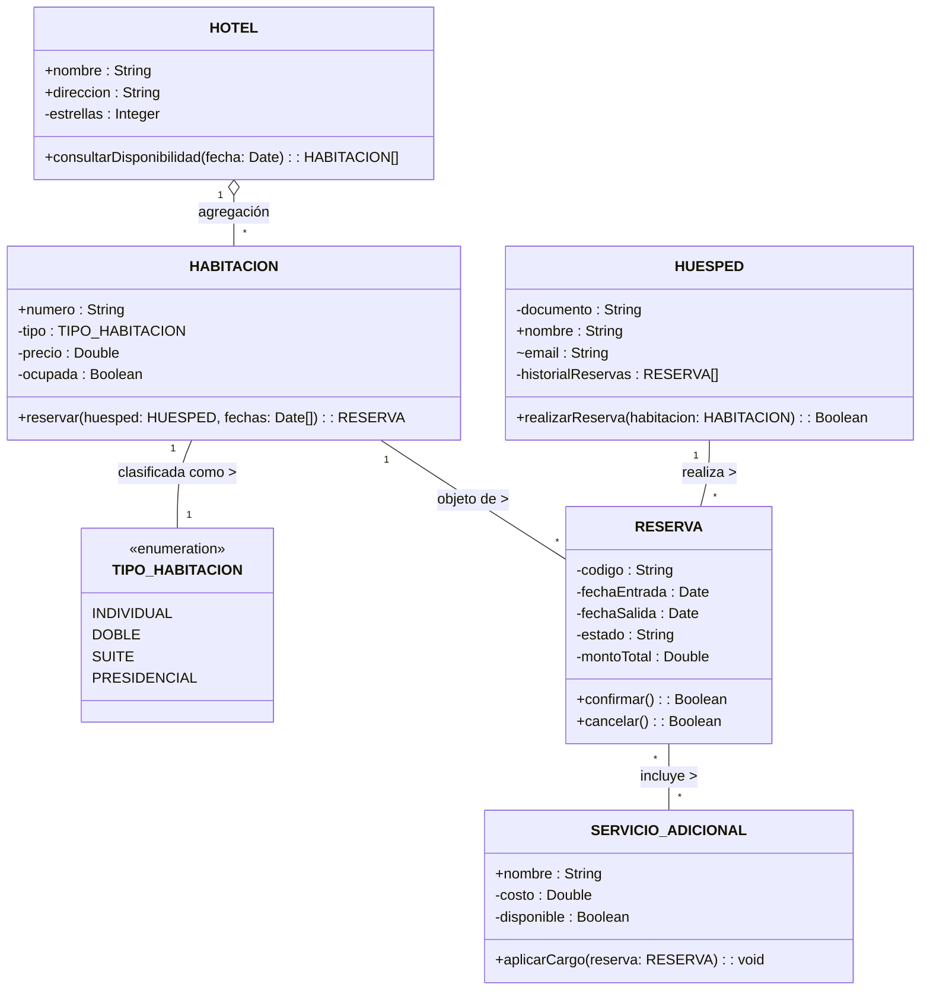
```mermaid
classDiagram
    class HOTEL {
        +nombre : String
        +direccion : String
        -estrellas : Integer
        +consultarDisponibilidad(fecha: Date) : HABITACION[]
    }
    
    class HABITACION {
        +numero : String
        -tipo : TIPO_HABITACION
        -precio : Double
        -ocupada : Boolean
        +reservar(huesped: HUESPED, fechas: Date[]) : RESERVA
    }
    
    class TIPO_HABITACION {
        <<enumeration>>
        INDIVIDUAL
        DOBLE
        SUITE
        PRESIDENCIAL
    }
    
    class HUESPED {
        -documento : String
        +nombre : String
        ~email : String
        -historialReservas : RESERVA[]
        +realizarReserva(habitacion: HABITACION) : Boolean
    }
    
    class RESERVA {
        -codigo : String
        -fechaEntrada : Date
        -fechaSalida : Date
        -estado : String
        -montoTotal : Double
        +confirmar() : Boolean
        +cancelar() : Boolean
    }
    
    class SERVICIO_ADICIONAL {
        +nombre : String
        -costo : Double
        -disponible : Boolean
        +aplicarCargo(reserva: RESERVA) : void
    }
    
    HOTEL "1" o-- "*" HABITACION : agregación
    HABITACION "1" -- "1" TIPO_HABITACION : clasificada como >
    HUESPED "1" -- "*" RESERVA : realiza >
    HABITACION "1" -- "*" RESERVA : objeto de >
    RESERVA "*" -- "*" SERVICIO_ADICIONAL : incluye >
```

**Conceptos:** Enumeraciones como tipos, agregación vs composición, asociaciones múltiples.

## 11. Sistema de Red Social - Autoasociación

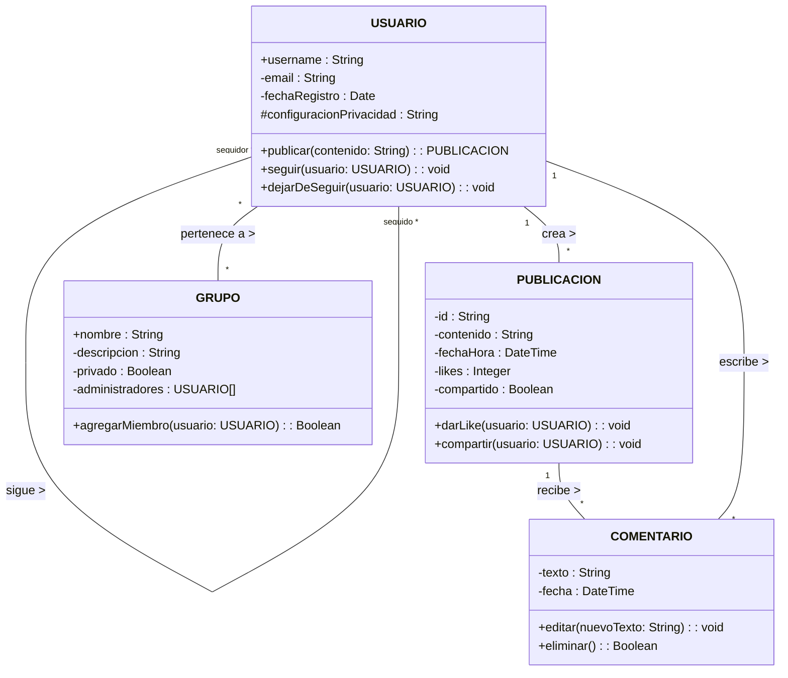
```mermaid
classDiagram
    class USUARIO {
        +username : String
        -email : String
        -fechaRegistro : Date
        #configuracionPrivacidad : String
        +publicar(contenido: String) : PUBLICACION
        +seguir(usuario: USUARIO) : void
        +dejarDeSeguir(usuario: USUARIO) : void
    }
    
    class PUBLICACION {
        -id : String
        -contenido : String
        -fechaHora : DateTime
        -likes : Integer
        -compartido : Boolean
        +darLike(usuario: USUARIO) : void
        +compartir(usuario: USUARIO) : void
    }
    
    class COMENTARIO {
        -texto : String
        -fecha : DateTime
        +editar(nuevoTexto: String) : void
        +eliminar() : Boolean
    }
    
    class GRUPO {
        +nombre : String
        -descripcion : String
        -privado : Boolean
        -administradores : USUARIO[]
        +agregarMiembro(usuario: USUARIO) : Boolean
    }
    
    USUARIO "seguidor *" -- "seguido *" USUARIO : sigue >
    USUARIO "1" -- "*" PUBLICACION : crea >
    PUBLICACION "1" -- "*" COMENTARIO : recibe >
    USUARIO "1" -- "*" COMENTARIO : escribe >
    USUARIO "*" -- "*" GRUPO : pertenece a >
```

**Conceptos:** Autoasociación (self-association), roles en asociaciones, arrays como atributos.

## 12. Sistema de Inventario - Composite Pattern

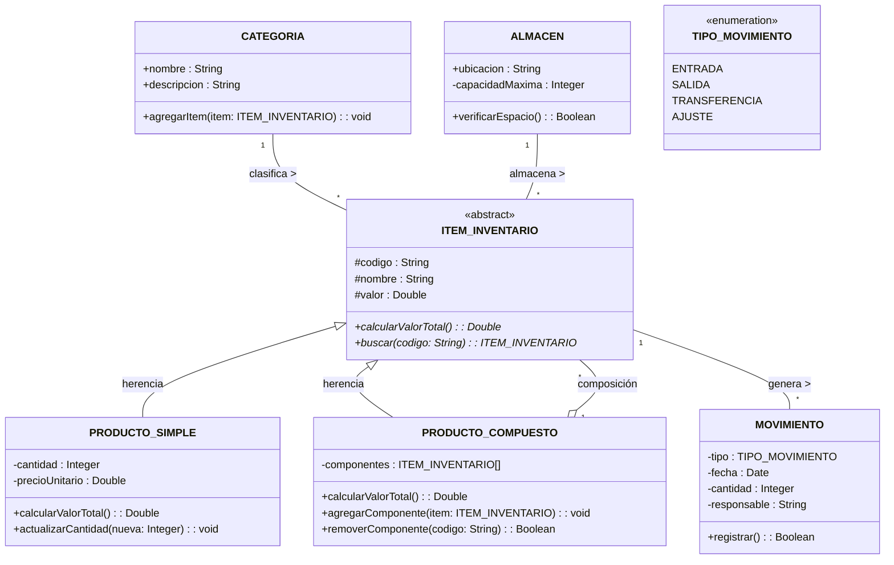
```mermaid
classDiagram
    class ITEM_INVENTARIO {
        <<abstract>>
        #codigo : String
        #nombre : String
        #valor : Double
        +calcularValorTotal() : Double*
        +buscar(codigo: String) : ITEM_INVENTARIO*
    }
    
    class PRODUCTO_SIMPLE {
        -cantidad : Integer
        -precioUnitario : Double
        +calcularValorTotal() : Double
        +actualizarCantidad(nueva: Integer) : void
    }
    
    class PRODUCTO_COMPUESTO {
        -componentes : ITEM_INVENTARIO[]
        +calcularValorTotal() : Double
        +agregarComponente(item: ITEM_INVENTARIO) : void
        +removerComponente(codigo: String) : Boolean
    }
    
    class CATEGORIA {
        +nombre : String
        +descripcion : String
        +agregarItem(item: ITEM_INVENTARIO) : void
    }
    
    class ALMACEN {
        +ubicacion : String
        -capacidadMaxima : Integer
        +verificarEspacio() : Boolean
    }
    
    class MOVIMIENTO {
        -tipo : TIPO_MOVIMIENTO
        -fecha : Date
        -cantidad : Integer
        -responsable : String
        +registrar() : Boolean
    }
    
    class TIPO_MOVIMIENTO {
        <<enumeration>>
        ENTRADA
        SALIDA
        TRANSFERENCIA
        AJUSTE
    }
    
    ITEM_INVENTARIO <|-- PRODUCTO_SIMPLE : herencia
    ITEM_INVENTARIO <|-- PRODUCTO_COMPUESTO : herencia
    PRODUCTO_COMPUESTO "1" o-- "*" ITEM_INVENTARIO : composición
    CATEGORIA "1" -- "*" ITEM_INVENTARIO : clasifica >
    ALMACEN "1" -- "*" ITEM_INVENTARIO : almacena >
    ITEM_INVENTARIO "1" -- "*" MOVIMIENTO : genera >
```

**Conceptos:** Patrón Composite, recursividad en asociaciones, métodos abstractos.

## 13. Sistema de Manufactura - Dependency Injection

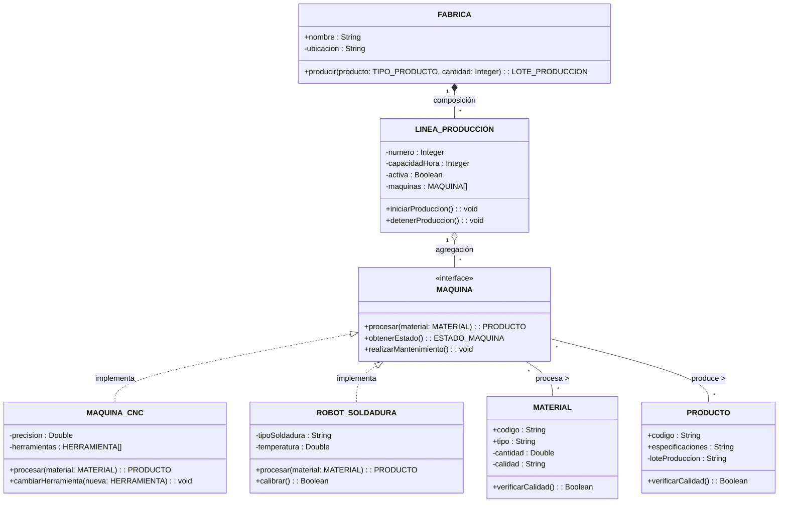
```mermaid
classDiagram
    class FABRICA {
        +nombre : String
        -ubicacion : String
        +producir(producto: TIPO_PRODUCTO, cantidad: Integer) : LOTE_PRODUCCION
    }
    
    class LINEA_PRODUCCION {
        -numero : Integer
        -capacidadHora : Integer
        -activa : Boolean
        -maquinas : MAQUINA[]
        +iniciarProduccion() : void
        +detenerProduccion() : void
    }
    
    class MAQUINA {
        <<interface>>
        +procesar(material: MATERIAL) : PRODUCTO
        +obtenerEstado() : ESTADO_MAQUINA
        +realizarMantenimiento() : void
    }
    
    class MAQUINA_CNC {
        -precision : Double
        -herramientas : HERRAMIENTA[]
        +procesar(material: MATERIAL) : PRODUCTO
        +cambiarHerramienta(nueva: HERRAMIENTA) : void
    }
    
    class ROBOT_SOLDADURA {
        -tipoSoldadura : String
        -temperatura : Double
        +procesar(material: MATERIAL) : PRODUCTO
        +calibrar() : Boolean
    }
    
    class MATERIAL {
        +codigo : String
        +tipo : String
        -cantidad : Double
        -calidad : String
        +verificarCalidad() : Boolean
    }
    
    class PRODUCTO {
        +codigo : String
        +especificaciones : String
        -loteProduccion : String
        +verificarCalidad() : Boolean
    }
    
    FABRICA "1" *-- "*" LINEA_PRODUCCION : composición
    LINEA_PRODUCCION "1" o-- "*" MAQUINA : agregación  
    MAQUINA <|.. MAQUINA_CNC : implementa
    MAQUINA <|.. ROBOT_SOLDADURA : implementa
    MAQUINA "*" -- "*" MATERIAL : procesa >
    MAQUINA "*" -- "*" PRODUCTO : produce >
```

**Conceptos:** Interfaces, inyección de dependencias, implementación múltiple.

## 14. Sistema de Gestión Documental - Strategy Pattern

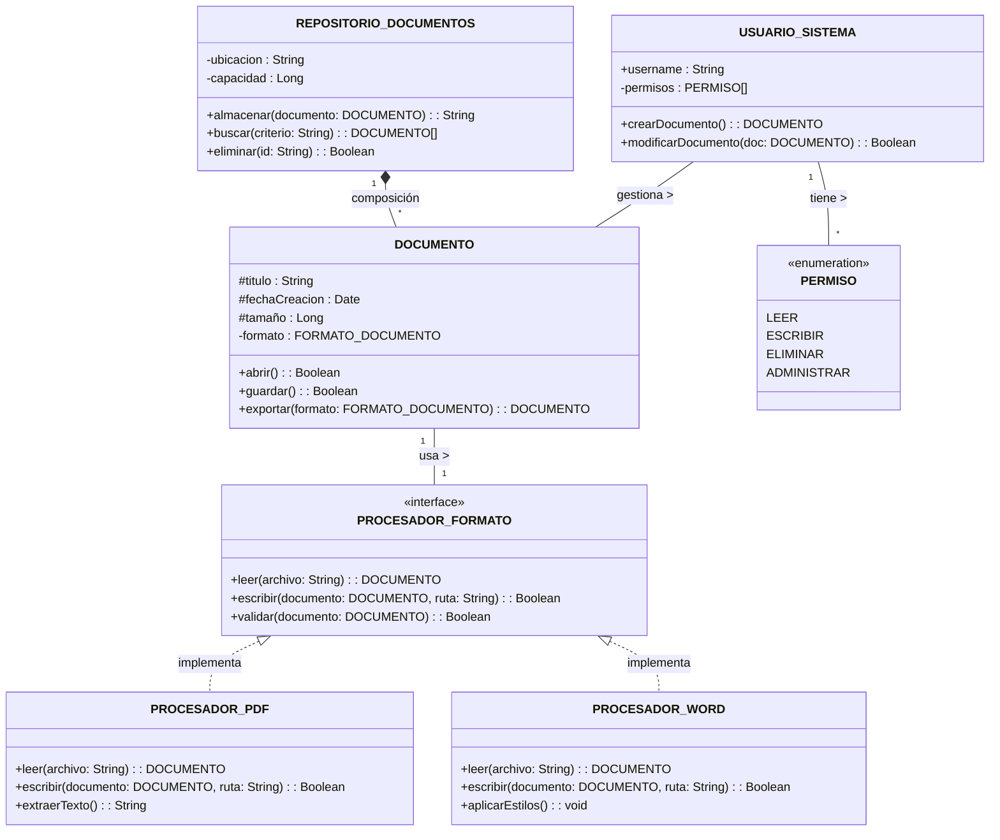
```mermaid
classDiagram
    class DOCUMENTO {
        #titulo : String
        #fechaCreacion : Date
        #tamaño : Long
        -formato : FORMATO_DOCUMENTO
        +abrir() : Boolean
        +guardar() : Boolean
        +exportar(formato: FORMATO_DOCUMENTO) : DOCUMENTO
    }
    
    class PROCESADOR_FORMATO {
        <<interface>>
        +leer(archivo: String) : DOCUMENTO
        +escribir(documento: DOCUMENTO, ruta: String) : Boolean
        +validar(documento: DOCUMENTO) : Boolean
    }
    
    class PROCESADOR_PDF {
        +leer(archivo: String) : DOCUMENTO
        +escribir(documento: DOCUMENTO, ruta: String) : Boolean
        +extraerTexto() : String
    }
    
    class PROCESADOR_WORD {
        +leer(archivo: String) : DOCUMENTO
        +escribir(documento: DOCUMENTO, ruta: String) : Boolean
        +aplicarEstilos() : void
    }
    
    class REPOSITORIO_DOCUMENTOS {
        -ubicacion : String
        -capacidad : Long
        +almacenar(documento: DOCUMENTO) : String
        +buscar(criterio: String) : DOCUMENTO[]
        +eliminar(id: String) : Boolean
    }
    
    class USUARIO_SISTEMA {
        +username : String
        -permisos : PERMISO[]
        +crearDocumento() : DOCUMENTO
        +modificarDocumento(doc: DOCUMENTO) : Boolean
    }
    
    class PERMISO {
        <<enumeration>>
        LEER
        ESCRIBIR
        ELIMINAR
        ADMINISTRAR
    }
    
    PROCESADOR_FORMATO <|.. PROCESADOR_PDF : implementa
    PROCESADOR_FORMATO <|.. PROCESADOR_WORD : implementa
    DOCUMENTO "1" -- "1" PROCESADOR_FORMATO : usa >
    REPOSITORIO_DOCUMENTOS "1" *-- "*" DOCUMENTO : composición
    USUARIO_SISTEMA "*" -- "*" DOCUMENTO : gestiona >
    USUARIO_SISTEMA "1" -- "*" PERMISO : tiene >
```

**Conceptos:** Patrón Strategy, enumeraciones como permisos, gestión de formatos.

## 15. Sistema de Logística - Chain of Responsibility

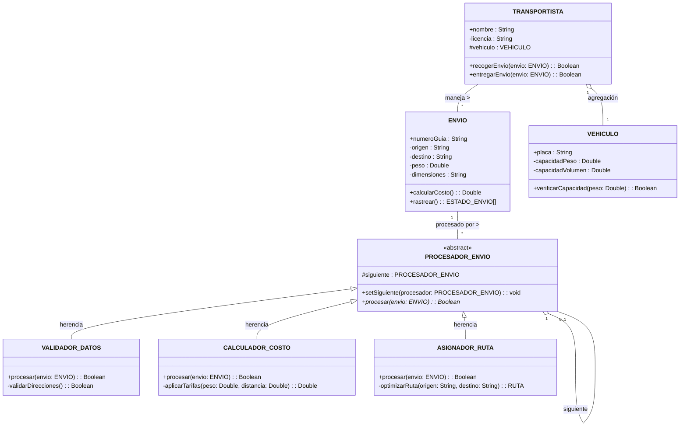
```mermaid
classDiagram
    class ENVIO {
        +numeroGuia : String
        -origen : String
        -destino : String
        -peso : Double
        -dimensiones : String
        +calcularCosto() : Double
        +rastrear() : ESTADO_ENVIO[]
    }
    
    class PROCESADOR_ENVIO {
        <<abstract>>
        #siguiente : PROCESADOR_ENVIO
        +setSiguiente(procesador: PROCESADOR_ENVIO) : void
        +procesar(envio: ENVIO) : Boolean*
    }
    
    class VALIDADOR_DATOS {
        +procesar(envio: ENVIO) : Boolean
        -validarDirecciones() : Boolean
    }
    
    class CALCULADOR_COSTO {
        +procesar(envio: ENVIO) : Boolean
        -aplicarTarifas(peso: Double, distancia: Double) : Double
    }
    
    class ASIGNADOR_RUTA {
        +procesar(envio: ENVIO) : Boolean
        -optimizarRuta(origen: String, destino: String) : RUTA
    }
    
    class TRANSPORTISTA {
        +nombre : String
        -licencia : String
        #vehiculo : VEHICULO
        +recogerEnvio(envio: ENVIO) : Boolean
        +entregarEnvio(envio: ENVIO) : Boolean
    }
    
    class VEHICULO {
        +placa : String
        -capacidadPeso : Double
        -capacidadVolumen : Double
        +verificarCapacidad(peso: Double) : Boolean
    }
    
    PROCESADOR_ENVIO <|-- VALIDADOR_DATOS : herencia
    PROCESADOR_ENVIO <|-- CALCULADOR_COSTO : herencia  
    PROCESADOR_ENVIO <|-- ASIGNADOR_RUTA : herencia
    PROCESADOR_ENVIO "1" o-- "0..1" PROCESADOR_ENVIO : siguiente
    ENVIO "1" -- "*" PROCESADOR_ENVIO : procesado por >
    TRANSPORTISTA "*" -- "*" ENVIO : maneja >
    TRANSPORTISTA "1" o-- "1" VEHICULO : agregación
```

**Conceptos:** Chain of Responsibility pattern, procesamiento secuencial, asociación opcional.

## 16. Sistema de Comercio Electrónico - Decorator Pattern

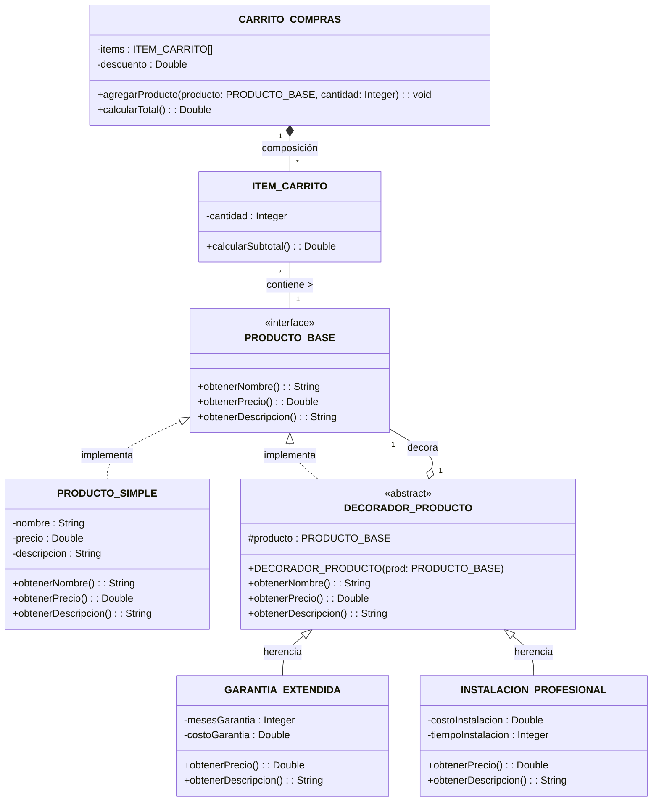
```mermaid
classDiagram
    class PRODUCTO_BASE {
        <<interface>>
        +obtenerNombre() : String
        +obtenerPrecio() : Double
        +obtenerDescripcion() : String
    }
    
    class PRODUCTO_SIMPLE {
        -nombre : String
        -precio : Double
        -descripcion : String
        +obtenerNombre() : String
        +obtenerPrecio() : Double
        +obtenerDescripcion() : String
    }
    
    class DECORADOR_PRODUCTO {
        <<abstract>>
        #producto : PRODUCTO_BASE
        +DECORADOR_PRODUCTO(prod: PRODUCTO_BASE)
        +obtenerNombre() : String
        +obtenerPrecio() : Double
        +obtenerDescripcion() : String
    }
    
    class GARANTIA_EXTENDIDA {
        -mesesGarantia : Integer
        -costoGarantia : Double
        +obtenerPrecio() : Double
        +obtenerDescripcion() : String
    }
    
    class INSTALACION_PROFESIONAL {
        -costoInstalacion : Double
        -tiempoInstalacion : Integer
        +obtenerPrecio() : Double
        +obtenerDescripcion() : String
    }
    
    class CARRITO_COMPRAS {
        -items : ITEM_CARRITO[]
        -descuento : Double
        +agregarProducto(producto: PRODUCTO_BASE, cantidad: Integer) : void
        +calcularTotal() : Double
    }
    
    class ITEM_CARRITO {
        -cantidad : Integer
        +calcularSubtotal() : Double
    }
    
    PRODUCTO_BASE <|.. PRODUCTO_SIMPLE : implementa
    PRODUCTO_BASE <|.. DECORADOR_PRODUCTO : implementa
    DECORADOR_PRODUCTO <|-- GARANTIA_EXTENDIDA : herencia
    DECORADOR_PRODUCTO <|-- INSTALACION_PROFESIONAL : herencia
    DECORADOR_PRODUCTO "1" o-- "1" PRODUCTO_BASE : decora
    CARRITO_COMPRAS "1" *-- "*" ITEM_CARRITO : composición
    ITEM_CARRITO "*" -- "1" PRODUCTO_BASE : contiene >
```

**Conceptos:** Patrón Decorator, interfaces como contratos, decoración múltiple.

## 17. Sistema de Recursos Humanos - Command Pattern

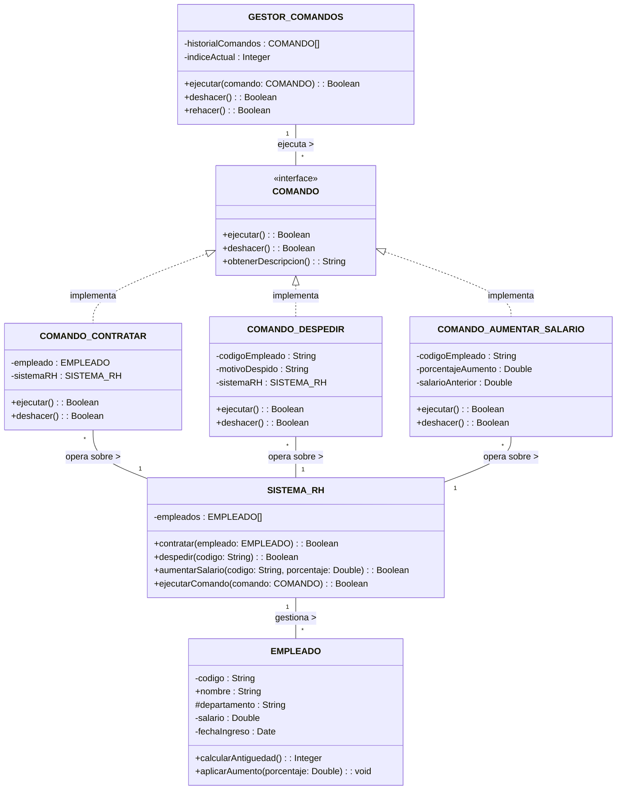
```mermaid
classDiagram
    class EMPLEADO {
        -codigo : String
        +nombre : String
        #departamento : String
        -salario : Double
        -fechaIngreso : Date
        +calcularAntiguedad() : Integer
        +aplicarAumento(porcentaje: Double) : void
    }
    
    class COMANDO {
        <<interface>>
        +ejecutar() : Boolean
        +deshacer() : Boolean
        +obtenerDescripcion() : String
    }
    
    class COMANDO_CONTRATAR {
        -empleado : EMPLEADO
        -sistemaRH : SISTEMA_RH
        +ejecutar() : Boolean
        +deshacer() : Boolean
    }
    
    class COMANDO_DESPEDIR {
        -codigoEmpleado : String
        -motivoDespido : String
        -sistemaRH : SISTEMA_RH
        +ejecutar() : Boolean
        +deshacer() : Boolean
    }
    
    class COMANDO_AUMENTAR_SALARIO {
        -codigoEmpleado : String
        -porcentajeAumento : Double
        -salarioAnterior : Double
        +ejecutar() : Boolean
        +deshacer() : Boolean
    }
    
    class SISTEMA_RH {
        -empleados : EMPLEADO[]
        +contratar(empleado: EMPLEADO) : Boolean
        +despedir(codigo: String) : Boolean
        +aumentarSalario(codigo: String, porcentaje: Double) : Boolean
        +ejecutarComando(comando: COMANDO) : Boolean
    }
    
    class GESTOR_COMANDOS {
        -historialComandos : COMANDO[]
        -indiceActual : Integer
        +ejecutar(comando: COMANDO) : Boolean
        +deshacer() : Boolean
        +rehacer() : Boolean
    }
    
    COMANDO <|.. COMANDO_CONTRATAR : implementa
    COMANDO <|.. COMANDO_DESPEDIR : implementa
    COMANDO <|.. COMANDO_AUMENTAR_SALARIO : implementa
    SISTEMA_RH "1" -- "*" EMPLEADO : gestiona >
    GESTOR_COMANDOS "1" -- "*" COMANDO : ejecuta >
    COMANDO_CONTRATAR "*" -- "1" SISTEMA_RH : opera sobre >
    COMANDO_DESPEDIR "*" -- "1" SISTEMA_RH : opera sobre >
    COMANDO_AUMENTAR_SALARIO "*" -- "1" SISTEMA_RH : opera sobre >
```

**Conceptos:** Patrón Command, deshacer/rehacer operaciones, historial de comandos.

## 18. Sistema de Videoconferencias - Mediator Pattern

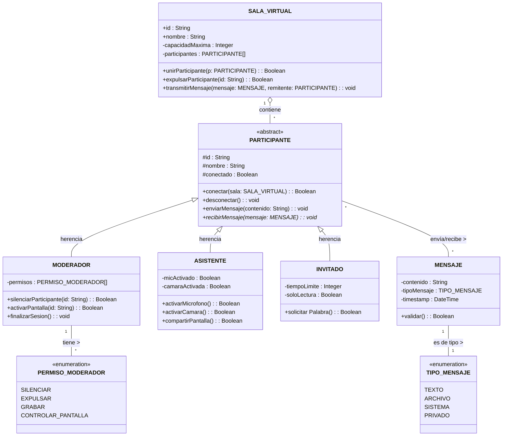
```mermaid
classDiagram
    class SALA_VIRTUAL {
        +id : String
        +nombre : String
        -capacidadMaxima : Integer
        -participantes : PARTICIPANTE[]
        +unirParticipante(p: PARTICIPANTE) : Boolean
        +expulsarParticipante(id: String) : Boolean
        +transmitirMensaje(mensaje: MENSAJE, remitente: PARTICIPANTE) : void
    }
    
    class PARTICIPANTE {
        <<abstract>>
        #id : String
        #nombre : String
        #conectado : Boolean
        +conectar(sala: SALA_VIRTUAL) : Boolean
        +desconectar() : void
        +enviarMensaje(contenido: String) : void
        +recibirMensaje(mensaje: MENSAJE) : void*
    }
    
    class MODERADOR {
        -permisos : PERMISO_MODERADOR[]
        +silenciarParticipante(id: String) : Boolean
        +activarPantalla(id: String) : Boolean
        +finalizarSesion() : void
    }
    
    class ASISTENTE {
        -micActivado : Boolean
        -camaraActivada : Boolean
        +activarMicrofono() : Boolean
        +activarCamara() : Boolean
        +compartirPantalla() : Boolean
    }
    
    class INVITADO {
        -tiempoLimite : Integer
        -soloLectura : Boolean
        +solicitar Palabra() : Boolean
    }
    
    class MENSAJE {
        -contenido : String
        -tipoMensaje : TIPO_MENSAJE
        -timestamp : DateTime
        +validar() : Boolean
    }
    
    class TIPO_MENSAJE {
        <<enumeration>>
        TEXTO
        ARCHIVO
        SISTEMA
        PRIVADO
    }
    
    class PERMISO_MODERADOR {
        <<enumeration>>
        SILENCIAR
        EXPULSAR
        GRABAR
        CONTROLAR_PANTALLA
    }
    
    PARTICIPANTE <|-- MODERADOR : herencia
    PARTICIPANTE <|-- ASISTENTE : herencia
    PARTICIPANTE <|-- INVITADO : herencia
    SALA_VIRTUAL "1" o-- "*" PARTICIPANTE : contiene
    PARTICIPANTE "*" -- "*" MENSAJE : envía/recibe >
    MENSAJE "1" -- "1" TIPO_MENSAJE : es de tipo >
    MODERADOR "1" -- "*" PERMISO_MODERADOR : tiene >
```

**Conceptos:** Patrón Mediator, comunicación centralizada, múltiples tipos de participantes.

## 19. Sistema de Control de Acceso - State Pattern

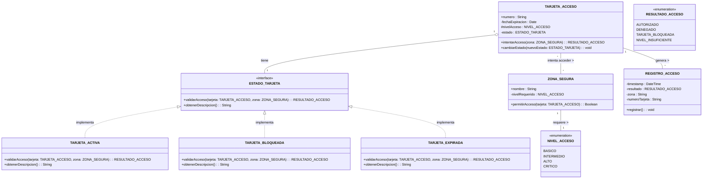
```mermaid
classDiagram
    class TARJETA_ACCESO {
        +numero : String
        -fechaExpiracion : Date
        #nivelAcceso : NIVEL_ACCESO
        -estado : ESTADO_TARJETA
        +intentarAcceso(zona: ZONA_SEGURA) : RESULTADO_ACCESO
        +cambiarEstado(nuevoEstado: ESTADO_TARJETA) : void
    }
    
    class ESTADO_TARJETA {
        <<interface>>
        +validarAcceso(tarjeta: TARJETA_ACCESO, zona: ZONA_SEGURA) : RESULTADO_ACCESO
        +obtenerDescripcion() : String
    }
    
    class TARJETA_ACTIVA {
        +validarAcceso(tarjeta: TARJETA_ACCESO, zona: ZONA_SEGURA) : RESULTADO_ACCESO
        +obtenerDescripcion() : String
    }
    
    class TARJETA_BLOQUEADA {
        +validarAcceso(tarjeta: TARJETA_ACCESO, zona: ZONA_SEGURA) : RESULTADO_ACCESO
        +obtenerDescripcion() : String
    }
    
    class TARJETA_EXPIRADA {
        +validarAcceso(tarjeta: TARJETA_ACCESO, zona: ZONA_SEGURA) : RESULTADO_ACCESO
        +obtenerDescripcion() : String
    }
    
    class ZONA_SEGURA {
        +nombre : String
        -nivelRequerido : NIVEL_ACCESO
        +permitirAcceso(tarjeta: TARJETA_ACCESO) : Boolean
    }
    
    class NIVEL_ACCESO {
        <<enumeration>>
        BASICO
        INTERMEDIO
        ALTO
        CRITICO
    }
    
    class RESULTADO_ACCESO {
        <<enumeration>>
        AUTORIZADO
        DENEGADO
        TARJETA_BLOQUEADA
        NIVEL_INSUFICIENTE
    }
    
    class REGISTRO_ACCESO {
        -timestamp : DateTime
        -resultado : RESULTADO_ACCESO
        -zona : String
        -numeroTarjeta : String
        +registrar() : void
    }
    
    ESTADO_TARJETA <|.. TARJETA_ACTIVA : implementa
    ESTADO_TARJETA <|.. TARJETA_BLOQUEADA : implementa
    ESTADO_TARJETA <|.. TARJETA_EXPIRADA : implementa
    TARJETA_ACCESO "1" o-- "1" ESTADO_TARJETA : tiene
    TARJETA_ACCESO "*" -- "*" ZONA_SEGURA : intenta acceder >
    TARJETA_ACCESO "1" -- "*" REGISTRO_ACCESO : genera >
    ZONA_SEGURA "1" -- "1" NIVEL_ACCESO : requiere >
```

**Conceptos:** Patrón State, cambio de comportamiento según estado, registro de eventos.

## 20. Sistema de Gestión de Proyectos - Facade Pattern

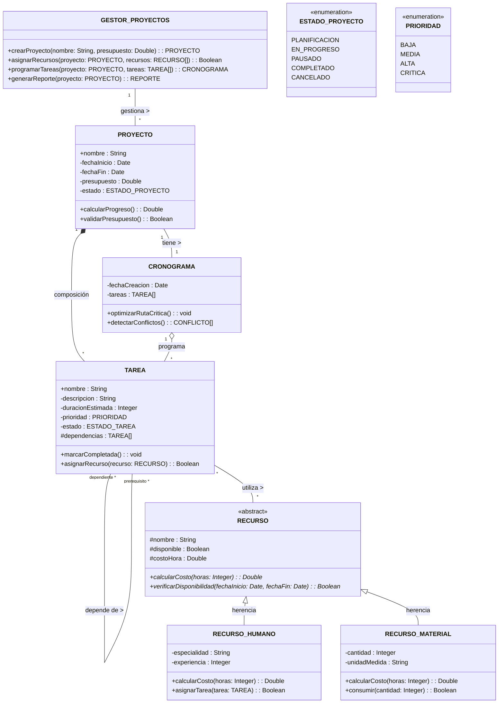
```mermaid
classDiagram
    class GESTOR_PROYECTOS {
        +crearProyecto(nombre: String, presupuesto: Double) : PROYECTO
        +asignarRecursos(proyecto: PROYECTO, recursos: RECURSO[]) : Boolean
        +programarTareas(proyecto: PROYECTO, tareas: TAREA[]) : CRONOGRAMA
        +generarReporte(proyecto: PROYECTO) : REPORTE
    }
    
    class PROYECTO {
        +nombre : String
        -fechaInicio : Date
        -fechaFin : Date
        -presupuesto : Double
        -estado : ESTADO_PROYECTO
        +calcularProgreso() : Double
        +validarPresupuesto() : Boolean
    }
    
    class TAREA {
        +nombre : String
        -descripcion : String
        -duracionEstimada : Integer
        -prioridad : PRIORIDAD
        -estado : ESTADO_TAREA
        #dependencias : TAREA[]
        +marcarCompletada() : void
        +asignarRecurso(recurso: RECURSO) : Boolean
    }
    
    class RECURSO {
        <<abstract>>
        #nombre : String
        #disponible : Boolean
        #costoHora : Double
        +calcularCosto(horas: Integer) : Double*
        +verificarDisponibilidad(fechaInicio: Date, fechaFin: Date) : Boolean*
    }
    
    class RECURSO_HUMANO {
        -especialidad : String
        -experiencia : Integer
        +calcularCosto(horas: Integer) : Double
        +asignarTarea(tarea: TAREA) : Boolean
    }
    
    class RECURSO_MATERIAL {
        -cantidad : Integer
        -unidadMedida : String
        +calcularCosto(horas: Integer) : Double
        +consumir(cantidad: Integer) : Boolean
    }
    
    class CRONOGRAMA {
        -fechaCreacion : Date
        -tareas : TAREA[]
        +optimizarRutaCritica() : void
        +detectarConflictos() : CONFLICTO[]
    }
    
    class ESTADO_PROYECTO {
        <<enumeration>>
        PLANIFICACION
        EN_PROGRESO
        PAUSADO
        COMPLETADO
        CANCELADO
    }
    
    class PRIORIDAD {
        <<enumeration>>
        BAJA
        MEDIA
        ALTA
        CRITICA
    }
    
    GESTOR_PROYECTOS "1" -- "*" PROYECTO : gestiona >
    PROYECTO "1" *-- "*" TAREA : composición
    TAREA "dependiente *" -- "prerequisito *" TAREA : depende de >
    TAREA "*" -- "*" RECURSO : utiliza >
    RECURSO <|-- RECURSO_HUMANO : herencia
    RECURSO <|-- RECURSO_MATERIAL : herencia
    PROYECTO "1" -- "1" CRONOGRAMA : tiene >
    CRONOGRAMA "1" o-- "*" TAREA : programa
```

**Conceptos:** Patrón Facade, autoasociaciones con roles, gestión de dependencias.

---

## Resumen de Conceptos Cubiertos

### Tipos de Relaciones:
- **Herencia (|-->)**: Relación "es-un"
- **Implementación (<|..)**: Clase implementa interfaz
- **Composición (*--)**: Relación "parte-de" fuerte (diamante lleno)
- **Agregación (o--)**: Relación "tiene-un" débil (diamante vacío)
- **Asociación (--)**: Relación general entre clases
- **Autoasociación**: Una clase se relaciona consigo misma

### Visibilidad de Atributos:
- **Público (+)**: Accesible desde cualquier clase
- **Privado (-)**: Solo accesible dentro de la misma clase
- **Protegido (#)**: Accesible en la clase y sus subclases
- **Package (~)**: Accesible dentro del mismo paquete

### Multiplicidad:
- **1**: Exactamente uno
- **0..1**: Cero o uno (opcional)
- **1..\***: Uno o más
- **\***: Cero o más
- **2..8**: Entre 2 y 8

### Elementos Especiales:
- **<<abstract>>**: Clase abstracta
- **<<interface>>**: Interfaz
- **<<enumeration>>**: Enumeración
- **Métodos abstractos (*)**: Con asterisco

Estos diagramas cubren desde conceptos básicos hasta patrones de diseño avanzados. Practica identificando las relaciones, multiplicidades y tipos de visibilidad en cada ejemplo.
