# 5 Diagramas UML Robustos y Complejos - Práctica Avanzada

## 1. Sistema de Gestión Hospitalaria Integral - Múltiples Patrones y Relaciones Complejas

```mermaid
classDiagram
    class PERSONA {
        <<abstract>>
        #cedula : String
        #nombres : String
        #apellidos : String
        #fechaNacimiento : Date
        #direccion : DIRECCION
        #telefonos : String[]
        #sexo : SEXO
        +calcularEdad() : Integer
        +actualizarDatos(datos: DATOS_PERSONALES) : Boolean*
        +validarIdentidad() : Boolean*
    }

    class PACIENTE {
        -numeroHistoriaClinica : String
        -tipoSangre : TIPO_SANGRE
        -alergias : ALERGIA[]
        -seguroMedico : SEGURO_MEDICO
        -contactoEmergencia : CONTACTO_EMERGENCIA
        ~fechaUltimaVisita : Date
        -historialMedico : HISTORIAL_MEDICO[]
        +programarCita(especialidad: ESPECIALIDAD_MEDICA, fecha: Date) : CITA
        +actualizarHistorial(diagnostico: DIAGNOSTICO) : void
        +verificarSeguro() : ESTADO_SEGURO
        +obtenerHistorialCompleto() : HISTORIAL_MEDICO[]
    }

    class PROFESIONAL_SALUD {
        <<abstract>>
        #numeroLicencia : String
        #especialidades : ESPECIALIDAD_MEDICA[]
        #fechaGraduacion : Date
        #universidadGrado : String
        #salario : SALARIO
        #horarioTrabajo : HORARIO_TRABAJO
        #departamento : DEPARTAMENTO
        +validarLicencia() : Boolean
        +calcularHorasDisponibles(fecha: Date) : Integer*
        +atenderPaciente(paciente: PACIENTE) : CONSULTA*
    }

    class MEDICO {
        -codigoMedico : String
        -consultorio : CONSULTORIO
        -pacientesAsignados : PACIENTE[]
        -cirugiasProgramadas : CIRUGIA[]
        +diagnosticar(paciente: PACIENTE, sintomas: SINTOMA[]) : DIAGNOSTICO
        +prescribir(paciente: PACIENTE, medicamentos: MEDICAMENTO[]) : RECETA_MEDICA
        +programarCirugia(paciente: PACIENTE, tipo: TIPO_CIRUGIA) : CIRUGIA
        +derivarEspecialista(paciente: PACIENTE, especialidad: ESPECIALIDAD_MEDICA) : DERIVACION
        +emitirCertificado(paciente: PACIENTE, tipo: TIPO_CERTIFICADO) : CERTIFICADO_MEDICO
    }

    class ENFERMERO {
        -codigoEnfermero : String
        -area : AREA_HOSPITALARIA
        -turnos : TURNO[]
        -pacientesACargo : PACIENTE[]
        +administrarMedicamento(paciente: PACIENTE, medicamento: MEDICAMENTO, dosis: DOSIS) : ADMINISTRACION_MEDICAMENTO
        +tomarSignosVitales(paciente: PACIENTE) : SIGNOS_VITALES
        +registrarEvolucion(paciente: PACIENTE, observaciones: String) : NOTA_ENFERMERIA
        +prepararPacienteCirugia(paciente: PACIENTE) : Boolean
    }

    class CITA {
        -numeroCita : String
        -fecha : Date
        -hora : Time
        -motivo : String
        -estado : ESTADO_CITA
        -duracionEstimada : Integer
        -observaciones : String
        -costoConsulta : Double
        +confirmar() : Boolean
        +reagendar(nuevaFecha: Date, nuevaHora: Time) : Boolean
        +cancelar(motivo: String) : void
        +marcarAsistencia() : void
        +generarFactura() : FACTURA
    }

    class CONSULTA {
        -numeroConsulta : String
        -fechaHora : DateTime
        -motivoConsulta : String
        -anamnesis : String
        -examenFisico : EXAMEN_FISICO
        -diagnostico : DIAGNOSTICO
        -tratamiento : TRATAMIENTO
        -examenesSolicitados : EXAMEN_CLINICO[]
        -proximaConsulta : Date
        +registrarConsulta() : Boolean
        +actualizarDiagnostico(nuevoDiagnostico: DIAGNOSTICO) : void
        +solicitarExamenes(examenes: EXAMEN_CLINICO[]) : ORDEN_EXAMENES
    }

    class HOSPITALIZACION {
        -numeroIngreso : String
        -fechaIngreso : DateTime
        -fechaAlta : DateTime
        -motivoIngreso : String
        -habitacion : HABITACION
        -medicoTratante : MEDICO
        -enfermerosAsignados : ENFERMERO[]
        -tratamientos : TRATAMIENTO[]
        -visitasPermitidas : VISITA[]
        -estado : ESTADO_HOSPITALIZACION
        +asignarHabitacion(habitacion: HABITACION) : Boolean
        +programarAlta(fecha: DateTime) : void
        +registrarVisita(visitante: VISITANTE) : VISITA
        +aplicarTratamiento(tratamiento: TRATAMIENTO) : APLICACION_TRATAMIENTO
    }

    class CIRUGIA {
        -codigoCirugia : String
        -fechaHora : DateTime
        -tipoIntervencion : TIPO_CIRUGIA
        -duracionEstimada : Integer
        -duracionReal : Integer
        -quirofano : QUIROFANO
        -equipoQuirurgico : EQUIPO_QUIRURGICO
        -anestesia : ANESTESIA
        -estado : ESTADO_CIRUGIA
        -complicaciones : COMPLICACION[]
        +programar(fecha: DateTime, quirofano: QUIROFANO) : Boolean
        +asignarEquipo(equipo: EQUIPO_QUIRURGICO) : void
        +registrarComplicacion(complicacion: COMPLICACION) : void
        +marcarCompletada() : void
    }

    class EQUIPO_MEDICO {
        <<abstract>>
        #codigo : String
        #nombre : String
        #marca : String
        #modelo : String
        #fechaAdquisicion : Date
        #estado : ESTADO_EQUIPO
        #ubicacion : String
        #mantenimientos : MANTENIMIENTO[]
        +programarMantenimiento(fecha: Date, tipo: TIPO_MANTENIMIENTO) : MANTENIMIENTO
        +verificarFuncionamiento() : Boolean*
        +registrarUso(fecha: DateTime, usuario: PROFESIONAL_SALUD) : USO_EQUIPO*
    }

    class EQUIPO_DIAGNOSTICO {
        -tipoEstudio : TIPO_ESTUDIO[]
        -resolucion : String
        -softwareVersion : String
        +realizarEstudio(paciente: PACIENTE, tipo: TIPO_ESTUDIO) : RESULTADO_ESTUDIO
        +calibrar() : Boolean
        +exportarImagenes(estudio: RESULTADO_ESTUDIO, formato: FORMATO_IMAGEN) : Boolean
    }

    class EQUIPO_TERAPEUTICO {
        -potencia : Double
        -frecuencia : String
        -protocolos : PROTOCOLO_TERAPIA[]
        +aplicarTerapia(paciente: PACIENTE, protocolo: PROTOCOLO_TERAPIA) : SESION_TERAPIA
        +ajustarParametros(parametros: PARAMETROS_EQUIPO) : Boolean
    }

    class EQUIPO_QUIRURGICO {
        -esterilizado : Boolean
        -ultimaEsterilizacion : DateTime
        -tiempoCirugia : Integer
        -especialidad : ESPECIALIDAD_MEDICA
        +esterilizar() : Boolean
        +verificarEsterilidad() : Boolean
        +prepararParaCirugia() : Boolean
    }

    class FARMACIA {
        -codigo : String
        -nombre : String
        -licenciaFuncionamiento : String
        -inventario : INVENTARIO_MEDICAMENTO[]
        -farmacos : FARMACO[]
        +dispensarMedicamento(receta: RECETA_MEDICA) : DISPENSACION
        +verificarStock(medicamento: MEDICAMENTO) : Integer
        +recibirInventario(lote: LOTE_MEDICAMENTO) : Boolean
        +alertarVencimiento() : ALERTA_VENCIMIENTO[]
    }

    class LABORATORIO {
        -codigoLab : String
        -tipoLaboratorio : TIPO_LABORATORIO
        -certificaciones : CERTIFICACION[]
        -equipos : EQUIPO_LABORATORIO[]
        -personal : TECNICO_LABORATORIO[]
        +procesarMuestra(muestra: MUESTRA_CLINICA) : RESULTADO_LABORATORIO
        +validarResultado(resultado: RESULTADO_LABORATORIO) : Boolean
        +generarReporte(resultados: RESULTADO_LABORATORIO[]) : REPORTE_LABORATORIO
    }

    class SISTEMA_FACTURACION {
        -configuracion : CONFIGURACION_FACTURACION
        +generarFactura(servicios: SERVICIO_MEDICO[], paciente: PACIENTE) : FACTURA
        +aplicarDescuentos(factura: FACTURA, descuentos: DESCUENTO[]) : void
        +procesarPago(factura: FACTURA, metodoPago: METODO_PAGO) : COMPROBANTE_PAGO
        +generarReporteFinanciero(periodo: PERIODO) : REPORTE_FINANCIERO
    }

    %% Enumeraciones y tipos
    class SEXO {
        <<enumeration>>
        MASCULINO
        FEMENINO
        OTRO
    }

    class TIPO_SANGRE {
        <<enumeration>>
        A_POSITIVO
        A_NEGATIVO
        B_POSITIVO
        B_NEGATIVO
        AB_POSITIVO
        AB_NEGATIVO
        O_POSITIVO
        O_NEGATIVO
    }

    class ESTADO_CITA {
        <<enumeration>>
        PROGRAMADA
        CONFIRMADA
        EN_CURSO
        COMPLETADA
        CANCELADA
        NO_ASISTIO
    }

    class ESPECIALIDAD_MEDICA {
        <<enumeration>>
        MEDICINA_GENERAL
        CARDIOLOGIA
        NEUROLOGIA
        PEDIATRIA
        GINECOLOGIA
        TRAUMATOLOGIA
        PSIQUIATRIA
        ONCOLOGIA
        RADIOLOGIA
        ANESTESIOLOGIA
    }

    %% Relaciones principales
    PERSONA <|-- PACIENTE : herencia
    PERSONA <|-- PROFESIONAL_SALUD : herencia
    PROFESIONAL_SALUD <|-- MEDICO : herencia
    PROFESIONAL_SALUD <|-- ENFERMERO : herencia
    
    EQUIPO_MEDICO <|-- EQUIPO_DIAGNOSTICO : herencia
    EQUIPO_MEDICO <|-- EQUIPO_TERAPEUTICO : herencia
    EQUIPO_MEDICO <|-- EQUIPO_QUIRURGICO : herencia

    %% Asociaciones complejas
    PACIENTE "1" -- "*" CITA : programa >
    MEDICO "1" -- "*" CITA : atiende >
    CITA "1" -- "0..1" CONSULTA : genera >
    
    PACIENTE "1" -- "0..*" HOSPITALIZACION : puede tener >
    MEDICO "1" -- "*" HOSPITALIZACION : trata en >
    ENFERMERO "*" -- "*" HOSPITALIZACION : cuida en >
    
    MEDICO "cirujano principal 1" -- "*" CIRUGIA : realiza >
    MEDICO "equipo médico 2..5" -- "*" CIRUGIA : participa en >
    PACIENTE "1" -- "*" CIRUGIA : sometido a >
    
    %% Composiciones
    FARMACIA "1" *-- "*" INVENTARIO_MEDICAMENTO : composición
    LABORATORIO "1" *-- "*" EQUIPO_LABORATORIO : composición
    CONSULTA "1" *-- "1" DIAGNOSTICO : composición
    HOSPITALIZACION "1" *-- "*" TRATAMIENTO : composición
    
    %% Agregaciones
    MEDICO "1" o-- "1" CONSULTORIO : agregación
    ENFERMERO "*" o-- "1" AREA_HOSPITALARIA : agregación
    CIRUGIA "*" o-- "1" QUIROFANO : agregación
    
    %% Relaciones con enumeraciones
    PACIENTE "1" -- "1" TIPO_SANGRE : tiene >
    PERSONA "1" -- "1" SEXO : es >
    CITA "1" -- "1" ESTADO_CITA : está en >
    PROFESIONAL_SALUD "*" -- "*" ESPECIALIDAD_MEDICA : especializado en >
```

**Conceptos Integrados:** Herencia múltiple nivel, clases abstractas, composición vs agregación, autoasociaciones con roles múltiples, enumeraciones complejas, multiplicidad variable, métodos abstractos.

---

## 2. Plataforma de Comercio Electrónico Empresarial - Patrones de Diseño Integrados

```mermaid
classDiagram
    class PLATAFORMA_ECOMMERCE {
        -nombre : String
        -version : String
        -configuracion : CONFIGURACION_PLATAFORMA
        +procesarPedido(pedido: PEDIDO) : RESULTADO_PROCESAMIENTO
        +aplicarEstrategiaPrecios(contexto: CONTEXTO_PRECIOS) : PRECIO_FINAL
        +notificarEventos(evento: EVENTO_PLATAFORMA) : void
    }

    class USUARIO_SISTEMA {
        <<abstract>>
        #id : String
        #email : String
        #password : String
        #fechaRegistro : DateTime
        #estado : ESTADO_USUARIO
        #perfilSeguridad : PERFIL_SEGURIDAD
        #sesionesActivas : SESION[]
        +autenticar(credenciales: CREDENCIALES) : TOKEN_AUTENTICACION
        +cambiarPassword(passwordActual: String, passwordNuevo: String) : Boolean*
        +obtenerPermisos() : PERMISO[]*
        +registrarActividad(actividad: ACTIVIDAD) : void
    }

    class CLIENTE {
        -codigoCliente : String
        -tipoCliente : TIPO_CLIENTE
        -historialCompras : HISTORIAL_COMPRA[]
        -direcciones : DIRECCION[]
        -metodosUago : METODO_PAGO[]
        -wishlist : LISTA_DESEOS[]
        -carrito : CARRITO_COMPRAS
        ~puntosFidelidad : Integer
        +realizarPedido(items: ITEM_CARRITO[]) : PEDIDO
        +agregarDireccion(direccion: DIRECCION) : Boolean
        +aplicarCupon(codigo: String) : RESULTADO_CUPON
        +suscribirseNotificaciones(categoria: CATEGORIA) : SUSCRIPCION
    }

    class VENDEDOR {
        -codigoVendedor : String
        -razonSocial : String
        -documentoFiscal : String
        -tienda : TIENDA_VIRTUAL
        -comisionVentas : Double
        -politicasVenta : POLITICA_VENTA[]
        +publicarProducto(producto: PRODUCTO) : PUBLICACION
        +gestionarInventario(producto: PRODUCTO, cantidad: Integer) : void
        +configurarPromocion(promocion: PROMOCION) : Boolean
        +generarReporteVentas(periodo: PERIODO) : REPORTE_VENTAS
    }

    class ADMINISTRADOR {
        -nivelAcceso : NIVEL_ADMINISTRADOR
        -modulosAsignados : MODULO_SISTEMA[]
        -ultimoAcceso : DateTime
        +gestionarUsuarios(operacion: OPERACION_USUARIO) : Boolean
        +configurarSistema(configuracion: CONFIGURACION_SISTEMA) : void
        +generarReportes(tipo: TIPO_REPORTE, parametros: PARAMETROS_REPORTE) : REPORTE
        +auditarSistema() : RESULTADO_AUDITORIA
    }

    class PRODUCTO {
        -sku : String
        +nombre : String
        -descripcion : String
        -categoria : CATEGORIA
        -marca : MARCA
        -imagenes : IMAGEN_PRODUCTO[]
        -atributos : ATRIBUTO_PRODUCTO[]
        -estado : ESTADO_PRODUCTO
        ~puntuacion : Double
        +calcularPrecio(contexto: CONTEXTO_PRECIO) : PRECIO_CALCULADO
        +verificarDisponibilidad(cantidad: Integer, ubicacion: UBICACION) : Boolean
        +aplicarDescuento(descuento: DESCUENTO) : PRECIO_CON_DESCUENTO
        +obtenerVariantes() : VARIANTE_PRODUCTO[]
    }

    class PRODUCTO_FISICO {
        -peso : Double
        -dimensiones : DIMENSIONES
        -requiereEnvio : Boolean
        -stockFisico : STOCK_FISICO[]
        -proveedores : PROVEEDOR[]
        +calcularCostoEnvio(destino: DIRECCION) : COSTO_ENVIO
        +verificarStockUbicacion(ubicacion: ALMACEN) : Integer
        +programarRestock(cantidad: Integer, proveedor: PROVEEDOR) : ORDEN_COMPRA
    }

    class PRODUCTO_DIGITAL {
        -tamañoArchivo : Long
        -formatosDisponibles : FORMATO_DIGITAL[]
        -licencia : TIPO_LICENCIA
        -linkDescarga : String
        -duracionLicencia : Integer
        +generarLinkDescarga(cliente: CLIENTE) : LINK_DESCARGA
        +validarLicencia(cliente: CLIENTE) : ESTADO_LICENCIA
        +renovarLicencia(cliente: CLIENTE, periodo: PERIODO) : Boolean
    }

    class SERVICIO {
        -tipoServicio : TIPO_SERVICIO
        -duracion : Integer
        -modalidad : MODALIDAD_SERVICIO
        -profesionalesDisponibles : PROFESIONAL[]
        -horarios : HORARIO_DISPONIBLE[]
        +programarServicio(cliente: CLIENTE, fechaHora: DateTime) : CITA_SERVICIO
        +asignarProfesional(preferencias: PREFERENCIAS_CLIENTE) : PROFESIONAL
        +reprogramarServicio(nuevaFecha: DateTime) : Boolean
    }

    class PEDIDO {
        -numeroPedido : String
        -fechaPedido : DateTime
        -estado : ESTADO_PEDIDO
        -items : ITEM_PEDIDO[]
        -cliente : CLIENTE
        -direccionEnvio : DIRECCION
        -metodoPago : METODO_PAGO
        -subtotal : Double
        -impuestos : Double
        -costoEnvio : Double
        -descuentos : Double
        -total : Double
        +procesarPago() : RESULTADO_PAGO
        +confirmarPedido() : CONFIRMACION_PEDIDO
        +rastrearEnvio() : ESTADO_ENVIO
        +aplicarCambios(cambios: CAMBIO_PEDIDO[]) : Boolean
        +generarFactura() : FACTURA_ELECTRONICA
    }

    class ESTRATEGIA_PRECIOS {
        <<interface>>
        +calcularPrecio(producto: PRODUCTO, contexto: CONTEXTO_PRECIOS) : Double
        +aplicarDescuentos(precio: Double, descuentos: DESCUENTO[]) : Double
        +validarPrecio(precio: Double) : Boolean
    }

    class PRECIO_FIJO {
        -precioBase : Double
        -margenGanancia : Double
        +calcularPrecio(producto: PRODUCTO, contexto: CONTEXTO_PRECIOS) : Double
        +actualizarPrecioBase(nuevoPrecio: Double) : void
    }

    class PRECIO_DINAMICO {
        -factoresInfluencia : FACTOR_PRECIO[]
        -algoritmoCalculo : ALGORITMO_PRECIO
        -historialPrecios : HISTORIAL_PRECIO[]
        +calcularPrecio(producto: PRODUCTO, contexto: CONTEXTO_PRECIOS) : Double
        +analizarTendenciaMercado() : TENDENCIA_PRECIO
        +ajustarPrecioSegunDemanda(demanda: DATOS_DEMANDA) : Double
    }

    class PRECIO_SUBASTA {
        -precioInicial : Double
        -incrementoMinimo : Double
        -fechaFinalizacion : DateTime
        -pujasActivas : PUJA[]
        +registrarPuja(cliente: CLIENTE, monto: Double) : RESULTADO_PUJA
        +finalizarSubasta() : GANADOR_SUBASTA
        +notificarSuperacion(puja: PUJA) : void
    }

    class OBSERVADOR_EVENTOS {
        <<interface>>
        +notificar(evento: EVENTO_SISTEMA) : void
        +suscribirse(tipoEvento: TIPO_EVENTO) : Boolean
        +desuscribirse(tipoEvento: TIPO_EVENTO) : Boolean
    }

    class SERVICIO_NOTIFICACIONES {
        -canalesNotificacion : CANAL_NOTIFICACION[]
        -plantillas : PLANTILLA_NOTIFICACION[]
        +notificar(evento: EVENTO_SISTEMA) : void
        +enviarEmail(destinatario: String, asunto: String, contenido: String) : Boolean
        +enviarSMS(telefono: String, mensaje: String) : Boolean
        +enviarPushNotification(usuario: USUARIO_SISTEMA, mensaje: String) : Boolean
    }

    class SERVICIO_INVENTARIO {
        -almacenes : ALMACEN[]
        -movimientosStock : MOVIMIENTO_STOCK[]
        +notificar(evento: EVENTO_SISTEMA) : void
        +actualizarStock(producto: PRODUCTO, cantidad: Integer, tipoMovimiento: TIPO_MOVIMIENTO) : void
        +alertarStockBajo(umbral: Integer) : ALERTA_STOCK[]
        +generarReporteInventario() : REPORTE_INVENTARIO
    }

    class SERVICIO_ANALYTICS {
        -metricas : METRICA[]
        -reportes : REPORTE_ANALYTICS[]
        +notificar(evento: EVENTO_SISTEMA) : void
        +registrarEventoAnalytics(evento: EVENTO_ANALYTICS) : void
        +generarDashboard(usuario: USUARIO_SISTEMA) : DASHBOARD
        +analizarComportamientoCliente(cliente: CLIENTE) : PERFIL_CLIENTE
    }

    class FACTORY_PRODUCTO {
        +crearProducto(tipo: TIPO_PRODUCTO, especificaciones: ESPECIFICACIONES) : PRODUCTO
        +crearProductoFisico(especificaciones: ESPECIFICACIONES_FISICAS) : PRODUCTO_FISICO
        +crearProductoDigital(especificaciones: ESPECIFICACIONES_DIGITALES) : PRODUCTO_DIGITAL
        +crearServicio(especificaciones: ESPECIFICACIONES_SERVICIO) : SERVICIO
    }

    class PROCESSOR_COMMAND {
        <<abstract>>
        #comando : COMANDO_SISTEMA
        +ejecutar() : RESULTADO_COMANDO*
        +deshacer() : Boolean*
        +validar() : Boolean
    }

    class COMMAND_PROCESAR_PEDIDO {
        -pedido : PEDIDO
        -serviciosRequeridos : SERVICIO_SISTEMA[]
        +ejecutar() : RESULTADO_COMANDO
        +deshacer() : Boolean
        +notificarProgreso() : void
    }

    %% Enumeraciones complejas
    class ESTADO_USUARIO {
        <<enumeration>>
        ACTIVO
        INACTIVO
        SUSPENDIDO
        PENDIENTE_VERIFICACION
        BLOQUEADO
    }

    class TIPO_CLIENTE {
        <<enumeration>>
        INDIVIDUAL
        CORPORATIVO
        MAYORISTA
        VIP
        PREMIUM
    }

    class ESTADO_PEDIDO {
        <<enumeration>>
        CARRITO
        PENDIENTE_PAGO
        PAGADO
        PROCESANDO
        ENVIADO
        ENTREGADO
        CANCELADO
        DEVUELTO
    }

    class TIPO_PRODUCTO {
        <<enumeration>>
        FISICO
        DIGITAL
        SERVICIO
        SUSCRIPCION
        BUNDLE
    }

    %% Relaciones principales
    USUARIO_SISTEMA <|-- CLIENTE : herencia
    USUARIO_SISTEMA <|-- VENDEDOR : herencia
    USUARIO_SISTEMA <|-- ADMINISTRADOR : herencia
    
    PRODUCTO <|-- PRODUCTO_FISICO : herencia
    PRODUCTO <|-- PRODUCTO_DIGITAL : herencia
    PRODUCTO <|-- SERVICIO : herencia
    
    ESTRATEGIA_PRECIOS <|.. PRECIO_FIJO : implementa
    ESTRATEGIA_PRECIOS <|.. PRECIO_DINAMICO : implementa
    ESTRATEGIA_PRECIOS <|.. PRECIO_SUBASTA : implementa
    
    OBSERVADOR_EVENTOS <|.. SERVICIO_NOTIFICACIONES : implementa
    OBSERVADOR_EVENTOS <|.. SERVICIO_INVENTARIO : implementa
    OBSERVADOR_EVENTOS <|.. SERVICIO_ANALYTICS : implementa
    
    PROCESSOR_COMMAND <|-- COMMAND_PROCESAR_PEDIDO : herencia

    %% Asociaciones complejas con roles
    CLIENTE "comprador 1" -- "0..*" PEDIDO : realiza >
    VENDEDOR "vendedor 1..*" -- "*" PEDIDO : cumple >
    PEDIDO "1" *-- "1..*" ITEM_PEDIDO : composición
    PRODUCTO "1" -- "*" ITEM_PEDIDO : incluido en >
    
    %% Agregaciones con multiplicidad variable
    CLIENTE "1" o-- "1" CARRITO_COMPRAS : tiene
    VENDEDOR "1" o-- "1" TIENDA_VIRTUAL : opera
    PLATAFORMA_ECOMMERCE "1" o-- "*" USUARIO_SISTEMA : registra
    
    %% Composición con patrones
    PLATAFORMA_ECOMMERCE "1" *-- "1..*" OBSERVADOR_EVENTOS : composición
    PRODUCTO "1" *-- "1" ESTRATEGIA_PRECIOS : usa estrategia
    FACTORY_PRODUCTO "1" -- "*" PRODUCTO : crea >
    
    %% Autoasociaciones con roles múltiples
    PRODUCTO "principal 1" -- "relacionados *" PRODUCTO : se relaciona con >
    CLIENTE "referente 1" -- "referidos *" CLIENTE : refiere a >
    
    %% Relaciones con enumeraciones
    USUARIO_SISTEMA "1" -- "1" ESTADO_USUARIO : tiene estado >
    CLIENTE "1" -- "1" TIPO_CLIENTE : es tipo >
    PEDIDO "1" -- "1" ESTADO_PEDIDO : está en estado >
    PRODUCTO "1" -- "1" TIPO_PRODUCTO : es tipo >
```

**Conceptos Integrados:** Strategy Pattern, Observer Pattern, Factory Pattern, Command Pattern, herencia múltiple nivel, interfaces con implementaciones múltiples, autoasociaciones con roles, agregación vs composición compleja, enumeraciones como estados.

---

## 3. Sistema de Gestión Académica Universitaria - Arquitectura Compleja con Múltiples Subsistemas

```mermaid
classDiagram
    class ENTIDAD_UNIVERSITARIA {
        <<abstract>>
        #codigo : String
        #nombre : String
        #fechaCreacion : Date
        #estado : ESTADO_ENTIDAD
        #responsables : PERSONA[]
        #presupuesto : PRESUPUESTO
        +validarEntidad() : Boolean*
        +generarReporte(tipo: TIPO_REPORTE) : REPORTE*
        +aplicarCambioEstado(nuevoEstado: ESTADO_ENTIDAD) : Boolean*
    }

    class UNIVERSIDAD {
        -rector : AUTORIDAD_UNIVERSITARIA
        -viceRectores : VICE_RECTOR[]
        -facultades : FACULTAD[]
        -campuses : CAMPUS[]
        -acreditaciones : ACREDITACION[]
        ~rankingNacional : Integer
        ~rankingInternacional : Integer
        +crearFacultad(datos: DATOS_FACULTAD) : FACULTAD
        +aprobarPrograma(programa: PROGRAMA_ACADEMICO) : Boolean
        +designarAutoridades(cargo: CARGO_UNIVERSITARIO, persona: PERSONA) : NOMBRAMIENTO
        +gestionarPresupuestoGlobal() : DISTRIBUCION_PRESUPUESTO
    }

    class FACULTAD {
        -decano : DECANO
        -escuelas : ESCUELA[]
        -departamentos : DEPARTAMENTO[]
        -programasAcademicos : PROGRAMA_ACADEMICO[]
        -consejo : CONSEJO_FACULTAD
        -investigaciones : PROYECTO_INVESTIGACION[]
        +aprobarCurriculo(programa: PROGRAMA_ACADEMICO, curriculo: CURRICULO) : Boolean
        +asignarRecursosInvestigacion(proyecto: PROYECTO_INVESTIGACION) : ASIGNACION_RECURSOS
        +evaluarDesempeñoAcademico() : REPORTE_DESEMPEÑO
        +gestionarConvenios(entidad: ENTIDAD_EXTERNA) : CONVENIO
    }

    class DEPARTAMENTO {
        -jefe : JEFE_DEPARTAMENTO
        -profesores : PROFESOR[]
        -cursos : CURSO[]
        -laboratorios : LABORATORIO[]
        -equipamiento : EQUIPO_ACADEMICO[]
        -linesInvestigacion : LINEA_INVESTIGACION[]
        +planificarCursos(periodo: PERIODO_ACADEMICO) : PLANIFICACION_CURSOS
        +asignarProfesores(curso: CURSO, profesores: PROFESOR[]) : ASIGNACION_DOCENTE
        +gestionarRecursos(tipo: TIPO_RECURSO) : GESTION_RECURSOS
        +evaluarCargaAcademica() : ANALISIS_CARGA
    }

    class PERSONA_UNIVERSITARIA {
        <<abstract>>
        #numeroIdentificacion : String
        #nombres : String
        #apellidos : String
        #fechaNacimiento : Date
        #genero : GENERO
        #direccion : DIRECCION
        #telefonos : TELEFONO[]
        #emails : EMAIL[]
        #estadoCivil : ESTADO_CIVIL
        #nacionalidad : String
        +actualizarDatosPersonales(datos: DATOS_PERSONALES) : Boolean
        +obtenerHistorialAcademico() : HISTORIAL_ACADEMICO*
        +generarCertificados(tipo: TIPO_CERTIFICADO) : CERTIFICADO*
    }

    class ESTUDIANTE {
        -codigoEstudiante : String
        -carrera : PROGRAMA_ACADEMICO
        -nivelAcademico : NIVEL_ACADEMICO
        -semestreActual : Integer
        -promedioAcumulado : Double
        -creditosAprobados : Integer
        -creditosRequeridos : Integer
        -estado : ESTADO_ESTUDIANTE
        -becas : BECA[]
        -sanciones : SANCION_ACADEMICA[]
        ~tutor : PROFESOR
        +matricularCursos(cursos: CURSO[], periodo: PERIODO_ACADEMICO) : MATRICULA
        +retirarCurso(curso: CURSO, motivo: String) : RETIRO_CURSO
        +solicitarBeca(tipoBeca: TIPO_BECA) : SOLICITUD_BECA
        +presentarTesis(tesis: TESIS) : DEFENSA_TESIS
        +calcularPromedioSemestre(periodo: PERIODO_ACADEMICO) : Double
        +verificarRequisitosGraduacion() : EVALUACION_GRADUACION
    }

    class PROFESOR {
        -codigoProfesor : String
        -titulo : TITULO_ACADEMICO[]
        -categoria : CATEGORIA_PROFESOR
        -dedicacion : TIPO_DEDICACION
        -departamento : DEPARTAMENTO
        -salario : SALARIO_ACADEMICO
        -cargaAcademica : CARGA_DOCENTE
        -investigaciones : INVESTIGACION[]
        -publicaciones : PUBLICACION[]
        -evaluaciones : EVALUACION_DOCENTE[]
        +dictarCurso(curso: CURSO, grupo: GRUPO_CLASE) : DICTADO_CURSO
        +calificarEstudiante(estudiante: ESTUDIANTE, evaluacion: EVALUACION) : CALIFICACION
        +dirigirTesis(estudiante: ESTUDIANTE, tema: TEMA_TESIS) : DIRECCION_TESIS
        +desarrollarInvestigacion(proyecto: PROYECTO_INVESTIGACION) : PARTICIPACION_INVESTIGACION
        +publicarArticulo(datos: DATOS_PUBLICACION) : PUBLICACION
        +participarComite(comite: COMITE_ACADEMICO) : PARTICIPACION_COMITE
    }

    class PERSONAL_ADMINISTRATIVO {
        -codigoEmpleado : String
        -cargo : CARGO_ADMINISTRATIVO
        -area : AREA_ADMINISTRATIVA
        -nivelJerarquico : NIVEL_JERARQUICO
        -supervisor : PERSONAL_ADMINISTRATIVO
        -subordinados : PERSONAL_ADMINISTRATIVO[]
        -horarioTrabajo : HORARIO_LABORAL
        +procesarSolicitud(solicitud: SOLICITUD_ADMINISTRATIVA) : RESPUESTA_SOLICITUD
        +generarInforme(tipo: TIPO_INFORME, periodo: PERIODO) : INFORME_ADMINISTRATIVO
        +supervisarProcesos(procesos: PROCESO_ADMINISTRATIVO[]) : SUPERVISION
    }

    class CURSO {
        -codigoCurso : String
        +nombreCurso : String
        -descripcion : String
        -creditos : Integer
        -horasTeoricas : Integer
        -horasPracticas : Integer
        -prerequisitos : CURSO[]
        -correquisitos : CURSO[]
        -competencias : COMPETENCIA[]
        -programa : PROGRAMA_CURSO
        -modalidad : MODALIDAD_CURSO
        -nivel : NIVEL_CURSO
        +programarClases(periodo: PERIODO_ACADEMICO, aulas: AULA[]) : PROGRAMACION_CLASES
        +asignarProfesores(profesores: PROFESOR[], roles: ROL_DOCENTE[]) : ASIGNACION_PROFESORES
        +definirEvaluaciones(evaluaciones: TIPO_EVALUACION[]) : PLAN_EVALUACION
        +validarPrerequisitos(estudiante: ESTUDIANTE) : Boolean
        +calcularNotaFinal(calificaciones: CALIFICACION[]) : NOTA_FINAL
    }

    class MATRICULA {
        -numeroMatricula : String
        -fechaMatricula : Date
        -periodoAcademico : PERIODO_ACADEMICO
        -cursosInscritos : INSCRIPCION_CURSO[]
        -creditosInscritos : Integer
        -costoMatricula : Double
        -descuentos : DESCUENTO_MATRICULA[]
        -estado : ESTADO_MATRICULA
        -observaciones : String
        +confirmarMatricula() : CONFIRMACION_MATRICULA
        +aplicarDescuentos(descuentos: DESCUENTO_MATRICULA[]) : Double
        +generarRecibo() : RECIBO_MATRICULA
        +modificarInscripciones(cambios: CAMBIO_MATRICULA[]) : Boolean
    }

    class INSCRIPCION_CURSO {
        -fechaInscripcion : DateTime
        -grupo : GRUPO_CLASE
        -estado : ESTADO_INSCRIPCION
        -calificaciones : CALIFICACION[]
        -asistencias : ASISTENCIA[]
        -notaFinal : NOTA_FINAL
        -observaciones : String
        +registrarCalificacion(tipo: TIPO_EVALUACION, nota: Double) : CALIFICACION
        +calcularNotaFinal() : NOTA_FINAL
        +registrarAsistencia(fecha: Date, presente: Boolean) : ASISTENCIA
        +retirarCurso(motivo: String) : RETIRO_CURSO
    }

    class SISTEMA_EVALUACION {
        <<abstract>>
        #escala : ESCALA_CALIFICACION
        #pesoEvaluaciones : PESO_EVALUACION[]
        +calcularNota(calificaciones: CALIFICACION[]) : NOTA_FINAL*
        +validarNota(nota: Double) : Boolean*
        +convertirEscala(nota: Double, escalaDestino: ESCALA_CALIFICACION) : Double*
    }

    class EVALUACION_NUMERICA {
        -notaMinima : Double
        -notaMaxima : Double
        -notaAprobacion : Double
        -precision : Integer
        +calcularNota(calificaciones: CALIFICACION[]) : NOTA_FINAL
        +validarRango(nota: Double) : Boolean
        +redondearNota(nota: Double) : Double
    }

    class EVALUACION_CONCEPTUAL {
        -conceptos : CONCEPTO_CALIFICACION[]
        -equivalenciasNumericas : EQUIVALENCIA_NUMERICA[]
        +calcularNota(calificaciones: CALIFICACION[]) : NOTA_FINAL
        +convertirConcepto(nota: Double) : CONCEPTO_CALIFICACION
        +obtenerEquivalencia(concepto: CONCEPTO_CALIFICACION) : Double
    }

    class BIBLIOTECA_UNIVERSITARIA {
        -codigo : String
        -sede : SEDE_UNIVERSITARIA
        -colecciones : COLECCION_BIBLIOGRAFICA[]
        -servicios : SERVICIO_BIBLIOTECA[]
        -personal : BIBLIOTECARIO[]
        -usuarios : USUARIO_BIBLIOTECA[]
        -espaciosEstudio : ESPACIO_ESTUDIO[]
        +prestarMaterial(usuario: USUARIO_BIBLIOTECA, material: MATERIAL_BIBLIOGRAFICO) : PRESTAMO
        +renovarPrestamo(prestamo: PRESTAMO) : Boolean
        +reservarEspacio(usuario: USUARIO_BIBLIOTECA, espacio: ESPACIO_ESTUDIO) : RESERVA_ESPACIO
        +buscarMaterial(criterios: CRITERIOS_BUSQUEDA) : RESULTADO_BUSQUEDA[]
        +gestionarMultas(usuario: USUARIO_BIBLIOTECA) : GESTION_MULTAS
    }

    class LABORATORIO_INVESTIGACION {
        -codigoLab : String
        -tipoLaboratorio : TIPO_LABORATORIO
        -equipamiento : EQUIPO_LABORATORIO[]
        -proyectosActivos : PROYECTO_INVESTIGACION[]
        -investigadoresPrincipales : INVESTIGADOR[]
        -presupuestoOperativo : PRESUPUESTO_LABORATORIO
        -normasSeguridad : NORMA_SEGURIDAD[]
        +asignarProyecto(proyecto: PROYECTO_INVESTIGACION) : ASIGNACION_LABORATORIO
        +programarUso(investigador: INVESTIGADOR, fechaHora: DateTime) : RESERVA_LABORATORIO
        +mantenerEquipo(equipo: EQUIPO_LABORATORIO) : MANTENIMIENTO_EQUIPO
        +verificarSeguridad() : REPORTE_SEGURIDAD
        +solicitarRecursos(recursos: RECURSO_INVESTIGACION[]) : SOLICITUD_RECURSOS
    }

    class CENTRO_ESTUDIANTES {
        -nombreCentro : String
        -programa : PROGRAMA_ACADEMICO
        -directiva : DIRECTIVA_ESTUDIANTIL[]
        -estudiantes : ESTUDIANTE[]
        -actividades : ACTIVIDAD_ESTUDIANTIL[]
        -presupuesto : PRESUPUESTO_ESTUDIANTIL
        -representantes : REPRESENTANTE_ESTUDIANTIL[]
        +organizarActividad(actividad: ACTIVIDAD_ESTUDIANTIL) : ORGANIZACION_ACTIVIDAD
        +elegirRepresentantes(cargos: CARGO_ESTUDIANTIL[]) : ELECCION_ESTUDIANTIL
        +gestionarRecursos(solicitud: SOLICITUD_RECURSOS_ESTUDIANTILES) : GESTION_RECURSOS
        +representarEstudiantes(instancia: INSTANCIA_UNIVERSITARIA) : REPRESENTACION
    }

    class SISTEMA_POSTGRADO {
        -programas : PROGRAMA_POSTGRADO[]
        -coordinadores : COORDINADOR_POSTGRADO[]
        -comitesAcademicos : COMITE_ACADEMICO[]
        -procesosAdmision : PROCESO_ADMISION[]
        +administrarAdmision(programa: PROGRAMA_POSTGRADO) : PROCESO_ADMISION
        +asignarTutor(estudiante: ESTUDIANTE, tutor: PROFESOR) : ASIGNACION_TUTOR
        +evaluarProgreso(estudiante: ESTUDIANTE) : EVALUACION_PROGRESO
        +programarDefensaTesis(tesis: TESIS) : DEFENSA_TESIS
    }

    %% Interfaces para servicios
    class SERVICIO_ACADEMICO {
        <<interface>>
        +procesarSolicitud(solicitud: SOLICITUD_ACADEMICA) : RESPUESTA_ACADEMICA
        +validarRequisitos(requisitos: REQUISITO[]) : Boolean
        +generarDocumento(tipo: TIPO_DOCUMENTO) : DOCUMENTO_ACADEMICO
    }

    class SERVICIO_FINANCIERO {
        <<interface>>
        +procesarPago(pago: PAGO_ACADEMICO) : RESULTADO_PAGO
        +calcularAranceles(estudiante: ESTUDIANTE) : CALCULO_ARANCELES
        +aplicarDescuentos(descuentos: DESCUENTO[]) : APLICACION_DESCUENTO
        +generarFactura(servicios: SERVICIO_COBRABLE[]) : FACTURA_ACADEMICA
    }

    %% Enumeraciones específicas del dominio académico
    class NIVEL_ACADEMICO {
        <<enumeration>>
        PREGRADO
        POSTGRADO
        MAESTRIA
        DOCTORADO
        ESPECIALIZACION
        DIPLOMADO
        EDUCACION_CONTINUA
    }

    class ESTADO_ESTUDIANTE {
        <<enumeration>>
        ACTIVO
        INACTIVO
        SUSPENDIDO
        GRADUADO
        RETIRADO
        TRANSFERIDO
        INTERCAMBIO
    }

    class CATEGORIA_PROFESOR {
        <<enumeration>>
        INSTRUCTOR
        ASISTENTE
        ASOCIADO
        TITULAR
        EMERITO
        VISITANTE
        CATEDRA
    }

    class TIPO_DEDICACION {
        <<enumeration>>
        TIEMPO_COMPLETO
        MEDIO_TIEMPO
        CATEDRA
        HONORARIOS
        AD_HONOREM
    }

    class MODALIDAD_CURSO {
        <<enumeration>>
        PRESENCIAL
        VIRTUAL
        HIBRIDA
        SEMIPRESENCIAL
        A_DISTANCIA
    }

    class ESTADO_ENTIDAD {
        <<enumeration>>
        ACTIVA
        INACTIVA
        EN_PROCESO_CREACION
        EN_REESTRUCTURACION
        SUSPENDIDA
        CERRADA
    }

    %% Relaciones de herencia principales
    ENTIDAD_UNIVERSITARIA <|-- UNIVERSIDAD : herencia
    ENTIDAD_UNIVERSITARIA <|-- FACULTAD : herencia
    ENTIDAD_UNIVERSITARIA <|-- DEPARTAMENTO : herencia
    
    PERSONA_UNIVERSITARIA <|-- ESTUDIANTE : herencia
    PERSONA_UNIVERSITARIA <|-- PROFESOR : herencia
    PERSONA_UNIVERSITARIA <|-- PERSONAL_ADMINISTRATIVO : herencia
    
    SISTEMA_EVALUACION <|-- EVALUACION_NUMERICA : herencia
    SISTEMA_EVALUACION <|-- EVALUACION_CONCEPTUAL : herencia

    %% Composiciones complejas (parte integral)
    UNIVERSIDAD "1" *-- "*" FACULTAD : composición
    FACULTAD "1" *-- "*" DEPARTAMENTO : composición
    DEPARTAMENTO "1" *-- "*" CURSO : composición
    MATRICULA "1" *-- "*" INSCRIPCION_CURSO : composición
    BIBLIOTECA_UNIVERSITARIA "1" *-- "*" COLECCION_BIBLIOGRAFICA : composición

    %% Agregaciones (relaciones "tiene")
    UNIVERSIDAD "1" o-- "*" CAMPUS : agregación
    FACULTAD "1" o-- "*" PROGRAMA_ACADEMICO : agregación
    DEPARTAMENTO "1" o-- "*" PROFESOR : agregación
    ESTUDIANTE "*" o-- "*" BECA : agregación
    PROFESOR "*" o-- "*" INVESTIGACION : agregación

    %% Asociaciones complejas con multiplicidad y roles
    ESTUDIANTE "inscrito 1" -- "*" MATRICULA : realiza >
    PROFESOR "docente 1..*" -- "*" CURSO : imparte >
    CURSO "prerequisito *" -- "curso dependiente *" CURSO : es prerequisito de >
    
    %% Autoasociaciones jerárquicas
    PERSONAL_ADMINISTRATIVO "supervisor 0..1" -- "subordinados *" PERSONAL_ADMINISTRATIVO : supervisa a >
    DEPARTAMENTO "principal 0..1" -- "subdepartamentos *" DEPARTAMENTO : contiene >

    %% Asociaciones ternarias implícitas a través de clases de asociación
    ESTUDIANTE "1" -- "*" INSCRIPCION_CURSO : se inscribe >
    CURSO "1" -- "*" INSCRIPCION_CURSO : recibe >
    PERIODO_ACADEMICO "1" -- "*" INSCRIPCION_CURSO : se realiza en >

    %% Relaciones con interfaces (implementación de servicios)
    SERVICIO_ACADEMICO <|.. SISTEMA_POSTGRADO : implementa
    SERVICIO_FINANCIERO <|.. SISTEMA_POSTGRADO : implementa
    SERVICIO_ACADEMICO <|.. DEPARTAMENTO : implementa

    %% Asociaciones con enumeraciones
    ESTUDIANTE "1" -- "1" NIVEL_ACADEMICO : estudia en >
    ESTUDIANTE "1" -- "1" ESTADO_ESTUDIANTE : tiene estado >
    PROFESOR "1" -- "1" CATEGORIA_PROFESOR : tiene categoría >
    PROFESOR "1" -- "1" TIPO_DEDICACION : tiene dedicación >
    CURSO "1" -- "1" MODALIDAD_CURSO : se dicta en >
    ENTIDAD_UNIVERSITARIA "1" -- "1" ESTADO_ENTIDAD : está en >

    %% Relaciones especializadas con roles múltiples
    PROFESOR "tutor 0..1" -- "tutorados *" ESTUDIANTE : tutoriza >
    PROFESOR "director 1" -- "tesista 1" ESTUDIANTE : dirige tesis de >
    PROFESOR "jurado *" -- "*" DEFENSA_TESIS : evalúa >
    
    %% Asociaciones de participación en entidades colectivas
    ESTUDIANTE "*" -- "1" CENTRO_ESTUDIANTES : pertenece a >
    PROFESOR "*" -- "*" COMITE_ACADEMICO : participa en >
    INVESTIGADOR "*" -- "*" LABORATORIO_INVESTIGACION : trabaja en >
```

**Conceptos Integrados:** Herencia múltiple compleja, autoasociaciones jerárquicas, asociaciones ternarias, clases de asociación, implementación de interfaces múltiples, composición vs agregación con semánticas específicas, roles múltiples en asociaciones, enumeraciones como tipos de estado.

---

## 4. Sistema de Producción Industrial Inteligente - IoT, Patrones y Arquitectura Distribuida

```mermaid
classDiagram
    class SISTEMA_MANUFACTURA {
        -nombreSistema : String
        -version : String
        -configuracion : CONFIGURACION_SISTEMA
        -estadoGeneral : ESTADO_SISTEMA
        -metricas : METRICAS_SISTEMA
        +inicializarSistema() : Boolean
        +monitorearOperaciones() : REPORTE_MONITOREO
        +optimizarProduccion() : PLAN_OPTIMIZACION
        +generarReporteIntegral() : REPORTE_INTEGRAL
    }

    class ENTIDAD_PRODUCTIVA {
        <<abstract>>
        #identificador : String
        #nombre : String
        #ubicacion : COORDENADAS_GPS
        #fechaInstalacion : Date
        #estadoOperacional : ESTADO_OPERACIONAL
        #sensores : SENSOR_IOT[]
        #actuadores : ACTUADOR_IOT[]
        #conectividad : CONEXION_RED
        +inicializar() : Boolean*
        +detener() : Boolean*
        +obtenerEstado() : ESTADO_DETALLADO*
        +ejecutarMantenimiento() : RESULTADO_MANTENIMIENTO*
        +enviarDatos() : PAQUETE_DATOS*
    }

    class PLANTA_INDUSTRIAL {
        -codigoPlanta : String
        -capacidadProduccion : CAPACIDAD_PRODUCCION
        -lineasProduccion : LINEA_PRODUCCION[]
        -almacenes : ALMACEN[]
        -laboratorios : LABORATORIO_CONTROL_CALIDAD[]
        -personal : OPERARIO[]
        -sistemaEnergetico : SISTEMA_ENERGETICO
        -sistemaSeguridad : SISTEMA_SEGURIDAD
        +programarProduccion(orden: ORDEN_PRODUCCION) : PROGRAMACION_PRODUCCION
        +coordinarLineas() : COORDINACION_LINEAS
        +gestionarInventario() : GESTION_INVENTARIO
        +monitorearCalidad() : MONITOREO_CALIDAD
        +optimizarEnergia() : OPTIMIZACION_ENERGETICA
    }

    class LINEA_PRODUCCION {
        -numeroLinea : Integer
        -tipoProducto : TIPO_PRODUCTO
        -velocidadProduccion : VELOCIDAD_PRODUCCION
        -estaciones : ESTACION_TRABAJO[]
        -robots : ROBOT_INDUSTRIAL[]
        -sistemasTransporte : SISTEMA_TRANSPORTE[]
        -controladores : CONTROLADOR_PLC[]
        +configurarProduccion(especificaciones: ESPECIFICACIONES_PRODUCTO) : CONFIGURACION_LINEA
        +iniciarProduccion(lote: LOTE_PRODUCCION) : Boolean
        +pausarProduccion(razon: RAZON_PAUSA) : void
        +ajustarVelocidad(nuevaVelocidad: VELOCIDAD_PRODUCCION) : Boolean
        +sincronizarEstaciones() : SINCRONIZACION_ESTACIONES
    }

    class ESTACION_TRABAJO {
        -numeroEstacion : Integer
        -tipoOperacion : TIPO_OPERACION
        -herramientas : HERRAMIENTA_INDUSTRIAL[]
        -operarios : OPERARIO[]
        -tiempoCiclo : TIEMPO_CICLO
        -indicadoresKPI : KPI_ESTACION[]
        +ejecutarOperacion(pieza: PIEZA_TRABAJO) : RESULTADO_OPERACION
        +cambiarHerramienta(nueva: HERRAMIENTA_INDUSTRIAL) : TIEMPO_CAMBIO
        +calibrarEquipos() : RESULTADO_CALIBRACION
        +reportarProblema(problema: PROBLEMA_OPERACIONAL) : REPORTE_PROBLEMA
    }

    class DISPOSITIVO_IOT {
        <<abstract>>
        #macAddress : String
        #ipAddress : String
        #protocolo : PROTOCOLO_COMUNICACION
        #frecuenciaMuestreo : Integer
        #ultimaTransmision : DateTime
        #bateria : NIVEL_BATERIA
        #firmware : VERSION_FIRMWARE
        +conectar() : ESTADO_CONEXION*
        +desconectar() : void
        +actualizarFirmware(version: VERSION_FIRMWARE) : RESULTADO_ACTUALIZACION*
        +autodiagnostico() : DIAGNOSTICO_DISPOSITIVO*
        +transmitirDatos(datos: DATOS_SENSOR) : RESULTADO_TRANSMISION*
    }

    class SENSOR_IOT {
        -tipoSensor : TIPO_SENSOR
        -rangoMedicion : RANGO_MEDICION
        -precision : PRECISION_SENSOR
        -unidadMedida : UNIDAD_MEDIDA
        -valorActual : Double
        -historialLecturas : LECTURA_SENSOR[]
        -umbralAlarma : UMBRAL_ALARMA
        +tomarLectura() : LECTURA_SENSOR
        +calibrar(valorReferencia: Double) : RESULTADO_CALIBRACION
        +configurarAlarma(umbral: UMBRAL_ALARMA) : void
        +detectarAnomalia() : ANOMALIA_SENSOR
        +generarAlerta() : ALERTA_SENSOR
    }

    class ACTUADOR_IOT {
        -tipoActuador : TIPO_ACTUADOR
        -estadoActual : ESTADO_ACTUADOR
        -comandoActual : COMANDO_ACTUADOR
        -potencia : POTENCIA_ACTUADOR
        -historialComandos : COMANDO_ACTUADOR[]
        +ejecutarComando(comando: COMANDO_ACTUADOR) : RESULTADO_EJECUCION
        +detener() : Boolean
        +obtenerPosicion() : POSICION_ACTUADOR
        +configurarLimites(limites: LIMITES_OPERACION) : void
        +reportarEstado() : ESTADO_DETALLADO_ACTUADOR
    }

    class ROBOT_INDUSTRIAL {
        -modelo : MODELO_ROBOT
        -numeroEjes : Integer
        -cargaMaxima : CARGA_MAXIMA
        -precision : PRECISION_ROBOT
        -programas : PROGRAMA_ROBOT[]
        -herramientasFinales : HERRAMIENTA_FINAL[]
        -sistemaVision : SISTEMA_VISION
        -coordenadas : SISTEMA_COORDENADAS
        +ejecutarPrograma(programa: PROGRAMA_ROBOT) : EJECUCION_PROGRAMA
        +moverPosicion(coordenadas: COORDENADAS_ROBOT) : MOVIMIENTO_ROBOT
        +cambiarHerramienta(herramienta: HERRAMIENTA_FINAL) : CAMBIO_HERRAMIENTA
        +aprenderMovimiento(secuencia: SECUENCIA_MOVIMIENTOS) : PROGRAMA_APRENDIDO
        +detectarColision() : DETECCION_COLISION
    }

    class CONTROLADOR_PLC {
        -modeloPLC : MODELO_PLC
        -memoriaPrograma : MEMORIA_PROGRAMA
        -entradasDigitales : ENTRADA_DIGITAL[]
        -salidasDigitales : SALIDA_DIGITAL[]
        -entradasAnalogicas : ENTRADA_ANALOGICA[]
        -salidasAnalogicas : SALIDA_ANALOGICA[]
        -programaControl : PROGRAMA_LADDER
        -estadoEjecucion : ESTADO_PLC
        +cargarPrograma(programa: PROGRAMA_LADDER) : RESULTADO_CARGA
        +ejecutarCiclo() : CICLO_PLC
        +leerEntradas() : ESTADO_ENTRADAS
        +escribirSalidas(valores: VALORES_SALIDAS) : void
        +diagnosticarSistema() : DIAGNOSTICO_PLC
    }

    class ESTRATEGIA_MANTENIMIENTO {
        <<interface>>
        +planificarMantenimiento(equipo: ENTIDAD_PRODUCTIVA) : PLAN_MANTENIMIENTO
        +evaluarCondicion(datos: DATOS_CONDICION) : EVALUACION_CONDICION
        +predecirFalla(historial: HISTORIAL_OPERACION) : PREDICCION_FALLA
        +optimizarRecursos(recursos: RECURSOS_MANTENIMIENTO) : OPTIMIZACION_RECURSOS
    }

    class MANTENIMIENTO_PREVENTIVO {
        -intervalos : INTERVALO_MANTENIMIENTO[]
        -procedimientos : PROCEDIMIENTO_MANTENIMIENTO[]
        -recursosRequeridos : RECURSOS_REQUERIDOS[]
        +planificarMantenimiento(equipo: ENTIDAD_PRODUCTIVA) : PLAN_MANTENIMIENTO
        +generarCalendario(periodo: PERIODO) : CALENDARIO_MANTENIMIENTO
        +verificarCumplimiento() : REPORTE_CUMPLIMIENTO
    }

    class MANTENIMIENTO_PREDICTIVO {
        -modelosPrediccion : MODELO_PREDICCION[]
        -algoritmos : ALGORITMO_ML[]
        -umbralesPrediccion : UMBRAL_PREDICCION[]
        +analizarTendencias(datos: SERIE_TEMPORAL) : ANALISIS_TENDENCIAS
        +predecirVidaUtil(componente: COMPONENTE) : PREDICCION_VIDA_UTIL
        +optimizarIntervencion() : MOMENTO_OPTIMO_INTERVENCION
    }

    class MANTENIMIENTO_CORRECTIVO {
        -tiposReparacion : TIPO_REPARACION[]
        -repuestosEmergencia : REPUESTO[]
        -personalEspecializado : TECNICO_ESPECIALIZADO[]
        +diagnosticarFalla(falla: FALLA_EQUIPO) : DIAGNOSTICO_FALLA
        +repararEquipo(diagnostico: DIAGNOSTICO_FALLA) : REPARACION
        +documentarReparacion(reparacion: REPARACION) : DOCUMENTACION_REPARACION
    }

    class SISTEMA_MES {
        -version : String
        -modulos : MODULO_MES[]
        -integraciones : INTEGRACION_SISTEMA[]
        -baseDatos : BASE_DATOS_MANUFACTURA
        +recopilarDatos(fuentes: FUENTE_DATOS[]) : DATOS_MANUFACTUREING
        +analizarRendimiento(metricas: METRICAS_PRODUCCION) : ANALISIS_RENDIMIENTO
        +generarReportes(tipoReporte: TIPO_REPORTE_MES) : REPORTE_MES
        +optimizarOperaciones() : RECOMENDACIONES_OPTIMIZACION
    }

    class GEMELO_DIGITAL {
        -modeloFisico : MODELO_3D
        -simulador : SIMULADOR_PROCESOS
        -datosEnTiempoReal : DATOS_TIEMPO_REAL
        -parametrosSimulacion : PARAMETROS_SIMULACION
        -predicciones : PREDICCION[]
        +sincronizarConFisico() : ESTADO_SINCRONIZACION
        +simularEscenarios(escenarios: ESCENARIO[]) : RESULTADOS_SIMULACION
        +optimizarParametros() : PARAMETROS_OPTIMIZADOS
        +predecirComportamiento(horizonte: HORIZONTE_PREDICCION) : PREDICCIONES
    }

    class OBSERVADOR_SISTEMA {
        <<interface>>
        +notificarEvento(evento: EVENTO_MANUFACTURA) : void
        +suscribirse(tipoEvento: TIPO_EVENTO_MANUFACTURA) : SUSCRIPCION
        +desuscribirse(suscripcion: SUSCRIPCION) : void
    }

    class SISTEMA_ALERTAS {
        -reglas : REGLA_ALERTA[]
        -canales : CANAL_NOTIFICACION[]
        -historialAlertas : HISTORIAL_ALERTAS
        +notificarEvento(evento: EVENTO_MANUFACTURA) : void
        +configurarAlerta(regla: REGLA_ALERTA) : void
        +enviarNotificacion(alerta: ALERTA, destinatarios: DESTINATARIO[]) : RESULTADO_ENVIO
    }

    class SISTEMA_CALIDAD {
        -estandares : ESTANDAR_CALIDAD[]
        -procedimientos : PROCEDIMIENTO_CALIDAD[]
        -instrumentos : INSTRUMENTO_MEDICION[]
        +notificarEvento(evento: EVENTO_MANUFACTURA) : void
        +realizarInspeccion(producto: PRODUCTO, criterios: CRITERIOS_CALIDAD) : RESULTADO_INSPECCION
        +generarCertificado(lote: LOTE_PRODUCCION) : CERTIFICADO_CALIDAD
    }

    class SISTEMA_SEGURIDAD {
        -protocolos : PROTOCOLO_SEGURIDAD[]
        -equiposProteccion : EQUIPO_PROTECCION[]
        -zonasRiesgo : ZONA_RIESGO[]
        +notificarEvento(evento: EVENTO_MANUFACTURA) : void
        +activarProtocolo(tipoEmergencia: TIPO_EMERGENCIA) : ACTIVACION_PROTOCOLO
        +monitorearZonas() : ESTADO_ZONAS_SEGURIDAD
    }

    %% Enumeraciones específicas del dominio industrial
    class ESTADO_OPERACIONAL {
        <<enumeration>>
        OPERATIVO
        MANTENIMIENTO
        PARADO
        FALLA
        CONFIGURACION
        CALIBRACION
        EMERGENCIA
    }

    class TIPO_SENSOR {
        <<enumeration>>
        TEMPERATURA
        PRESION
        VIBRATION
        HUMEDAD
        CORRIENTE
        VOLTAJE
        POSICION
        PROXIMIDAD
        VISION
        FUERZA
        TORQUE
        VELOCIDAD
    }

    class TIPO_ACTUADOR {
        <<enumeration>>
        MOTOR_ELECTRICO
        CILINDRO_NEUMATICO
        CILINDRO_HIDRAULICO
        VALVULA
        SERVO_MOTOR
        MOTOR_PASO
        ELECTROIMAN
        CALEFACTOR
        VENTILADOR
        BOMBA
    }

    class PROTOCOLO_COMUNICACION {
        <<enumeration>>
        MODBUS_TCP
        PROFINET
        ETHERNET_IP
        OPC_UA
        MQTT
        HTTP_REST
        COAP
        ZIGBEE
        WIFI
        BLUETOOTH_LE
        LORA
        CELLULAR_4G
    }

    class TIPO_OPERACION {
        <<enumeration>>
        ENSAMBLAJE
        SOLDADURA
        MECANIZADO
        PINTURA
        EMPAQUE
        INSPECCION
        TRANSPORTE
        ALMACENAMIENTO
        CONTROL_CALIDAD
        ETIQUETADO
    }

    class ESTADO_SISTEMA {
        <<enumeration>>
        INICIALIZANDO
        OPERATIVO
        DEGRADADO
        MANTENIMIENTO
        ERROR
        EMERGENCIA
        APAGADO
    }

    %% Relaciones de herencia complejas
    ENTIDAD_PRODUCTIVA <|-- PLANTA_INDUSTRIAL : herencia
    ENTIDAD_PRODUCTIVA <|-- LINEA_PRODUCCION : herencia
    ENTIDAD_PRODUCTIVA <|-- ESTACION_TRABAJO : herencia
    
    DISPOSITIVO_IOT <|-- SENSOR_IOT : herencia
    DISPOSITIVO_IOT <|-- ACTUADOR_IOT : herencia
    DISPOSITIVO_IOT <|-- ROBOT_INDUSTRIAL : herencia
    DISPOSITIVO_IOT <|-- CONTROLADOR_PLC : herencia

    %% Implementación de interfaces (Strategy Pattern)
    ESTRATEGIA_MANTENIMIENTO <|.. MANTENIMIENTO_PREVENTIVO : implementa
    ESTRATEGIA_MANTENIMIENTO <|.. MANTENIMIENTO_PREDICTIVO : implementa
    ESTRATEGIA_MANTENIMIENTO <|.. MANTENIMIENTO_CORRECTIVO : implementa

    %% Implementación de Observer Pattern
    OBSERVADOR_SISTEMA <|.. SISTEMA_ALERTAS : implementa
    OBSERVADOR_SISTEMA <|.. SISTEMA_CALIDAD : implementa
    OBSERVADOR_SISTEMA <|.. SISTEMA_SEGURIDAD : implementa

    %% Composiciones fuertes (el contenedor controla el ciclo de vida)
    PLANTA_INDUSTRIAL "1" *-- "*" LINEA_PRODUCCION : composición
    LINEA_PRODUCCION "1" *-- "*" ESTACION_TRABAJO : composición
    PLANTA_INDUSTRIAL "1" *-- "*" ALMACEN : composición
    SISTEMA_MANUFACTURA "1" *-- "*" PLANTA_INDUSTRIAL : composición
    ROBOT_INDUSTRIAL "1" *-- "*" PROGRAMA_ROBOT : composición

    %% Agregaciones (relaciones "tiene" o "usa")
    ENTIDAD_PRODUCTIVA "1" o-- "*" SENSOR_IOT : agregación
    ENTIDAD_PRODUCTIVA "1" o-- "*" ACTUADOR_IOT : agregación
    ESTACION_TRABAJO "1" o-- "*" HERRAMIENTA_INDUSTRIAL : agregación
    LINEA_PRODUCCION "1" o-- "*" ROBOT_INDUSTRIAL : agregación
    CONTROLADOR_PLC "1" o-- "1" PROGRAMA_LADDER : agregación

    %% Asociaciones complejas con roles y multiplicidades específicas
    ENTIDAD_PRODUCTIVA "equipo 1" -- "1" ESTRATEGIA_MANTENIMIENTO : aplica estrategia >
    SENSOR_IOT "sensores *" -- "gemelo 1" GEMELO_DIGITAL : alimenta datos >
    ROBOT_INDUSTRIAL "robot 1" -- "programas *" PROGRAMA_ROBOT : ejecuta >
    CONTROLADOR_PLC "controlador *" -- "estación 1" ESTACION_TRABAJO : controla >

    %% Autoasociaciones jerárquicas
    PLANTA_INDUSTRIAL "principal 0..1" -- "subsidiarias *" PLANTA_INDUSTRIAL : controla >
    ESTACION_TRABAJO "precedente *" -- "siguiente *" ESTACION_TRABAJO : precede a >

    %% Asociaciones ternarias a través de clases de asociación
    OPERARIO "1" -- "*" ASIGNACION_TRABAJO : realiza >
    ESTACION_TRABAJO "1" -- "*" ASIGNACION_TRABAJO : asignada en >
    TURNO_TRABAJO "1" -- "*" ASIGNACION_TRABAJO : durante >

    %% Relaciones con patrones complejos (Mediator implícito)
    SISTEMA_MES "mediador 1" -- "*" ENTIDAD_PRODUCTIVA : coordina >
    SISTEMA_MES "1" -- "*" OBSERVADOR_SISTEMA : notifica a >
    GEMELO_DIGITAL "modelo 1" -- "físico 1" ENTIDAD_PRODUCTIVA : modela >

    %% Asociaciones con enumeraciones
    ENTIDAD_PRODUCTIVA "1" -- "1" ESTADO_OPERACIONAL : tiene estado >
    SENSOR_IOT "1" -- "1" TIPO_SENSOR : es de tipo >
    ACTUADOR_IOT "1" -- "1" TIPO_ACTUADOR : es de tipo >
    DISPOSITIVO_IOT "1" -- "1" PROTOCOLO_COMUNICACION : usa protocolo >
    ESTACION_TRABAJO "1" -- "1" TIPO_OPERACION : realiza tipo >
    SISTEMA_MANUFACTURA "1" -- "1" ESTADO_SISTEMA : está en estado >

    %% Asociaciones de comunicación y red
    DISPOSITIVO_IOT "emisor *" -- "receptor *" DISPOSITIVO_IOT : comunica con >
    CONTROLADOR_PLC "maestro 1" -- "esclavos *" DISPOSITIVO_IOT : controla >
    SISTEMA_MES "colector 1" -- "fuentes *" DISPOSITIVO_IOT : recopila datos de >
```

**Conceptos Integrados:** IoT con herencia múltiple, Strategy Pattern para mantenimiento, Observer Pattern para monitoreo, arquitectura distribuida con mediador, autoasociaciones de control, comunicación entre dispositivos, estados complejos con transiciones.

---

## 5. Plataforma de Servicios Financieros Digitales - Arquitectura de Microservicios y Blockchain

```mermaid
classDiagram
    class PLATAFORMA_FINANCIERA {
        -nombre : String
        -licencia : LICENCIA_FINANCIERA
        -microservicios : MICROSERVICIO[]
        -blockchain : RED_BLOCKCHAIN
        -gateway : API_GATEWAY
        -seguridad : MODULO_SEGURIDAD
        -cumplimiento : MODULO_CUMPLIMIENTO
        +inicializarPlataforma() : ESTADO_INICIALIZACION
        +procesarTransaccion(transaccion: TRANSACCION) : RESULTADO_TRANSACCION
        +aplicarRegulaciones(regulacion: REGULACION) : APLICACION_REGULACION
        +generarReporteRegulatorio(tipo: TIPO_REPORTE_REGULATORIO) : REPORTE_REGULATORIO
    }

    class ENTIDAD_FINANCIERA {
        <<abstract>>
        #codigo : String
        #nombre : String
        #tipoEntidad : TIPO_ENTIDAD_FINANCIERA
        #licencias : LICENCIA[]
        #regulador : ENTE_REGULADOR
        #calificacionRiesgo : CALIFICACION_RIESGO
        #patrimonioTecnico : PATRIMONIO_TECNICO
        #indicadoresSolvencia : INDICADORES_SOLVENCIA
        +validarLicencia() : ESTADO_LICENCIA*
        +calcularPatrimonioTecnico() : PATRIMONIO_CALCULADO*
        +evaluarSolvencia() : EVALUACION_SOLVENCIA*
        +reportarRegulador(reporte: REPORTE_REGULATORIO) : CONFIRMACION_REPORTE*
    }

    class BANCO_DIGITAL {
        -codigoBanco : String
        -cuentasBancarias : CUENTA_BANCARIA[]
        -prestamos : PRESTAMO[]
        -tarjetasCredito : TARJETA_CREDITO[]
        -serviciosDigitales : SERVICIO_DIGITAL[]
        -sucursalesVirtuales : SUCURSAL_VIRTUAL[]
        +abrirCuenta(cliente: CLIENTE, tipoCuenta: TIPO_CUENTA) : CUENTA_BANCARIA
        +otorgarPrestamo(solicitud: SOLICITUD_PRESTAMO) : RESULTADO_PRESTAMO
        +emitirTarjeta(cliente: CLIENTE, tipoTarjeta: TIPO_TARJETA) : TARJETA_CREDITO
        +procesarPagoDigital(pago: PAGO_DIGITAL) : CONFIRMACION_PAGO
        +sincronizarBlockchain() : ESTADO_SINCRONIZACION
    }

    class FINTECH {
        -codigoFintech : String
        -verticales : VERTICAL_FINTECH[]
        -partners : PARTNER_FINANCIERO[]
        -apis : API_FINANCIERA[]
        -tecnologias : TECNOLOGIA_INNOVADORA[]
        +desarrollarServicio(concepto: CONCEPTO_SERVICIO) : SERVICIO_FINTECH
        +integrarPartner(partner: PARTNER_FINANCIERO) : INTEGRACION_PARTNER
        +desplegarTecnologia(tecnologia: TECNOLOGIA_INNOVADORA) : DESPLIEGUE_TECNOLOGIA
        +escalarServicios() : ESCALAMIENTO_SERVICIOS
    }

    class CASA_BOLSA {
        -codigoCasaBolsa : String
        -instrumentosFinancieros : INSTRUMENTO_FINANCIERO[]
        -portafolios : PORTAFOLIO[]
        -operaciones : OPERACION_BURSATIL[]
        -analistasFinancieros : ANALISTA_FINANCIERO[]
        +ejecutarOperacion(orden: ORDEN_BURSATIL) : EJECUCION_ORDEN
        +gestionarPortafolio(portafolio: PORTAFOLIO, estrategia: ESTRATEGIA_INVERSION) : GESTION_PORTAFOLIO
        +analizarMercado(instrumento: INSTRUMENTO_FINANCIERO) : ANALISIS_MERCADO
        +calcularRiesgoPortafolio(portafolio: PORTAFOLIO) : CALCULO_RIESGO
    }

    class USUARIO_FINANCIERO {
        <<abstract>>
        #identificacion : DOCUMENTO_IDENTIFICACION
        #perfil : PERFIL_FINANCIERO
        #historialCrediticio : HISTORIAL_CREDITICIO
        #cuentasVinculadas : CUENTA_FINANCIERA[]
        #transacciones : TRANSACCION[]
        #evaluacionRiesgo : EVALUACION_RIESGO_CLIENTE
        #status : STATUS_CLIENTE
        +autenticarBiometrico(biometria: DATOS_BIOMETRICOS) : RESULTADO_AUTENTICACION*
        +actualizarPerfil(datos: DATOS_PERFIL) : ACTUALIZACION_PERFIL*
        +solicitarServicio(servicio: TIPO_SERVICIO_FINANCIERO) : SOLICITUD_SERVICIO*
        +consultarHistorial(filtros: FILTROS_CONSULTA) : HISTORIAL_FILTRADO*
    }

    class CLIENTE_INDIVIDUAL {
        -ingresos : INGRESOS_DECLARADOS
        -patrimonio : PATRIMONIO_PERSONAL
        -dependientes : DEPENDIENTE[]
        -scoring : SCORE_CREDITICIO
        -productos : PRODUCTO_FINANCIERO[]
        ~categoriaCliente : CATEGORIA_CLIENTE
        +solicitarCredito(monto: Double, plazo: Integer) : SOLICITUD_CREDITO
        +invertirRecursos(monto: Double, instrumento: INSTRUMENTO_INVERSION) : INVERSION
        +asegurarBienes(bienes: BIEN[], tipoSeguro: TIPO_SEGURO) : POLIZA_SEGURO
        +transferirRecursos(destino: CUENTA_DESTINO, monto: Double) : TRANSFERENCIA
    }

    class CLIENTE_CORPORATIVO {
        -razonSocial : String
        -giro : GIRO_EMPRESARIAL
        -facturacion : FACTURACION_ANUAL
        -empleados : Integer
        -estadosFinancieros : ESTADO_FINANCIERO[]
        -lineasCredito : LINEA_CREDITO[]
        -representanteLegal : REPRESENTANTE_LEGAL
        +solicitarLineaCredito(monto: Double, garantias: GARANTIA[]) : LINEA_CREDITO
        +financiarProyecto(proyecto: PROYECTO_EMPRESARIAL) : FINANCIAMIENTO_PROYECTO
        +gestionarTesoreria(estrategia: ESTRATEGIA_TESORERIA) : GESTION_TESORERIA
        +cubrirRiesgos(riesgos: RIESGO_FINANCIERO[]) : COBERTURA_RIESGOS
    }

    class INVERSIONISTA_INSTITUCIONAL {
        -tipoInstitucion : TIPO_INSTITUCION
        -activosGestion : ACTIVOS_GESTION
        -mandatos : MANDATO_INVERSION[]
        -benchmarks : BENCHMARK[]
        -limitesInversion : LIMITES_INVERSION[]
        +ejecutarEstrategia(estrategia: ESTRATEGIA_INSTITUCIONAL) : EJECUCION_ESTRATEGIA
        +rebalancearPortafolio(portafolio: PORTAFOLIO) : REBALANCEO
        +cumplirMandato(mandato: MANDATO_INVERSION) : CUMPLIMIENTO_MANDATO
        +reportarDesempeño(periodo: PERIODO) : REPORTE_DESEMPEÑO
    }

    class TRANSACCION_FINANCIERA {
        <<abstract>>
        #idTransaccion : String
        #fecha : DateTime
        #monto : MONTO_TRANSACCION
        #moneda : MONEDA
        #origen : CUENTA_ORIGEN
        #destino : CUENTA_DESTINO
        #estado : ESTADO_TRANSACCION
        #firmaDigital : FIRMA_DIGITAL
        #hashBlockchain : HASH_BLOCKCHAIN
        +validarTransaccion() : RESULTADO_VALIDACION*
        +procesarTransaccion() : RESULTADO_PROCESAMIENTO*
        +registrarBlockchain() : REGISTRO_BLOCKCHAIN*
        +generarComprobante() : COMPROBANTE_TRANSACCION*
    }

    class TRANSFERENCIA_BANCARIA {
        -tipTransferencia : TIPO_TRANSFERENCIA
        -comision : COMISION_TRANSFERENCIA
        -tiempoEjecucion : TIEMPO_EJECUCION
        -referenciaCliente : String
        +validarCuentas() : VALIDACION_CUENTAS
        +aplicarComisiones() : APLICACION_COMISIONES
        +enviarNotificaciones() : NOTIFICACIONES_TRANSFERENCIA
    }

    class PAGO_DIGITAL {
        -metodoPago : METODO_PAGO_DIGITAL
        -comercio : COMERCIO_AFILIADO
        -tokenPago : TOKEN_PAGO
        -autenticacion : AUTENTICACION_FUERTE
        +procesarPago() : PROCESAMIENTO_PAGO
        +validarComercio() : VALIDACION_COMERCIO
        +aplicarPromociones() : APLICACION_PROMOCIONES
    }

    class OPERACION_INVERSION {
        -tipoOperacion : TIPO_OPERACION_INVERSION
        -instrumento : INSTRUMENTO_FINANCIERO
        -cantidad : CANTIDAD_TITULOS
        -precio : PRECIO_EJECUCION
        -comisiones : COMISION_BURSATIL
        +ejecutarOperacion() : EJECUCION_OPERACION
        +liquidarOperacion() : LIQUIDACION_OPERACION
        +registrarCustodia() : REGISTRO_CUSTODIA
    }

    class SMART_CONTRACT {
        -direccionContrato : DIRECCION_BLOCKCHAIN
        -codigoFuente : CODIGO_SOLIDITY
        -abi : ABI_CONTRATO
        -estado : ESTADO_CONTRATO
        -gas : GAS_CONSUMIDO
        -propietario : DIRECCION_PROPIETARIO
        +desplegar(red: RED_BLOCKCHAIN) : DESPLIEGUE_CONTRATO
        +ejecutar(funcion: FUNCION_CONTRATO, parametros: PARAMETROS[]) : RESULTADO_EJECUCION
        +actualizar(nuevoCodigo: CODIGO_SOLIDITY) : ACTUALIZACION_CONTRATO
        +transferirPropiedad(nuevoPropietario: DIRECCION_BLOCKCHAIN) : TRANSFERENCIA_PROPIEDAD
    }

    class TOKEN_DIGITAL {
        -simbolo : String
        -nombre : String
        -decimales : Integer
        -suministroTotal : SUMINISTRO_TOTAL
        -contratos : SMART_CONTRACT[]
        -holders : HOLDER_TOKEN[]
        +emitir(cantidad: CANTIDAD_TOKEN, destinatario: DIRECCION_BLOCKCHAIN) : EMISION_TOKEN
        +transferir(origen: DIRECCION_BLOCKCHAIN, destino: DIRECCION_BLOCKCHAIN, cantidad: CANTIDAD_TOKEN) : TRANSFERENCIA_TOKEN
        +quemar(cantidad: CANTIDAD_TOKEN) : QUEMA_TOKEN
        +congelar(direccion: DIRECCION_BLOCKCHAIN) : CONGELAMIENTO_DIRECCION
    }

    class MICROSERVICIO_FINANCIERO {
        <<abstract>>
        #nombre : String
        #version : String
        #puerto : Integer
        #baseDatos : BASE_DATOS_MICROSERVICIO
        #cache : CACHE_MICROSERVICIO
        #logs : LOGS_MICROSERVICIO
        #metricas : METRICAS_MICROSERVICIO
        +inicializar() : ESTADO_INICIALIZACION*
        +procesar(request: REQUEST) : RESPONSE*
        +monitorear() : ESTADO_SALUD*
        +escalar(instancias: Integer) : ESCALAMIENTO*
    }

    class SERVICIO_CUENTAS {
        -cuentasActivas : Integer
        -transaccionesDiarias : CONTADOR_TRANSACCIONES
        +crearCuenta(datos: DATOS_CUENTA) : CUENTA_CREADA
        +consultarSaldo(numeroCuenta: String) : SALDO_CUENTA
        +bloquearCuenta(numeroCuenta: String, motivo: MOTIVO_BLOQUEO) : BLOQUEO_CUENTA
        +generarEstadoCuenta(periodo: PERIODO) : ESTADO_CUENTA
    }

    class SERVICIO_PAGOS {
        -procesadorPagos : PROCESADOR_PAGOS[]
        -metodosAceptados : METODO_PAGO[]
        +procesarPago(pago: PAGO_DIGITAL) : RESULTADO_PAGO
        +validarTarjeta(tarjeta: TARJETA_PAGO) : VALIDACION_TARJETA
        +aplicarDescuentos(descuentos: DESCUENTO[]) : APLICACION_DESCUENTOS
        +reconciliarPagos(fecha: Date) : RECONCILIACION_PAGOS
    }

    class SERVICIO_RIESGOS {
        -modelosRiesgo : MODELO_RIESGO[]
        -limitesExposicion : LIMITE_EXPOSICION[]
        +evaluarRiesgoCredito(cliente: USUARIO_FINANCIERO) : EVALUACION_RIESGO_CREDITO
        +calcularVaR(portafolio: PORTAFOLIO) : CALCULO_VAR
        +monitorearLimites(exposiciones: EXPOSICION[]) : MONITOREO_LIMITES
        +generarAlertas(umbrales: UMBRAL_RIESGO[]) : ALERTAS_RIESGO
    }

    class SERVICIO_CUMPLIMIENTO {
        -regulaciones : REGULACION[]
        -listasRestrictivas : LISTA_RESTRICTIVA[]
        +validarLAFT(cliente: USUARIO_FINANCIERO, transaccion: TRANSACCION_FINANCIERA) : VALIDACION_LAFT
        +reportarTransaccionesSospechosas() : REPORTE_OPERACIONES_SOSPECHOSAS
        +actualizarListasRestrictivas() : ACTUALIZACION_LISTAS
        +auditarCumplimiento(periodo: PERIODO) : AUDITORIA_CUMPLIMIENTO
    }

    %% Interfaces para patrones de integración
    class PROCESADOR_TRANSACCIONES {
        <<interface>>
        +procesar(transaccion: TRANSACCION_FINANCIERA) : RESULTADO_PROCESAMIENTO
        +validar(transaccion: TRANSACCION_FINANCIERA) : RESULTADO_VALIDACION
        +confirmar(idTransaccion: String) : CONFIRMACION_TRANSACCION
        +reversar(idTransaccion: String, motivo: String) : REVERSO_TRANSACCION
    }

    class GATEWAY_PAGOS {
        <<interface>>
        +conectar(proveedor: PROVEEDOR_PAGOS) : CONEXION_GATEWAY
        +procesarPago(pago: SOLICITUD_PAGO) : RESPUESTA_PAGO
        +consultarEstado(referenciaTransaccion: String) : ESTADO_TRANSACCION_GATEWAY
        +configurarWebhook(url: String, eventos: EVENTO_WEBHOOK[]) : CONFIGURACION_WEBHOOK
    }

    %% Enumeraciones del dominio financiero
    class TIPO_ENTIDAD_FINANCIERA {
        <<enumeration>>
        BANCO_COMERCIAL
        BANCO_INVERSION
        COOPERATIVA_CREDITO
        CASA_BOLSA
        FINTECH
        ASEGURADORA
        ADMINISTRADORA_FONDOS
        UNION_CREDITO
    }

    class ESTADO_TRANSACCION {
        <<enumeration>>
        INICIADA
        VALIDANDO
        PROCESANDO
        CONFIRMADA
        LIQUIDADA
        FALLIDA
        REVERSADA
        CANCELADA
        EN_BLOCKCHAIN
    }

    class TIPO_OPERACION_INVERSION {
        <<enumeration>>
        COMPRA
        VENTA
        SUSCRIPCION
        REDENCION
        DIVIDENDOS
        SPLITS
        SPIN_OFFS
        FUSIONES
        DERECHOS
        WARRANTS
    }

    class METODO_PAGO_DIGITAL {
        <<enumeration>>
        TARJETA_DEBITO
        TARJETA_CREDITO
        TRANSFERENCIA_BANCARIA
        BILLETERA_DIGITAL
        CRIPTOMONEDA
        QR_CODE
        NFC
        BIOMETRICO
        SPEI
        CoDi
    }

    class STATUS_CLIENTE {
        <<enumeration>>
        PROSPECTO
        ACTIVO
        INACTIVO
        SUSPENDIDO
        VETO
        FALLECIDO
        MIGRADO
        VIP
        PREMIUM
    }

    %% Relaciones de herencia principales
    ENTIDAD_FINANCIERA <|-- BANCO_DIGITAL : herencia
    ENTIDAD_FINANCIERA <|-- FINTECH : herencia
    ENTIDAD_FINANCIERA <|-- CASA_BOLSA : herencia
    
    USUARIO_FINANCIERO <|-- CLIENTE_INDIVIDUAL : herencia
    USUARIO_FINANCIERO <|-- CLIENTE_CORPORATIVO : herencia
    USUARIO_FINANCIERO <|-- INVERSIONISTA_INSTITUCIONAL : herencia
    
    TRANSACCION_FINANCIERA <|-- TRANSFERENCIA_BANCARIA : herencia
    TRANSACCION_FINANCIERA <|-- PAGO_DIGITAL : herencia
    TRANSACCION_FINANCIERA <|-- OPERACION_INVERSION : herencia
    
    MICROSERVICIO_FINANCIERO <|-- SERVICIO_CUENTAS : herencia
    MICROSERVICIO_FINANCIERO <|-- SERVICIO_PAGOS : herencia
    MICROSERVICIO_FINANCIERO <|-- SERVICIO_RIESGOS : herencia
    MICROSERVICIO_FINANCIERO <|-- SERVICIO_CUMPLIMIENTO : herencia

    %% Implementaciones de interfaces
    PROCESADOR_TRANSACCIONES <|.. SERVICIO_PAGOS : implementa
    PROCESADOR_TRANSACCIONES <|.. SERVICIO_CUENTAS : implementa
    GATEWAY_PAGOS <|.. SERVICIO_PAGOS : implementa

    %% Composiciones (arquitectura de microservicios)
    PLATAFORMA_FINANCIERA "1" *-- "*" MICROSERVICIO_FINANCIERO : composición
    PLATAFORMA_FINANCIERA "1" *-- "1" RED_BLOCKCHAIN : composición
    SMART_CONTRACT "1" *-- "*" TOKEN_DIGITAL : administra

    %% Agregaciones (uso de servicios)
    ENTIDAD_FINANCIERA "1" o-- "*" MICROSERVICIO_FINANCIERO : usa servicios
    BANCO_DIGITAL "1" o-- "*" CUENTA_BANCARIA : administra
    CASA_BOLSA "1" o-- "*" PORTAFOLIO : gestiona
    USUARIO_FINANCIERO "*" o-- "*" CUENTA_FINANCIERA : posee

    %% Asociaciones complejas con roles múltiples
    USUARIO_FINANCIERO "cliente 1" -- "*" TRANSACCION_FINANCIERA : realiza >
    ENTIDAD_FINANCIERA "procesador 1..*" -- "*" TRANSACCION_FINANCIERA : procesa >
    SMART_CONTRACT "contrato 1" -- "*" TRANSACCION_FINANCIERA : registra >
    
    %% Autoasociaciones (relaciones entre entidades del mismo tipo)
    ENTIDAD_FINANCIERA "corresponsal *" -- "banco *" ENTIDAD_FINANCIERA : corresponsalía >
    USUARIO_FINANCIERO "referente 0..1" -- "referidos *" USUARIO_FINANCIERO : refiere a >
    
    %% Asociaciones de comunicación entre microservicios
    MICROSERVICIO_FINANCIERO "consumidor *" -- "proveedor *" MICROSERVICIO_FINANCIERO : consume API >
    SERVICIO_PAGOS "1" -- "*" SERVICIO_CUENTAS : consulta saldos >
    SERVICIO_RIESGOS "1" -- "*" SERVICIO_CUENTAS : evalúa exposiciones >
    SERVICIO_CUMPLIMIENTO "1" -- "*" TRANSACCION_FINANCIERA : audita >

    %% Relaciones blockchain
    TOKEN_DIGITAL "*" -- "1" SMART_CONTRACT : implementado por >
    TRANSACCION_FINANCIERA "*" -- "1" SMART_CONTRACT : ejecutada por >
    RED_BLOCKCHAIN "1" -- "*" SMART_CONTRACT : despliega >

    %% Relaciones con enumeraciones
    ENTIDAD_FINANCIERA "1" -- "1" TIPO_ENTIDAD_FINANCIERA : es de tipo >
    TRANSACCION_FINANCIERA "1" -- "1" ESTADO_TRANSACCION : tiene estado >
    OPERACION_INVERSION "1" -- "1" TIPO_OPERACION_INVERSION : es tipo >
    PAGO_DIGITAL "1" -- "1" METODO_PAGO_DIGITAL : usa método >
    USUARIO_FINANCIERO "1" -- "1" STATUS_CLIENTE : tiene status >

    %% Asociaciones de procesamiento y validación
    PROCESADOR_TRANSACCIONES "1" -- "*" TRANSACCION_FINANCIERA : procesa >
    GATEWAY_PAGOS "1" -- "*" PAGO_DIGITAL : procesa pagos >
    SERVICIO_RIESGOS "evaluador 1" -- "evaluados *" USUARIO_FINANCIERO : evalúa riesgo >
    SERVICIO_CUMPLIMIENTO "auditor 1" -- "auditados *" ENTIDAD_FINANCIERA : audita >
```

**Conceptos Integrados:** Arquitectura de microservicios, blockchain con smart contracts, múltiples interfaces de servicios, herencia compleja con roles especializados, patrones de integración empresarial, autoasociaciones de corresponsalía, comunicación entre servicios, estados de transacción distribuida.

---

## Resumen de Conceptos Avanzados Cubiertos

### 📋 **Relaciones Complejas:**
- **Herencia múltiple nivel**: 3-4 niveles de profundidad
- **Autoasociaciones con roles**: Supervisor-subordinado, precedente-siguiente
- **Asociaciones ternarias**: A través de clases de asociación
- **Composición vs Agregación**: Semánticas específicas del dominio

### 🔧 **Patrones de Diseño Implementados:**
- **Strategy Pattern**: Múltiples algoritmos intercambiables
- **Observer Pattern**: Notificación de eventos distribuida
- **Factory Pattern**: Creación de objetos complejos
- **Command Pattern**: Operaciones reversibles
- **Mediator Pattern**: Comunicación centralizada
- **State Pattern**: Comportamiento según estado
- **Decorator Pattern**: Funcionalidad adicional dinámica
- **Chain of Responsibility**: Procesamiento secuencial

### 💻 **Arquitecturas Empresariales:**
- **Microservicios**: Servicios independientes comunicándose
- **IoT**: Dispositivos conectados con protocolos específicos
- **Blockchain**: Smart contracts y tokens digitales
- **APIs**: Interfaces de servicios empresariales

### 🎯 **Elementos de Modelado Avanzado:**
- **Clases abstractas** con métodos abstractos (*)
- **Interfaces** con implementaciones múltiples (<|..)
- **Enumeraciones** como tipos de estado y configuración
- **Multiplicidad variable** (0..1, 1..*, 2..5, etc.)
- **Roles en asociaciones** (supervisor, cliente, procesador, etc.)
- **Visibilidad específica** (+, -, #, ~) según el contexto

Estos 5 diagramas representan sistemas reales complejos que integran múltiples conceptos UML avanzados. Cada uno está diseñado para desafiar tu comprensión y aplicación práctica del modelado orientado a objetos.
