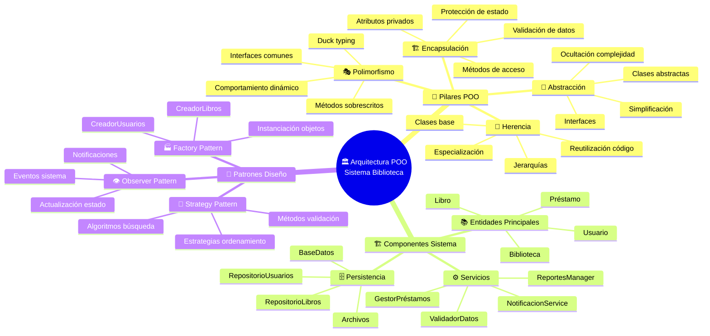
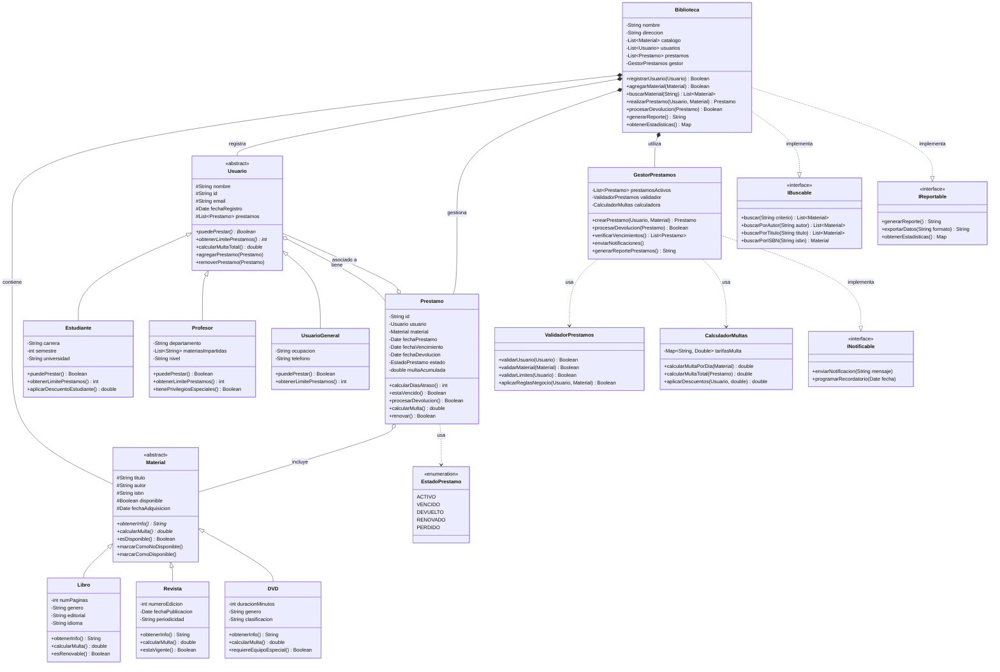
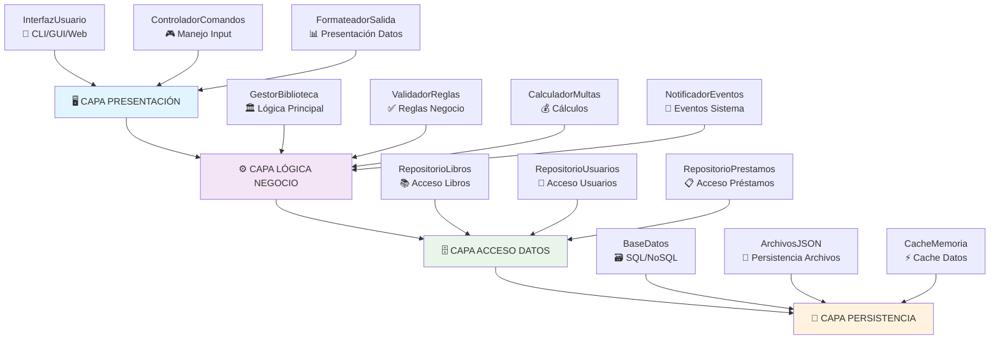

# 🏛️ Arquitectura POO - Sistema de Gestión de Biblioteca

## 📊 Mapa Conceptual de la Arquitectura



---

## 🏛️ Diagrama de Clases - Sistema Biblioteca



---

## 🔧 Implementación de los Pilares POO

### 🏗️ **1. ENCAPSULACIÓN**

```python
class Libro:
    def __init__(self, titulo, autor, isbn):
        self._titulo = titulo           # Protegido
        self._autor = autor            # Protegido
        self.__isbn = isbn             # Privado
        self.__disponible = True       # Privado
        self.__fecha_adquisicion = datetime.now()
    
    # Getters y Setters
    @property
    def titulo(self):
        return self._titulo
    
    @property
    def disponible(self):
        return self.__disponible
    
    def _marcar_no_disponible(self):   # Método protegido
        """Solo accesible desde la clase y sus hijas"""
        self.__disponible = False
    
    def __calcular_valor_libro(self):  # Método privado
        """Método interno para cálculos internos"""
        return len(self._titulo) * 10
```

### 🧬 **2. HERENCIA**

```python
class Material:  # Clase base abstracta
    def __init__(self, titulo, autor):
        self.titulo = titulo
        self.autor = autor
        self.disponible = True
    
    def obtener_info(self):
        """Método que debe ser sobrescrito"""
        raise NotImplementedError
    
    def marcar_prestado(self):
        """Método común para todos los materiales"""
        self.disponible = False

class Libro(Material):  # Herencia simple
    def __init__(self, titulo, autor, isbn, paginas):
        super().__init__(titulo, autor)  # Llamada al constructor padre
        self.isbn = isbn
        self.paginas = paginas
    
    def obtener_info(self):  # Sobrescritura del método padre
        return f"Libro: {self.titulo} - {self.autor} (ISBN: {self.isbn})"

class LibroDigital(Libro):  # Herencia multinivel
    def __init__(self, titulo, autor, isbn, paginas, formato, tamaño_mb):
        super().__init__(titulo, autor, isbn, paginas)
        self.formato = formato
        self.tamaño_mb = tamaño_mb
    
    def obtener_info(self):
        info_base = super().obtener_info()
        return f"{info_base} - Digital ({self.formato}, {self.tamaño_mb}MB)"
```

### 🎭 **3. POLIMORFISMO**

```python
class SistemaBiblioteca:
    def procesar_materiales(self, materiales):
        """Un método, múltiples comportamientos"""
        for material in materiales:
            # Polimorfismo: cada material responde diferente
            print(material.obtener_info())           # Método común
            print(f"Multa por día: ${material.calcular_multa()}")  # Comportamiento específico
    
    def notificar_usuarios(self, usuarios):
        """Polimorfismo con diferentes tipos de usuario"""
        for usuario in usuarios:
            # Cada tipo de usuario maneja las notificaciones diferente
            usuario.recibir_notificacion("Recordatorio de devolución")

# Uso del polimorfismo
materiales = [
    Libro("Python POO", "Autor1", "123", 200),
    Revista("Tech Today", "Editor1", "456"),
    DVD("Tutorial Python", "Instructor1", 120)
]

sistema = SistemaBiblioteca()
sistema.procesar_materiales(materiales)  # Cada uno se comporta diferente
```

### 🎨 **4. ABSTRACCIÓN**

```python
from abc import ABC, abstractmethod

class Reportable(ABC):  # Clase abstracta
    """Interfaz para objetos que pueden generar reportes"""
    
    @abstractmethod
    def generar_reporte(self):
        """Método abstracto que debe implementarse"""
        pass
    
    @abstractmethod
    def exportar_datos(self, formato):
        """Método abstracto para exportación"""
        pass
    
    def mostrar_estadisticas(self):  # Método concreto común
        """Método común para todas las implementaciones"""
        print("=== ESTADÍSTICAS ===")
        print(self.generar_reporte())

class Biblioteca(Reportable):  # Implementa la abstracción
    def __init__(self):
        self.materiales = []
        self.usuarios = []
        self.prestamos = []
    
    def generar_reporte(self):  # Implementación obligatoria
        total_materiales = len(self.materiales)
        total_usuarios = len(self.usuarios)
        prestamos_activos = len([p for p in self.prestamos if p.activo])
        
        return f"""
        📊 REPORTE BIBLIOTECA
        =====================
        📚 Total Materiales: {total_materiales}
        👥 Total Usuarios: {total_usuarios}
        📋 Préstamos Activos: {prestamos_activos}
        """
    
    def exportar_datos(self, formato="JSON"):  # Implementación obligatoria
        if formato.upper() == "JSON":
            return json.dumps({
                "materiales": len(self.materiales),
                "usuarios": len(self.usuarios),
                "prestamos": len(self.prestamos)
            })
        elif formato.upper() == "CSV":
            return "Tipo,Cantidad\nMateriales,{}\nUsuarios,{}\nPréstamos,{}".format(
                len(self.materiales), len(self.usuarios), len(self.prestamos)
            )
```

---

## 🏗️ Arquitectura por Capas



---

## 🎯 Patrones de Diseño Aplicados

### 🏭 **Factory Pattern**

```python
class CreadorMaterial:
    """Factory para crear diferentes tipos de materiales"""
    
    @staticmethod
    def crear_material(tipo, **kwargs):
        if tipo.lower() == "libro":
            return Libro(kwargs['titulo'], kwargs['autor'], 
                        kwargs['isbn'], kwargs['paginas'])
        elif tipo.lower() == "revista":
            return Revista(kwargs['titulo'], kwargs['autor'], 
                          kwargs['numero_edicion'])
        elif tipo.lower() == "dvd":
            return DVD(kwargs['titulo'], kwargs['autor'], 
                      kwargs['duracion'])
        else:
            raise ValueError(f"Tipo de material '{tipo}' no soportado")

# Uso del Factory
material1 = CreadorMaterial.crear_material("libro", 
    titulo="Python Avanzado", autor="Experto", isbn="789", paginas=300)
```

### 👁️ **Observer Pattern**

```python
class EventoSistema:
    """Observable para eventos de la biblioteca"""
    
    def __init__(self):
        self._observadores = []
    
    def agregar_observador(self, observador):
        self._observadores.append(observador)
    
    def notificar_observadores(self, evento, datos):
        for observador in self._observadores:
            observador.actualizar(evento, datos)

class NotificadorEmail:
    """Observer que envía emails"""
    
    def actualizar(self, evento, datos):
        if evento == "prestamo_vencido":
            self.enviar_email_vencimiento(datos['usuario'], datos['libro'])
        elif evento == "nuevo_libro":
            self.enviar_email_nuevo_libro(datos['libro'])
```

### 🎯 **Strategy Pattern**

```python
class EstrategiaBusqueda:
    """Estrategia base para búsquedas"""
    
    def buscar(self, criterio, catalogo):
        raise NotImplementedError

class BusquedaPorTitulo(EstrategiaBusqueda):
    def buscar(self, criterio, catalogo):
        return [libro for libro in catalogo 
                if criterio.lower() in libro.titulo.lower()]

class BusquedaPorAutor(EstrategiaBusqueda):
    def buscar(self, criterio, catalogo):
        return [libro for libro in catalogo 
                if criterio.lower() in libro.autor.lower()]

class BuscadorLibros:
    def __init__(self):
        self._estrategia = BusquedaPorTitulo()
    
    def cambiar_estrategia(self, estrategia):
        self._estrategia = estrategia
    
    def buscar(self, criterio, catalogo):
        return self._estrategia.buscar(criterio, catalogo)
```

---

## 📈 Métricas de Calidad POO

| 🎯 **Métrica** | ✅ **Buena Práctica** | ❌ **Problema** |
|:---|:---|:---|
| **Cohesión** | Clase con responsabilidad única | Clase que hace demasiadas cosas |
| **Acoplamiento** | Dependencias mínimas y bien definidas | Clases muy interdependientes |
| **Encapsulación** | Atributos privados con métodos de acceso | Todos los atributos públicos |
| **Reutilización** | Herencia y composición apropiadas | Código duplicado |
| **Extensibilidad** | Fácil agregar nuevas funcionalidades | Modificar código existente |
| **Mantenibilidad** | Código legible y bien estructurado | Código espagueti |

---

## 🧪 Testing de la Arquitectura

```python
import unittest
from unittest.mock import Mock, patch

class TestArquitecturaBiblioteca(unittest.TestCase):
    
    def setUp(self):
        """Configuración inicial para cada test"""
        self.biblioteca = Biblioteca()
        self.usuario = Estudiante("Ana García", "EST001", "Ingeniería")
        self.libro = Libro("Python POO", "Experto", "12345", 200)
    
    def test_encapsulacion_libro(self):
        """Verifica que la encapsulación funcione correctamente"""
        # No se puede acceder directamente al ISBN privado
        with self.assertRaises(AttributeError):
            _ = self.libro.__isbn
    
    def test_herencia_usuario_estudiante(self):
        """Verifica que la herencia funcione correctamente"""
        self.assertIsInstance(self.usuario, Usuario)
        self.assertTrue(self.usuario.puedePrestar())
        self.assertEqual(self.usuario.obtenerLimitePrestamos(), 3)
    
    def test_polimorfismo_materiales(self):
        """Verifica que el polimorfismo funcione correctamente"""
        materiales = [
            Libro("Test Book", "Author", "123", 100),
            Revista("Test Magazine", "Editor", "456"),
            DVD("Test Movie", "Director", 90)
        ]
        
        # Todos deben responder al mismo método pero diferente
        for material in materiales:
            info = material.obtenerInfo()
            self.assertIsInstance(info, str)
            self.assertIn("Test", info)
    
    @patch('datetime.datetime')
    def test_calculo_multas(self, mock_datetime):
        """Test para verificar cálculo de multas"""
        # Mock de fecha para testing
        mock_datetime.now.return_value = datetime(2024, 1, 15)
        
        prestamo = Prestamo(self.usuario, self.libro)
        prestamo.fechaVencimiento = datetime(2024, 1, 10)  # 5 días de atraso
        
        multa = prestamo.calcularMulta()
        self.assertEqual(multa, 25.0)  # 5 días * 5 pesos por día
```

---

Este mapa conceptual y diagramas muestran cómo los pilares de POO se integran en una arquitectura real, proporcionando una guía completa para entender y implementar sistemas orientados a objetos profesionales.
