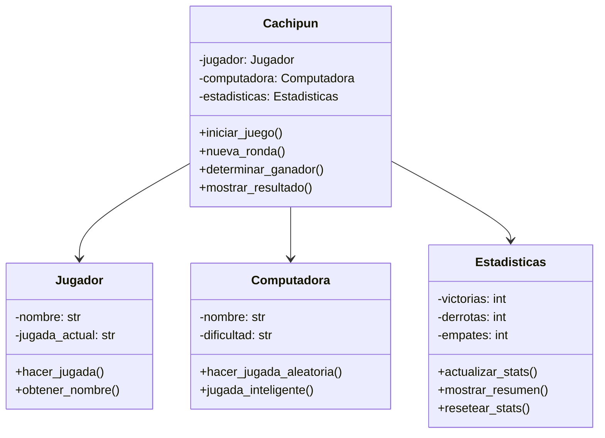

<div align="center">

# 🎮 Cachipún - Piedra, Papel o Tijera 


[](https://python.org)
[](https://es.wikipedia.org/wiki/Piedra,_papel_o_tijera)
[](https://en.wikipedia.org/wiki/Object-oriented_programming)
[](https://github.com/Arkanabytes)


</div>

## 🎯 Descripción del Juego

**Cachipún** (también conocido como Piedra, Papel o Tijera) es un juego clásico implementado en Python usando **Programación Orientada a Objetos**. Este proyecto demuestra conceptos fundamentales de POO como clases, objetos, métodos y encapsulación en un contexto divertido e interactivo.

<div align="center">

### 🎲 Reglas del Juego

| Jugada | Vence a | Pierde contra |
|--------|---------|---------------|
| 🪨 **Piedra** | ✂️ Tijera | 📄 Papel |
| 📄 **Papel** | 🪨 Piedra | ✂️ Tijera |
| ✂️ **Tijera** | 📄 Papel | 🪨 Piedra |

</div>

---

## 📋 Tabla de Contenidos

- [🚀 Características](#-características)
- [📁 Estructura del Proyecto](#-estructura-del-proyecto)
- [⚡ Instalación y Ejecución](#-instalación-y-ejecución)
- [🎮 Cómo Jugar](#-cómo-jugar)
- [🏗️ Arquitectura POO](#️-arquitectura-poo)
- [📸 Screenshots](#-screenshots)
- [🛠️ Tecnologías](#️-tecnologías)
- [🔮 Futuras Mejoras](#-futuras-mejoras)

---

## 🚀 Características

<div align="center">

### ✨ Funcionalidades Principales


</div>

- **🎮 Interfaz Interactiva**: Menús coloridos y fáciles de usar
- **🤖 Oponente IA**: Computadora con jugadas aleatorias inteligentes
- **📊 Sistema de Puntuación**: Lleva el registro de victorias, derrotas y empates
- **🎯 Validación de Jugadas**: Control de entradas del usuario
- **🔄 Juego Continuo**: Rondas múltiples hasta que decidas salir
- **🎨 Emojis y Colores**: Experiencia visual atractiva
- **📈 Estadísticas Detalladas**: Historial completo de partidas

---

## 📁 Estructura del Proyecto

```
📂 Juego_Cachipun/
├── 📜 README.md
├── 🐍 main.py                 # Archivo principal del juego
├── 🐍 cachipun.py             # Clase principal del juego
├── 🐍 jugador.py              # Clase Jugador
├── 🐍 computadora.py          # Clase Computadora (IA)
├── 🐍 estadisticas.py         # Clase para manejar stats
├── 📂 utils/
│   ├── 🐍 __init__.py
│   ├── 🐍 colores.py          # Colores para la terminal
│   ├── 🐍 validaciones.py     # Funciones de validación
│   └── 🐍 helpers.py          # Funciones auxiliares
├── 📂 tests/
│   ├── 🧪 test_cachipun.py
│   ├── 🧪 test_jugador.py
│   └── 🧪 test_validaciones.py
└── 📂 docs/
    ├── 📄 reglas.md
    └── 📄 arquitectura.md
```

---

## ⚡ Instalación y Ejecución

### 🖥️ Prerrequisitos

<div align="center">


</div>

### 🚀 Pasos para Ejecutar

```bash
# 📥 1. Clonar el repositorio
git clone https://github.com/Arkanabytes/POO-Python.git

# 📂 2. Navegar al directorio del juego
cd POO-Python/Programacion/Juego_Cachipun

# 🐍 3. Ejecutar el juego
python main.py

# 🎮 4. ¡A jugar! Sigue las instrucciones en pantalla
```

### 🔧 Instalación Alternativa

```bash
# 📦 Opción con virtual environment (recomendado)
python -m venv cachipun_env
source cachipun_env/bin/activate  # Linux/macOS
# cachipun_env\Scripts\activate    # Windows

pip install -r requirements.txt  # Si existe
python main.py
```

---

## 🎮 Cómo Jugar

### 🎯 Instrucciones Paso a Paso

1. **🚀 Inicia el juego** ejecutando `python main.py`
2. **✍️ Ingresa tu nombre** cuando se te solicite
3. **🎲 Elige tu jugada:**
   - `1` o `piedra` para 🪨 Piedra
   - `2` o `papel` para 📄 Papel  
   - `3` o `tijera` para ✂️ Tijera
4. **🤖 La computadora** hará su jugada automáticamente
5. **🏆 Ve el resultado** y las estadísticas actualizadas
6. **🔄 Continúa jugando** o sal del juego cuando quieras

### 💻 Ejemplo de Partida

```
🎮 =================== CACHIPÚN ===================

👤 Jugador: Arkanabytes
🤖 Computadora: Bot-Python

📊 ESTADÍSTICAS ACTUALES:
   🏆 Victorias: 2  |  💀 Derrotas: 1  |  🤝 Empates: 1

🎯 Elige tu jugada:
   1️⃣ 🪨 Piedra
   2️⃣ 📄 Papel  
   3️⃣ ✂️ Tijera
   ❌ 'salir' para terminar

➤ Tu elección: 1

🪨 Arkanabytes eligió: PIEDRA
✂️ Bot-Python eligió: TIJERA

🎉 ¡GANASTE! 🪨 Piedra vence a ✂️ Tijera

📈 ESTADÍSTICAS ACTUALIZADAS:
   🏆 Victorias: 3  |  💀 Derrotas: 1  |  🤝 Empates: 1
```

---

## 🏗️ Arquitectura POO

### 🔧 Clases Principales

<div align="center">



</div>

### 🎯 Conceptos POO Implementados

| Concepto | Implementación | Ejemplo |
|----------|----------------|---------|
| **🏗️ Encapsulación** | Atributos privados y métodos públicos | `_nombre`, `obtener_nombre()` |
| **🔄 Herencia** | Clases especializadas | `JugadorHumano` ← `Jugador` |
| **🎭 Polimorfismo** | Métodos con mismo nombre, diferente comportamiento | `hacer_jugada()` |
| **🎨 Abstracción** | Ocultar complejidad interna | `determinar_ganador()` |

---

## 📸 Screenshots

<div align="center">

### 🏠 Pantalla de Inicio
```
🎮 ========================================
    🪨 📄 ✂️  CACHIPÚN PYTHON POO  ✂️ 📄 🪨
🎮 ========================================

👋 ¡Bienvenido al juego más clásico!
🎯 Demuestra tu suerte contra la computadora

✍️ Ingresa tu nombre: Arkanabytes
🤖 Tu oponente será: Bot-Python

🚀 ¡Comenzemos a jugar!
```

### 🎲 Durante el Juego
```
🎯 RONDA #5

🪨 Arkanabytes: PIEDRA    vs    📄 Bot-Python: PAPEL

😅 ¡Perdiste! 📄 Papel envuelve a 🪨 Piedra

📊 Score: 🏆 2  💀 2  🤝 1
```

### 🏆 Final del Juego
```
🎊 =============== RESUMEN FINAL ===============

👤 Jugador: Arkanabytes
🎮 Partidas jugadas: 10

📈 ESTADÍSTICAS FINALES:
   🏆 Victorias: 4 (40%)
   💀 Derrotas: 3 (30%)
   🤝 Empates: 3 (30%)

🎯 Tu jugada favorita: 🪨 Piedra (5 veces)
🤖 La computadora prefirió: ✂️ Tijera (4 veces)

🌟 ¡Gracias por jugar! ¡Vuelve pronto!
```

</div>

---

## 🛠️ Tecnologías

<div align="center">


</div>

### 📦 Stack Tecnológico

- **🐍 Python 3.8+** - Lenguaje principal
- **🎨 Colorama** - Colores en terminal (opcional)
- **🧪 pytest** - Testing framework
- **📊 Random** - Generación de jugadas aleatorias
- **⏰ Time** - Delays y animaciones
- **🔧 OS** - Limpieza de terminal multiplataforma

---

## 🔮 Futuras Mejoras

### 🚀 Roadmap v2.0

<div align="center">

[](https://tkinter.org)
[](https://socket.io)
[](https://scikit-learn.org)
[](https://sqlite.org)

</div>

- **🎨 GUI con Tkinter**: Interfaz gráfica moderna
- **🧠 IA Inteligente**: Algoritmos de machine learning
- **🌐 Modo Online**: Jugar contra otros jugadores
- **💾 Persistencia**: Guardar estadísticas en base de datos
- **🏆 Sistema de Rangos**: Niveles y achievements
- **🎵 Efectos de Sonido**: Audio feedback
- **📱 Versión Mobile**: App para Android/iOS
- **🎮 Torneos**: Competencias entre jugadores

### 🔧 Posibles Extensiones

```python
# 🎯 Variantes del juego
class CachipunExtendido(Cachipun):
    """Versión con Lagarto y Spock"""
    jugadas = ['piedra', 'papel', 'tijera', 'lagarto', 'spock']

# 🤖 IA con aprendizaje
class IAInteligente(Computadora):
    """IA que aprende de patrones del jugador"""
    def __init__(self):
        self.historial_jugador = []
        self.predictor = MLPredictor()
```

---

<div align="center">


## 💫 Conecta Conmigo

<p align="center">
  <a href="https://linkedin.com/in/tu-perfil" target="_blank">
    
  </a>
  <a href="https://tu-sitio-web.com" target="_blank">
    
  </a>
  <a href="https://wa.me/tu-numero" target="_blank">
    
  </a>
  <a href="mailto:tu-email@ejemplo.com" target="_blank">
    
  </a>
  <a href="https://github.com/Arkanabytes" target="_blank">
    
  </a>
</p>


### 🎮 *"Un juego simple, pero con gran arquitectura de código"* 🎮


**¡Que gane el mejor! 🪨📄✂️**

</div>
