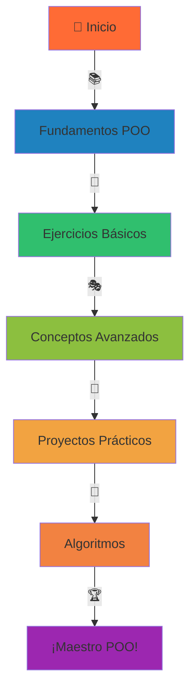

# 🐍✨ POO-Python: Programación Orientada a Objetos

<div align="center">


<h3>
  
  ¡Bienvenido al mundo de la Programación Orientada a Objetos!
  
</h3>

*Repositorio educativo dedicado al aprendizaje de POO con Python y desarrollo de algoritmos fundamentales*


[🚀 Comenzar](#-comenzar) • [📚 Contenido](#-contenido-del-repositorio) • [🎯 Objetivos](#-objetivos-de-aprendizaje) • [🤝 Contribuir](#-cómo-contribuir)

</div>

---

<div align="center">

## 🎬 Demostración en Vivo


### 💻 ¿Qué verás en acción?

</div>

<table align="center">
<tr>
<td align="center">
  
  <br><strong>Clases y Objetos</strong>
</td>
<td align="center">
  
  <br><strong>Herencia</strong>
</td>
<td align="center">
  
  <br><strong>Polimorfismo</strong>
</td>
<td align="center">
  
  <br><strong>Encapsulación</strong>
</td>
</tr>
</table>

---

## 📋 Descripción

<div align="center">

</div>

Este repositorio contiene una colección completa de ejercicios, proyectos y ejemplos prácticos para aprender **Programación Orientada a Objetos (POO)** utilizando Python y conceptos fundamentales de programación desarrollados inicialmente en PSeInt.

<details>
<summary>🎯 <strong>¿Qué encontrarás aquí?</strong> (Click para expandir)</summary>

<br>

<div align="center">

| 🏗️ **Fundamentos** | 🔬 **Algoritmos** | 🚀 **Proyectos** | 🎯 **Ejercicios** |
|:---:|:---:|:---:|:---:|
|  |  |  |  |
| POO Esencial | Implementaciones | Apps Reales | Práctica Progresiva |

</div>

- **🏛️ Fundamentos de POO**: Clases, objetos, herencia, polimorfismo, encapsulación
- **⚡ Algoritmos clásicos**: Implementaciones en Python de algoritmos fundamentales
- **🎯 Proyectos prácticos**: Aplicaciones reales que demuestran conceptos de POO
- **📈 Ejercicios progresivos**: Desde conceptos básicos hasta implementaciones avanzadas
- **📝 Pseudocódigo**: Algoritmos iniciales desarrollados en PSeInt para comprensión conceptual

</details>

---

<div align="center">

## 🗂️ Estructura del Repositorio


</div>

```
🌳 POO-Python/
├── 📁 Pseint/                    # 🔵 Algoritmos en pseudocódigo
│   ├── 📄 algoritmos_basicos.psc      ⚡ Fundamentos
│   ├── 📄 estructuras_control.psc     🔄 Bucles y condiciones
│   └── 📄 funciones_procedimientos.psc 🔧 Modularización
├── 📁 Fundamentos/               # 🟢 POO Esencial
│   ├── 📄 01_clases_objetos.py        🏗️ Construcción básica
│   ├── 📄 02_herencia.py              👨‍👩‍👧‍👦 Relaciones de clase
│   ├── 📄 03_polimorfismo.py          🎭 Múltiples formas
│   └── 📄 04_encapsulacion.py         🔒 Datos protegidos
├── 📁 Proyectos/                 # 🚀 Aplicaciones completas
│   ├── 📁 sistema_biblioteca/          📚 CRUD completo
│   ├── 📁 calculadora_avanzada/        🧮 Matemática POO
│   └── 📁 gestor_estudiantes/          🎓 Administración educativa
├── 📁 Algoritmos/                # 🧠 Lógica pura
│   ├── 📄 ordenamiento.py             📊 Sorting algorithms
│   ├── 📄 busqueda.py                 🔍 Search algorithms
│   └── 📄 estructuras_datos.py        📦 Data structures
├── 📁 Ejercicios/                # 💪 Práctica dirigida
│   ├── 📁 nivel_basico/               🥇 Para comenzar
│   ├── 📁 nivel_intermedio/           🥈 Desarrollando habilidades
│   └── 📁 nivel_avanzado/             🥉 Dominando conceptos
└── 📄 README.md                  # 📖 ¡Estás aquí!
```

<div align="center">

</div>

---

## 📚 Contenido del Repositorio

<div align="center">

### 🎨 Mapa de Aprendizaje Visual


</div>

### 🔤 Fundamentos de POO

<table align="center">
<thead>
<tr>
<th>🎯 Concepto</th>
<th>📝 Descripción</th>
<th>📁 Archivo</th>
<th>🎬 Demo</th>
</tr>
</thead>
<tbody>
<tr>
<td><strong>Clases y Objetos</strong></td>
<td>Definición y creación de clases, instanciación de objetos</td>
<td><code>fundamentos/01_clases_objetos.py</code></td>
<td></td>
</tr>
<tr>
<td><strong>Herencia</strong></td>
<td>Herencia simple y múltiple, super()</td>
<td><code>fundamentos/02_herencia.py</code></td>
<td></td>
</tr>
<tr>
<td><strong>Polimorfismo</strong></td>
<td>Sobrecarga y sobreescritura de métodos</td>
<td><code>fundamentos/03_polimorfismo.py</code></td>
<td></td>
</tr>
<tr>
<td><strong>Encapsulación</strong></td>
<td>Atributos privados, getters y setters</td>
<td><code>fundamentos/04_encapsulacion.py</code></td>
<td></td>
</tr>
</tbody>
</table>

---

<div align="center">

### 🏗️ Proyectos Destacados


</div>

<details>
<summary>📚 <strong>Sistema de Biblioteca</strong> - ¡Haz click para ver el código!</summary>

```python
# ✨ Ejemplo de implementación mágica
class Libro:
    def __init__(self, titulo, autor, isbn):
        self._titulo = titulo        # 📖 Título del libro
        self._autor = autor          # ✍️ Autor
        self._isbn = isbn            # 🔢 ISBN único  
        self._disponible = True      # ✅ Estado disponible
        self._prestamos = []         # 📋 Historial
    
    def prestar(self, usuario):
        """🎯 Prestar libro con validaciones"""
        if self._disponible:
            self._disponible = False
            self._prestamos.append({
                'usuario': usuario,
                'fecha': datetime.now(),
                'estado': 'prestado'
            })
            return f"📚 Libro '{self._titulo}' prestado a {usuario} ✅"
        return "❌ El libro no está disponible"
    
    def devolver(self):
        """🔄 Devolver libro al sistema"""
        if not self._disponible:
            self._disponible = True
            return f"✅ Libro '{self._titulo}' devuelto exitosamente"
        return "⚠️ El libro ya estaba disponible"

# 🎬 Uso en acción
mi_biblioteca = Biblioteca()
libro_python = Libro("Python POO", "Arkanabytes", "978-123-456")
resultado = libro_python.prestar("Estudiante Enthusiasta")
print(resultado)  # 📚 Libro 'Python POO' prestado a Estudiante Enthusiasta ✅
```

<div align="center">

</div>

</details>

<details>
<summary>🧮 <strong>Calculadora Avanzada</strong> - ¡Matemática POO en acción!</summary>

```python
class CalculadoraAvanzada:
    """🔢 Calculadora con superpoderes POO"""
    
    def __init__(self):
        self.historial = []          # 📊 Memoria de cálculos
        self.modo = "básico"         # ⚙️ Modo de operación
        
    def calcular(self, operacion, *args):
        """⚡ Motor de cálculo inteligente"""
        try:
            resultado = self._ejecutar_operacion(operacion, *args)
            self._guardar_historial(operacion, args, resultado)
            return resultado
        except Exception as e:
            return f"❌ Error: {e}"
    
    def _ejecutar_operacion(self, op, *args):
        """🎯 Ejecutor de operaciones polimórfico"""
        operaciones = {
            'suma': lambda x, y: x + y,
            'factorial': lambda n: math.factorial(n),
            'potencia': lambda base, exp: base ** exp,
            'raiz': lambda n: math.sqrt(n)
        }
        return operaciones[op](*args)

# 🚀 Demo en vivo
calc = CalculadoraAvanzada()
print(calc.calcular('potencia', 2, 10))  # 🔥 1024
```

<div align="center">

</div>

</details>

<details>
<summary>👨‍🎓 <strong>Gestor de Estudiantes</strong> - ¡Administración educativa!</summary>

```python
class EstudianteGestor:
    """🎓 Sistema completo de gestión estudiantil"""
    
    def __init__(self):
        self.estudiantes = {}        # 👥 Base de datos
        self.cursos = []            # 📚 Cursos disponibles
        self.estadisticas = {}      # 📊 Métricas en tiempo real
    
    def agregar_estudiante(self, estudiante):
        """✨ Incorporar nuevo estudiante al sistema"""
        self.estudiantes[estudiante.id] = estudiante
        self._actualizar_estadisticas()
        return f"🎉 {estudiante.nombre} agregado exitosamente!"
    
    def generar_reporte_completo(self):
        """📋 Reporte detallado con visualizaciones"""
        reporte = {
            'total_estudiantes': len(self.estudiantes),
            'promedio_general': self._calcular_promedio_general(),
            'top_estudiantes': self._obtener_top_estudiantes(5),
            'distribución_notas': self._generar_histograma_notas()
        }
        return reporte

# 🎬 Sistema en funcionamiento
gestor = EstudianteGestor()
estudiante1 = Estudiante("Ana García", "2024001", [9.5, 8.7, 9.2])
print(gestor.agregar_estudiante(estudiante1))
```

<div align="center">

</div>

</details>

---

<div align="center">

### 🧮 Algoritmos Implementados


</div>

| 🎯 Categoría | 🔧 Algoritmos | 📈 Complejidad | 🎬 Visualización |
|:---:|:---:|:---:|:---:|
| **🔄 Ordenamiento** | Bubble, Quick, Merge Sort | O(n²), O(n log n) |  |
| **🔍 Búsqueda** | Lineal, Binaria | O(n), O(log n) |  |
| **🏗️ Estructuras** | Listas, Pilas, Colas | O(1), O(n) |  |
| **🔄 Recursividad** | Factorial, Fibonacci, Torres de Hanoi | Varía |  |

---

## 🎯 Objetivos de Aprendizaje

<div align="center">


</div>

Al completar este repositorio, serás capaz de:

<table align="center">
<tr>
<td align="center">
  <br>
  <strong>🧠 Comprender</strong><br>
  Los principios fundamentales de la POO
</td>
<td align="center">
  <br>
  <strong>🏗️ Implementar</strong><br>
  Clases y objetos en Python efectivamente
</td>
<td align="center">
  <br>
  <strong>🎭 Aplicar</strong><br>
  Herencia, polimorfismo y encapsulación
</td>
</tr>
<tr>
<td align="center">
  <br>
  <strong>🚀 Desarrollar</strong><br>
  Proyectos completos utilizando POO
</td>
<td align="center">
  <br>
  <strong>🧩 Resolver</strong><br>
  Problemas complejos con algoritmos
</td>
<td align="center">
  <br>
  <strong>🔄 Traducir</strong><br>
  Pseudocódigo de PSeInt a Python
</td>
</tr>
</table>

---

<div align="center">

## 🚀 Comenzar


</div>

### 📋 Prerrequisitos

<div align="center">

| 🛠️ Herramienta | 📋 Versión | 📝 Descripción | ⚡ Estado |
|:---:|:---:|:---:|:---:|
| **Python** | 3.8+ | Lenguaje principal |  |
| **PSeInt** | Cualquiera | Para pseudocódigo (opcional) |  |
| **IDE** | VS Code/PyCharm | Editor recomendado |  |
| **Git** | 2.0+ | Control de versiones |  |

</div>

### ⚡ Instalación Súper Rápida

<details>
<summary>🚀 <strong>Método Rápido (1 minuto)</strong> - ¡Click aquí!</summary>

```bash
# 🎯 Paso 1: Clonar el repositorio mágico
git clone https://github.com/Arkanabytes/POO-Python.git

# 📁 Paso 2: Navegar al directorio
cd POO-Python

# 🐍 Paso 3: Crear entorno virtual (recomendado)
python -m venv venv

# ⚡ Paso 4: Activar entorno virtual
# En Windows:
venv\Scripts\activate
# En macOS/Linux:
source venv/bin/activate

# 🎉 Paso 5: ¡Ejecutar primer ejemplo!
python fundamentos/01_clases_objetos.py

# 🎊 ¡Listo! Ya estás programando POO
```

<div align="center">


**✨ ¡Instalación completada con éxito! ✨**
</div>

</details>

<details>
<summary>📚 <strong>Instalación Detallada</strong> - Para principiantes</summary>

### 🎯 Guía Paso a Paso Ilustrada

#### 1️⃣ **Clonación del Repositorio**
```bash
git clone https://github.com/Arkanabytes/POO-Python.git
cd POO-Python
```
<div align="center">

</div>

#### 2️⃣ **Configuración del Entorno**
```bash
# Crear entorno virtual
python -m venv mi_entorno_poo

# Activar (Windows)
mi_entorno_poo\Scripts\activate

# Activar (macOS/Linux)  
source mi_entorno_poo/bin/activate
```

#### 3️⃣ **Verificación de Instalación**
```bash
# Verificar Python
python --version

# Ejecutar test rápido
python -c "print('🎉 POO-Python listo para usar!')"
```

<div align="center">


**🎊 ¡Todo configurado perfectamente! 🎊**
</div>

</details>

---

### 🎓 Ruta de Aprendizaje Sugerida

<div align="center">


</div>



<table align="center">
<tr>
<th>🎯 Nivel</th>
<th>📚 Contenido</th>
<th>⏱️ Duración</th>
<th>🏆 Logros</th>
</tr>
<tr>
<td><strong>1️⃣ Fundamentos</strong></td>
<td>Clases, Objetos, Atributos</td>
<td>2-3 días</td>
<td>🥇 Conceptos básicos</td>
</tr>
<tr>
<td><strong>2️⃣ Práctica Básica</strong></td>
<td>Ejercicios simples</td>
<td>3-5 días</td>
<td>🥈 Primera aplicación</td>
</tr>
<tr>
<td><strong>3️⃣ Conceptos Avanzados</strong></td>
<td>Herencia, Polimorfismo</td>
<td>5-7 días</td>
<td>🥉 POO intermedio</td>
</tr>
<tr>
<td><strong>4️⃣ Proyectos</strong></td>
<td>Aplicaciones completas</td>
<td>1-2 semanas</td>
<td>🚀 Desarrollador POO</td>
</tr>
<tr>
<td><strong>5️⃣ Algoritmos</strong></td>
<td>Estructuras de datos</td>
<td>1-2 semanas</td>
<td>🧠 Experto en lógica</td>
</tr>
<tr>
<td><strong>6️⃣ Maestría</strong></td>
<td>Patrones de diseño</td>
<td>Continuo</td>
<td>🏆 Maestro POO</td>
</tr>
</table>

---

## 📖 Ejemplos de Uso

<div align="center">


</div>

### 🎬 Ejemplo 1: Clase Básica con Superpoderes

<details>
<summary>🚗 <strong>Vehículo Inteligente</strong> - ¡Haz click para ver la magia!</summary>

```python
# 🎯 Clase Vehículo con funcionalidades avanzadas
class Vehiculo:
    """🚗 Vehículo inteligente con IA incorporada"""
    
    # 🏭 Variables de clase (compartidas)
    vehiculos_creados = 0
    tipos_combustible = ['gasolina', 'diesel', 'eléctrico', 'híbrido']
    
    def __init__(self, marca, modelo, año, tipo_combustible='gasolina'):
        # 🏷️ Atributos de instancia
        self.marca = marca
        self.modelo = modelo 
        se
