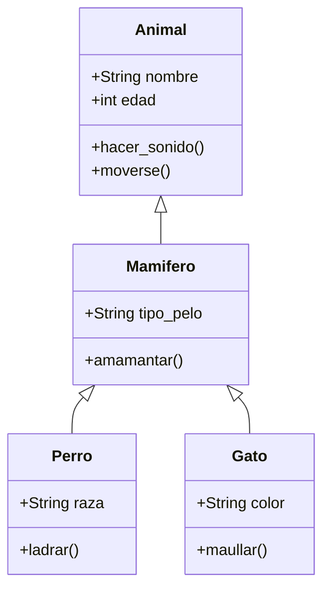

# 🐍 Módulo Programación - POO Python

<div align="center">


**Aprende Programación Orientada a Objetos de forma práctica e interactiva**

[🚀 **Ver Versión Animada**](https://arkanabytes.github.io/POO-Python/animated-readme.html) • [📚 **Explorar Código**](https://github.com/Arkanabytes/POO-Python/tree/Pseint/Programacion) • [💬 **Discusiones**](https://github.com/Arkanabytes/POO-Python/discussions)

</div>

---

## 📍 Información del Repositorio

| 🌿 **Branch** | 📂 **Ruta** | 🔗 **Enlace Directo** |
|:---:|:---:|:---:|
| `Pseint` | `/Programacion` | [Ver en GitHub →](https://github.com/Arkanabytes/POO-Python/tree/Pseint/Programacion) |

---

## 🎯 Objetivos del Módulo

<table>
<tr>
<td align="center">

<br><strong>4 Pilares de POO</strong>
<br><sub>Fundamentos sólidos</sub>
</td>
<td align="center">

<br><strong>15+ Ejercicios</strong>
<br><sub>Práctica intensiva</sub>
</td>
<td align="center">

<br><strong>100% Práctico</strong>
<br><sub>Aprendizaje activo</sub>
</td>
</tr>
</table>

---

## 📚 Conceptos Fundamentales

<div align="center">

### 🏗️ **Encapsulación**
*Protege y organiza tus datos*

```python
class CuentaBancaria:
    def __init__(self, titular, saldo_inicial=0):
        self.titular = titular
        self.__saldo = saldo_inicial  # Atributo privado
    
    def depositar(self, cantidad):
        if cantidad > 0:
            self.__saldo += cantidad
            return f"Depósito exitoso. Saldo: ${self.__saldo}"
```

---

### 🧬 **Herencia**
*Reutiliza y extiende código*

```python
class Vehiculo:
    def __init__(self, marca, modelo):
        self.marca = marca
        self.modelo = modelo
    
    def acelerar(self):
        return "El vehículo está acelerando"

class Coche(Vehiculo):  # Hereda de Vehiculo
    def __init__(self, marca, modelo, puertas):
        super().__init__(marca, modelo)
        self.puertas = puertas
```

---

### 🎭 **Polimorfismo**
*Una interfaz, múltiples formas*

```python
class Animal:
    def hacer_sonido(self):
        pass

class Perro(Animal):
    def hacer_sonido(self):
        return "¡Guau!"

class Gato(Animal):
    def hacer_sonido(self):
        return "¡Miau!"

# Mismo método, diferentes comportamientos
animales = [Perro(), Gato()]
for animal in animales:
    print(animal.hacer_sonido())
```

---

### 🎨 **Abstracción**
*Simplifica la complejidad*

```python
from abc import ABC, abstractmethod

class FiguraGeometrica(ABC):
    @abstractmethod
    def calcular_area(self):
        pass
    
    @abstractmethod
    def calcular_perimetro(self):
        pass

class Rectangulo(FiguraGeometrica):
    def __init__(self, ancho, alto):
        self.ancho = ancho
        self.alto = alto
    
    def calcular_area(self):
        return self.ancho * self.alto
```

</div>

---

## 🚀 Comenzando

### 📋 Prerrequisitos

```bash
# Verifica tu versión de Python
python --version  # Debe ser 3.6 o superior
```

### ⚡ Instalación Rápida

```bash
# 1. Clona el repositorio
git clone https://github.com/Arkanabytes/POO-Python.git

# 2. Cambia al branch correcto
git checkout Pseint

# 3. Navega al módulo de programación
cd POO-Python/Programacion

# 4. (Opcional) Crea un entorno virtual
python -m venv venv
source venv/bin/activate  # En Windows: venv\Scripts\activate

# 5. ¡Comienza a aprender!
python ejemplo_basico.py
```

---

## 📖 Estructura de Aprendizaje

```
📁 Programacion/
├── 🌱 01_Fundamentos/
│   ├── clases_y_objetos.py
│   ├── atributos_metodos.py
│   └── constructor.py
├── 🌿 02_Intermedio/
│   ├── encapsulacion.py
│   ├── herencia.py
│   └── polimorfismo.py
├── 🌳 03_Avanzado/
│   ├── clases_abstractas.py
│   ├── decoradores.py
│   └── patrones_diseno.py
├── 💻 04_Ejercicios/
│   ├── ejercicio_01_biblioteca.py
│   ├── ejercicio_02_tienda.py
│   └── ejercicio_03_juego_rpg.py
└── 🎯 05_Proyectos/
    ├── sistema_gestion/
    ├── calculadora_avanzada/
    └── juego_aventura/
```

---

## 🎓 Ruta de Aprendizaje

<details>
<summary><strong>🌱 Nivel Básico (Semana 1-2)</strong></summary>

- [ ] **Día 1-2**: Clases y objetos fundamentales
- [ ] **Día 3-4**: Atributos y métodos
- [ ] **Día 5-7**: Constructor y destructor
- [ ] **Día 8-10**: Métodos especiales (`__str__`, `__repr__`)
- [ ] **Día 11-14**: Ejercicios prácticos básicos

**🎯 Objetivo**: Crear tu primera clase funcional

</details>

<details>
<summary><strong>🌿 Nivel Intermedio (Semana 3-4)</strong></summary>

- [ ] **Día 15-17**: Encapsulación y modificadores de acceso
- [ ] **Día 18-21**: Herencia simple y múltiple
- [ ] **Día 22-24**: Polimorfismo y sobrecarga
- [ ] **Día 25-28**: Composición vs Herencia

**🎯 Objetivo**: Diseñar jerarquías de clases complejas

</details>

<details>
<summary><strong>🌳 Nivel Avanzado (Semana 5-6)</strong></summary>

- [ ] **Día 29-31**: Clases abstractas e interfaces
- [ ] **Día 32-35**: Decoradores y metaclases
- [ ] **Día 36-38**: Patrones de diseño (Singleton, Factory, Observer)
- [ ] **Día 39-42**: Proyectos integradores

**🎯 Objetivo**: Implementar patrones de diseño profesionales

</details>

---

## 🛠️ Herramientas y Recursos

### 📊 **Visualización de Conceptos**



### 🧪 **Testing y Validación**

```python
# Ejemplo de test unitario
import unittest

class TestClasesBasicas(unittest.TestCase):
    def test_crear_objeto(self):
        estudiante = Estudiante("Ana", 20)
        self.assertEqual(estudiante.nombre, "Ana")
        self.assertEqual(estudiante.edad, 20)
    
    def test_metodo_estudiar(self):
        estudiante = Estudiante("Carlos", 22)
        resultado = estudiante.estudiar("Python")
        self.assertIn("Python", resultado)

if __name__ == '__main__':
    unittest.main()
```

---

## 🎮 Ejercicios Interactivos

### 🏆 **Desafío 1: Sistema de Biblioteca**

<details>
<summary>📖 <strong>Ver Descripción</strong></summary>

Crea un sistema de gestión de biblioteca que incluya:

- **Clase `Libro`**: título, autor, ISBN, disponible
- **Clase `Usuario`**: nombre, ID, libros_prestados
- **Clase `Biblioteca`**: inventario, prestar_libro(), devolver_libro()

**🎯 Conceptos a aplicar**: Encapsulación, composición, manejo de listas

```python
# Tu código aquí
class Libro:
    def __init__(self, titulo, autor, isbn):
        # Implementa la clase
        pass

# Prueba tu implementación
biblioteca = Biblioteca()
libro1 = Libro("Python POO", "Autor Ejemplo", "123456789")
usuario1 = Usuario("Ana García", "U001")
```

</details>

### 🏆 **Desafío 2: Juego RPG**

<details>
<summary>⚔️ <strong>Ver Descripción</strong></summary>

Desarrolla un sistema de juego RPG con:

- **Clase base `Personaje`**: vida, ataque, defensa
- **Clases derivadas**: `Guerrero`, `Mago`, `Arquero`
- **Sistema de combate** con polimorfismo

**🎯 Conceptos a aplicar**: Herencia, polimorfismo, métodos abstractos

</details>

---

## 📈 Progreso del Estudiante

### ✅ **Lista de Verificación**

**Conceptos Básicos:**
- [ ] Puedo crear clases y objetos
- [ ] Entiendo la diferencia entre atributos y métodos
- [ ] Sé usar el constructor `__init__`
- [ ] Puedo implementar métodos especiales

**Conceptos Intermedios:**
- [ ] Aplico encapsulación correctamente
- [ ] Implemento herencia simple
- [ ] Uso polimorfismo en mis proyectos
- [ ] Distingo entre composición y herencia

**Conceptos Avanzados:**
- [ ] Trabajo con clases abstractas
- [ ] Implemento patrones de diseño
- [ ] Uso decoradores en mis clases
- [ ] Diseño arquitecturas orientadas a objetos

---

## 🤝 Contribuir

¿Quieres mejorar este módulo? ¡Genial!

1. **Fork** el repositorio
2. Crea una **rama** para tu feature (`git checkout -b feature/nueva-funcionalidad`)
3. **Commit** tus cambios (`git commit -am 'Añade nueva funcionalidad'`)
4. **Push** a la rama (`git push origin feature/nueva-funcionalidad`)
5. Abre un **Pull Request**

### 📝 **Formas de Contribuir:**

- 🐛 Reportar bugs
- 💡 Sugerir nuevos ejercicios
- 📚 Mejorar documentación
- ✨ Añadir ejemplos prácticos
- 🧪 Crear tests

---

## 🏆 Logros y Reconocimientos

<div align="center">


</div>

---

## 📞 Contacto y Soporte

<div align="center">

**¿Tienes preguntas? ¡Estamos aquí para ayudarte!**

[](https://github.com/Arkanabytes/POO-Python/discussions)
[](https://github.com/Arkanabytes/POO-Python/issues)

</div>

---

## 📄 Licencia

Este proyecto está bajo la Licencia MIT - ver el archivo [LICENSE](LICENSE) para más detalles.

---

<div align="center">

**⭐ Si este proyecto te ayuda, ¡dale una estrella en GitHub! ⭐**

*Hecho con ❤️ por [Arkanabytes](https://github.com/Arkanabytes)*

</div>
