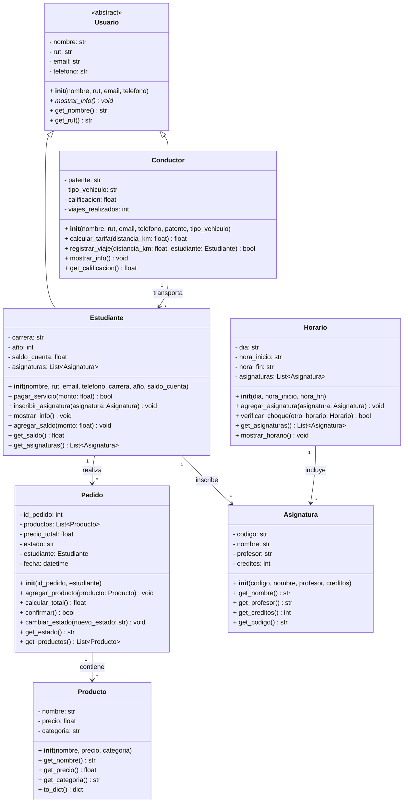
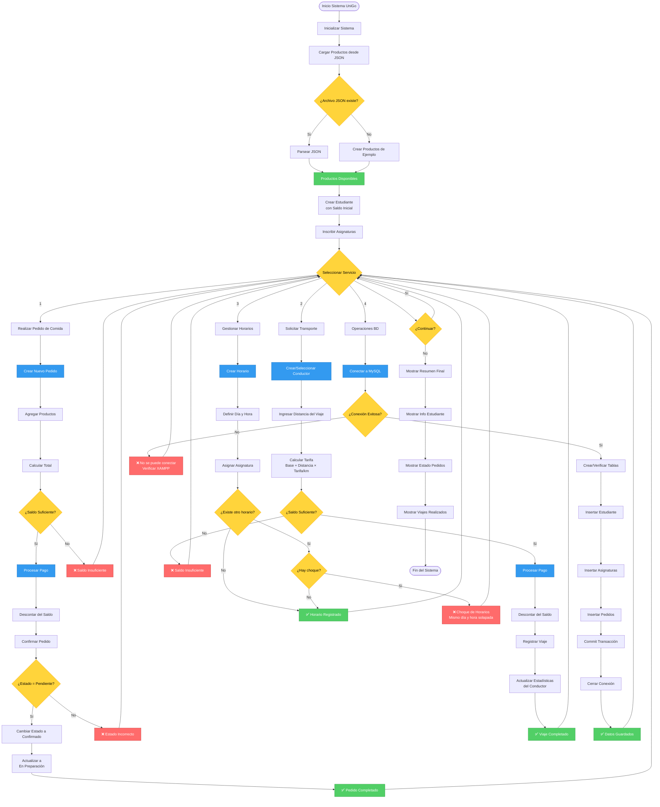

```mermaid
classDiagram
    class Usuario {
        <<abstract>>
        - nombre: str
        - rut: str
        - email: str
        - telefono: str
        + __init__(nombre, rut, email, telefono)
        + mostrar_info()* void
        + get_nombre() str
        + get_rut() str
    }
    
    class Estudiante {
        - carrera: str
        - año: int
        - saldo_cuenta: float
        - asignaturas: List~Asignatura~
        + __init__(nombre, rut, email, telefono, carrera, año, saldo_cuenta)
        + pagar_servicio(monto: float) bool
        + inscribir_asignatura(asignatura: Asignatura) void
        + mostrar_info() void
        + agregar_saldo(monto: float) void
        + get_saldo() float
        + get_asignaturas() List~Asignatura~
    }
    
    class Conductor {
        - patente: str
        - tipo_vehiculo: str
        - calificacion: float
        - viajes_realizados: int
        + __init__(nombre, rut, email, telefono, patente, tipo_vehiculo)
        + calcular_tarifa(distancia_km: float) float
        + registrar_viaje(distancia_km: float, estudiante: Estudiante) bool
        + mostrar_info() void
        + get_calificacion() float
    }
    
    class Producto {
        - nombre: str
        - precio: float
        - categoria: str
        + __init__(nombre, precio, categoria)
        + get_nombre() str
        + get_precio() float
        + get_categoria() str
        + to_dict() dict
    }
    
    class Pedido {
        - id_pedido: int
        - productos: List~Producto~
        - precio_total: float
        - estado: str
        - estudiante: Estudiante
        - fecha: datetime
        + __init__(id_pedido, estudiante)
        + agregar_producto(producto: Producto) void
        + calcular_total() float
        + confirmar() bool
        + cambiar_estado(nuevo_estado: str) void
        + get_estado() str
        + get_productos() List~Producto~
    }
    
    class Asignatura {
        - codigo: str
        - nombre: str
        - profesor: str
        - creditos: int
        + __init__(codigo, nombre, profesor, creditos)
        + get_nombre() str
        + get_profesor() str
        + get_creditos() int
        + get_codigo() str
    }
    
    class Horario {
        - dia: str
        - hora_inicio: str
        - hora_fin: str
        - asignaturas: List~Asignatura~
        + __init__(dia, hora_inicio, hora_fin)
        + agregar_asignatura(asignatura: Asignatura) void
        + verificar_choque(otro_horario: Horario) bool
        + get_asignaturas() List~Asignatura~
        + mostrar_horario() void
    }
    
    Usuario <|-- Estudiante
    Usuario <|-- Conductor
    Estudiante "1" --> "*" Pedido: realiza
    Pedido "1" --> "*" Producto: contiene
    Estudiante "1" --> "*" Asignatura: inscribe
    Horario "1" --> "*" Asignatura: incluye
    Conductor "1" --> "*" Estudiante: transporta

```

```mermaid

flowchart TD
    Start([Inicio Sistema UniGo]) --> Init[Inicializar Sistema]
    Init --> LoadProducts[Cargar Productos desde JSON]
    
    LoadProducts --> CheckJSON{¿Archivo JSON existe?}
    CheckJSON -->|Sí| ParseJSON[Parsear JSON]
    CheckJSON -->|No| CreateDefault[Crear Productos de Ejemplo]
    ParseJSON --> ProductsReady[Productos Disponibles]
    CreateDefault --> ProductsReady
    
    ProductsReady --> CreateStudent[Crear Estudiante<br/>con Saldo Inicial]
    CreateStudent --> RegisterAsig[Inscribir Asignaturas]
    
    RegisterAsig --> Menu{Seleccionar Servicio}
    
    Menu -->|1| OrderFood[Realizar Pedido de Comida]
    Menu -->|2| Transport[Solicitar Transporte]
    Menu -->|3| Schedule[Gestionar Horarios]
    Menu -->|4| DBOps[Operaciones BD]
    
    %% --- Flujo de Pedido ---
    OrderFood --> CreateOrder[Crear Nuevo Pedido]
    CreateOrder --> AddProducts[Agregar Productos]
    AddProducts --> CalcTotal[Calcular Total]
    CalcTotal --> CheckBalance1{¿Saldo Suficiente?}
    
    CheckBalance1 -->|Sí| ProcessPayment1[Procesar Pago]
    CheckBalance1 -->|No| ErrorBalance1[❌ Saldo Insuficiente]
    ErrorBalance1 --> Menu
    
    ProcessPayment1 --> DeductBalance1[Descontar del Saldo]
    DeductBalance1 --> ConfirmOrder[Confirmar Pedido]
    ConfirmOrder --> CheckState{¿Estado = Pendiente?}
    
    CheckState -->|Sí| ChangeState[Cambiar Estado a Confirmado]
    CheckState -->|No| ErrorState[❌ Estado Incorrecto]
    ErrorState --> Menu
    
    ChangeState --> UpdateOrderState[Actualizar a<br/>En Preparación]
    UpdateOrderState --> OrderComplete[✅ Pedido Completado]
    OrderComplete --> Menu
    
    %% --- Flujo de Transporte ---
    Transport --> CreateDriver[Crear/Seleccionar Conductor]
    CreateDriver --> InputDistance[Ingresar Distancia del Viaje]
    InputDistance --> CalcFare[Calcular Tarifa<br/>Base + Distancia × Tarifa/km]
    CalcFare --> CheckBalance2{¿Saldo Suficiente?}
    
    CheckBalance2 -->|Sí| ProcessPayment2[Procesar Pago]
    CheckBalance2 -->|No| ErrorBalance2[❌ Saldo Insuficiente]
    ErrorBalance2 --> Menu
    
    ProcessPayment2 --> DeductBalance2[Descontar del Saldo]
    DeductBalance2 --> RegisterTrip[Registrar Viaje]
    RegisterTrip --> UpdateDriver[Actualizar Estadísticas<br/>del Conductor]
    UpdateDriver --> TripComplete[✅ Viaje Completado]
    TripComplete --> Menu
    
    %% --- Flujo de Horarios ---
    Schedule --> CreateSchedule[Crear Horario]
    CreateSchedule --> SetTime[Definir Día y Hora]
    SetTime --> AssignCourse[Asignar Asignatura]
    AssignCourse --> CheckConflict{¿Existe otro horario?}
    
    CheckConflict -->|Sí| VerifyClash{¿Hay choque?}
    CheckConflict -->|No| ScheduleOK[✅ Horario Registrado]
    
    VerifyClash -->|Sí| ErrorClash[❌ Choque de Horarios<br/>Mismo día y hora solapada]
    VerifyClash -->|No| ScheduleOK
    
    ErrorClash --> Menu
    ScheduleOK --> Menu
    
    %% --- Flujo de Base de Datos ---
    DBOps --> ConnectDB[Conectar a MySQL]
    ConnectDB --> CheckConn{¿Conexión Exitosa?}
    
    CheckConn -->|No| ErrorDB[❌ No se puede conectar<br/>Verificar XAMPP]
    CheckConn -->|Sí| CreateTables[Crear/Verificar Tablas]
    
    ErrorDB --> Menu
    
    CreateTables --> InsertStudent[Insertar Estudiante]
    InsertStudent --> InsertCourses[Insertar Asignaturas]
    InsertCourses --> InsertOrders[Insertar Pedidos]
    InsertOrders --> Commit[Commit Transacción]
    Commit --> CloseDB[Cerrar Conexión]
    CloseDB --> DBComplete[✅ Datos Guardados]
    DBComplete --> Menu
    
    %% --- Final del Sistema ---
    Menu --> CheckEnd{¿Continuar?}
    CheckEnd -->|Sí| Menu
    CheckEnd -->|No| ShowSummary[Mostrar Resumen Final]
    
    ShowSummary --> DisplayStudent[Mostrar Info Estudiante]
    DisplayStudent --> DisplayOrders[Mostrar Estado Pedidos]
    DisplayOrders --> DisplayTrips[Mostrar Viajes Realizados]
    DisplayTrips --> End([Fin del Sistema])
    
    %% --- Estilos ---
    classDef errorStyle fill:#ff6b6b,stroke:#c92a2a,color:#fff
    classDef successStyle fill:#51cf66,stroke:#2f9e44,color:#fff
    classDef processStyle fill:#339af0,stroke:#1971c2,color:#fff
    classDef decisionStyle fill:#ffd43b,stroke:#f59f00,color:#000
    
    class ErrorBalance1,ErrorBalance2,ErrorState,ErrorClash,ErrorDB errorStyle
    class OrderComplete,TripComplete,ScheduleOK,DBComplete,ProductsReady successStyle
    class CreateOrder,CreateDriver,CreateSchedule,ConnectDB,ProcessPayment1,ProcessPayment2 processStyle
    class CheckJSON,CheckBalance1,CheckBalance2,CheckState,CheckConflict,VerifyClash,CheckConn,CheckEnd,Menu decisionStyle
```
