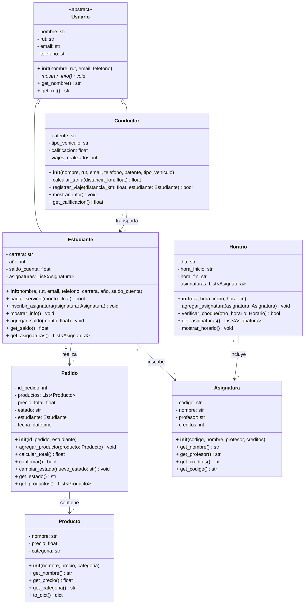

# INFORME TÉCNICO - SISTEMA UNIGO
## Gestión de Vida Universitaria

---

## ÍNDICE

1. [Introducción](#1-introducción)
2. [Identificación de Requerimientos](#2-identificación-de-requerimientos)
3. [Diseño del Sistema](#3-diseño-del-sistema)
4. [Implementación de Clases](#4-implementación-de-clases)
5. [Principios de POO Aplicados](#5-principios-de-poo-aplicados)
6. [Manejo de Excepciones](#6-manejo-de-excepciones)
7. [Conexión a Base de Datos](#7-conexión-a-base-de-datos)
8. [Autenticación Segura](#8-autenticación-segura)
9. [Diagramas UML](#9-diagramas-uml)
10. [Diagramas de Casos de Uso](#10-diagramas-de-casos-de-uso)
11. [Diagramas BPMN](#11-diagramas-bpmn)
12. [Arquitectura del Sistema](#12-arquitectura-del-sistema)
13. [Ejemplos de Ejecución](#13-ejemplos-de-ejecución)
14. [Conclusiones](#14-conclusiones)

---

## 1. INTRODUCCIÓN

### 1.1 Contexto del Proyecto

La startup chilena **UniGo** busca desarrollar una aplicación integral para la gestión de vida universitaria. La plataforma permite a los estudiantes coordinar transporte compartido, pedir comida en los patios de la universidad y administrar sus horarios de clases en una sola aplicación.

### 1.2 Objetivo General

Desarrollar un sistema de gestión universitaria utilizando Python 3 y Programación Orientada a Objetos, que integre funcionalidades de transporte, pedidos de comida y gestión académica, con conexión a base de datos MySQL y autenticación segura.

### 1.3 Tecnologías Utilizadas

- **Lenguaje:** Python 3
- **Base de Datos:** MySQL
- **Paradigma:** Programación Orientada a Objetos
- **Seguridad:** Hash SHA-256 para contraseñas
- **Arquitectura:** Patrón DAO (Data Access Object) y DTO (Data Transfer Object)

---

## 2. IDENTIFICACIÓN DE REQUERIMIENTOS

### 2.1 Requerimientos Funcionales

#### RF-01: Gestión de Usuarios
- El sistema debe permitir el registro de estudiantes y conductores
- Cada usuario debe tener autenticación segura con contraseña hasheada
- Los estudiantes deben poder gestionar su saldo de cuenta
- Los conductores deben poder calcular tarifas y registrar viajes

#### RF-02: Gestión de Pedidos
- Los estudiantes deben poder crear pedidos de productos
- El sistema debe validar el saldo antes de confirmar un pedido
- Los pedidos deben tener estados (Pendiente, Confirmado, En Preparación, Entregado, Cancelado)
- Se debe poder cambiar el estado de los pedidos

#### RF-03: Gestión de Transporte
- Los conductores deben poder registrar viajes
- El sistema debe calcular automáticamente la tarifa según distancia y tipo de vehículo
- Se debe mantener un registro de viajes realizados

#### RF-04: Gestión Académica
- Los estudiantes deben poder inscribir asignaturas
- El sistema debe validar que no haya conflictos de horario
- Se debe poder consultar el horario de un estudiante
- Las asignaturas deben tener información de profesor y créditos

#### RF-05: Gestión de Productos
- El sistema debe cargar productos desde un archivo JSON
- Los productos deben tener nombre, precio y categoría
- Se debe poder listar productos por categoría

#### RF-06: Persistencia de Datos
- El sistema debe conectarse a una base de datos MySQL
- Se debe poder guardar y recuperar estudiantes, pedidos y asignaturas
- La base de datos debe venir pre-poblada con datos de prueba

### 2.2 Requerimientos No Funcionales

#### RNF-01: Seguridad
- Las contraseñas deben almacenarse hasheadas (SHA-256)
- No se deben mostrar contraseñas en texto plano

#### RNF-02: Usabilidad
- El sistema debe tener una interfaz de terminal interactiva
- Los menús deben ser claros y fáciles de navegar
- Se deben mostrar mensajes informativos al usuario

#### RNF-03: Mantenibilidad
- El código debe seguir principios de POO
- Se debe aplicar separación de responsabilidades (DAO/DTO)
- El código debe estar documentado

#### RNF-04: Confiabilidad
- El sistema debe manejar excepciones de forma apropiada
- Se deben validar todas las entradas del usuario
- Los errores deben ser informativos

---

## 3. DISEÑO DEL SISTEMA

### 3.1 Arquitectura General

El sistema sigue una arquitectura de tres capas:

\`\`\`
┌─────────────────────────────────────┐
│     CAPA DE PRESENTACIÓN            │
│         (main.py)                   │
│   - Menús interactivos              │
│   - Interacción con usuario         │
└─────────────────────────────────────┘
              ↓
┌─────────────────────────────────────┐
│     CAPA DE LÓGICA DE NEGOCIO       │
│         (DTO Package)               │
│   - Clases de dominio               │
│   - Reglas de negocio               │
│   - Validaciones                    │
└─────────────────────────────────────┘
              ↓
┌─────────────────────────────────────┐
│     CAPA DE ACCESO A DATOS          │
│         (DAO Package)               │
│   - Conexión a BD                   │
│   - Operaciones CRUD                │
│   - Persistencia                    │
└─────────────────────────────────────┘
\`\`\`

### 3.2 Patrones de Diseño Aplicados

#### 3.2.1 Patrón DAO (Data Access Object)
Separa la lógica de acceso a datos de la lógica de negocio. Cada entidad tiene su propio DAO que maneja las operaciones de base de datos.

#### 3.2.2 Patrón DTO (Data Transfer Object)
Las clases de dominio (Usuario, Estudiante, Conductor, etc.) actúan como objetos de transferencia de datos entre capas.

#### 3.2.3 Patrón Singleton
La clase `DatabaseConnection` implementa el patrón Singleton para garantizar una única instancia de conexión a la base de datos.

#### 3.2.4 Patrón Template Method
La clase abstracta `Usuario` define el método abstracto `mostrar_info()` que debe ser implementado por las subclases.

---

## 4. IMPLEMENTACIÓN DE CLASES

### 4.1 Jerarquía de Clases

\`\`\`
Usuario (Abstracta)
├── Estudiante
└── Conductor

Pedido
└── contiene → Producto (lista)

Asignatura

Horario
└── contiene → Asignatura (lista)
\`\`\`

### 4.2 Clase Usuario (Abstracta)

**Ubicación:** `dto/usuario.py`

**Propósito:** Clase base abstracta que define los atributos y comportamientos comunes de todos los usuarios del sistema.

**Atributos:**
- `_rut` (str): Identificador único del usuario
- `_nombre` (str): Nombre completo del usuario
- `_email` (str): Correo electrónico
- `_telefono` (str): Número de teléfono
- `_password_hash` (str): Contraseña hasheada con SHA-256

**Métodos:**
- `mostrar_info()`: Método abstracto que debe ser implementado por las subclases
- `verificar_password(password)`: Verifica si la contraseña ingresada coincide con el hash almacenado
- Getters y setters para todos los atributos (encapsulamiento)

**Código clave:**
\`\`\`python
from abc import ABC, abstractmethod
from utils.auth import AuthManager

class Usuario(ABC):
    def __init__(self, rut, nombre, email, telefono, password=None):
        self._rut = rut
        self._nombre = nombre
        self._email = email
        self._telefono = telefono
        self._password_hash = AuthManager.hash_password(password) if password else None
    
    @abstractmethod
    def mostrar_info(self):
        pass
    
    def verificar_password(self, password):
        return AuthManager.verify_password(password, self._password_hash)
\`\`\`

### 4.3 Clase Estudiante

**Ubicación:** `dto/estudiante.py`

**Propósito:** Representa a un estudiante universitario con funcionalidades específicas de gestión académica y financiera.

**Atributos adicionales:**
- `_carrera` (str): Carrera que estudia
- `_anio` (int): Año de ingreso
- `_saldo_cuenta` (float): Saldo disponible para servicios
- `_asignaturas` (list): Lista de asignaturas inscritas

**Métodos específicos:**
- `pagar_servicio(monto)`: Descuenta un monto del saldo, lanza excepción si es insuficiente
- `inscribir_asignatura(asignatura, horario)`: Inscribe una asignatura validando conflictos de horario
- `mostrar_info()`: Implementación del método abstracto

**Validaciones implementadas:**
- Saldo insuficiente al pagar servicios
- Conflictos de horario al inscribir asignaturas
- Asignaturas duplicadas

### 4.4 Clase Conductor

**Ubicación:** `dto/conductor.py`

**Propósito:** Representa a un conductor que ofrece servicios de transporte compartido.

**Atributos adicionales:**
- `_patente` (str): Patente del vehículo
- `_tipo_vehiculo` (str): Tipo de vehículo (Auto, Moto, Camioneta)
- `_calificacion` (float): Calificación promedio del conductor
- `_viajes_realizados` (list): Historial de viajes

**Métodos específicos:**
- `calcular_tarifa(distancia_km)`: Calcula la tarifa según distancia y tipo de vehículo
- `registrar_viaje(origen, destino, distancia_km, pasajeros)`: Registra un nuevo viaje
- `mostrar_info()`: Implementación del método abstracto

**Lógica de tarifas:**
\`\`\`python
def calcular_tarifa(self, distancia_km):
    tarifa_base = {
        "Auto": 500,
        "Moto": 300,
        "Camioneta": 700
    }
    base = tarifa_base.get(self._tipo_vehiculo, 500)
    return base + (distancia_km * 150)
\`\`\`

### 4.5 Clase Pedido

**Ubicación:** `dto/pedido.py`

**Propósito:** Gestiona los pedidos de productos realizados por estudiantes.

**Atributos:**
- `_id_pedido` (int): Identificador único del pedido
- `_estudiante` (Estudiante): Estudiante que realiza el pedido
- `_productos` (list): Lista de productos del pedido
- `_precio_total` (float): Precio total calculado
- `_estado` (str): Estado actual del pedido
- `_fecha` (datetime): Fecha y hora del pedido

**Estados válidos:**
- Pendiente
- Confirmado
- En Preparación
- Entregado
- Cancelado

**Métodos:**
- `agregar_producto(producto)`: Añade un producto y recalcula el total
- `calcular_total()`: Suma los precios de todos los productos
- `confirmar()`: Confirma el pedido y descuenta del saldo del estudiante
- `cambiar_estado(nuevo_estado)`: Cambia el estado validando transiciones válidas

### 4.6 Clase Producto

**Ubicación:** `dto/producto.py`

**Propósito:** Representa un producto disponible para pedidos.

**Atributos:**
- `_nombre` (str): Nombre del producto
- `_precio` (float): Precio del producto
- `_categoria` (str): Categoría (Comida, Bebida, Snack, etc.)

**Método estático:**
- `cargar_desde_json(archivo)`: Carga productos desde un archivo JSON

### 4.7 Clase Asignatura

**Ubicación:** `dto/asignatura.py`

**Propósito:** Representa una asignatura académica.

**Atributos:**
- `_codigo` (str): Código único de la asignatura
- `_nombre` (str): Nombre de la asignatura
- `_profesor` (str): Nombre del profesor
- `_creditos` (int): Cantidad de créditos

### 4.8 Clase Horario

**Ubicación:** `dto/horario.py`

**Propósito:** Gestiona los horarios de clases de un estudiante.

**Atributos:**
- `_dia` (str): Día de la semana
- `_hora_inicio` (str): Hora de inicio (formato HH:MM)
- `_hora_fin` (str): Hora de fin (formato HH:MM)
- `_asignaturas` (list): Lista de asignaturas en ese horario

**Métodos:**
- `agregar_asignatura(asignatura)`: Añade una asignatura al horario
- `tiene_conflicto(otro_horario)`: Verifica si hay conflicto con otro horario

**Lógica de detección de conflictos:**
\`\`\`python
def tiene_conflicto(self, otro_horario):
    if self._dia != otro_horario.get_dia():
        return False
    
    inicio1 = datetime.strptime(self._hora_inicio, "%H:%M")
    fin1 = datetime.strptime(self._hora_fin, "%H:%M")
    inicio2 = datetime.strptime(otro_horario.get_hora_inicio(), "%H:%M")
    fin2 = datetime.strptime(otro_horario.get_hora_fin(), "%H:%M")
    
    return not (fin1 <= inicio2 or fin2 <= inicio1)
\`\`\`

---

## 5. PRINCIPIOS DE POO APLICADOS

### 5.1 Herencia

**Implementación:**
La clase `Usuario` es abstracta y sirve como clase base para `Estudiante` y `Conductor`.

**Ejemplo:**
\`\`\`python
class Usuario(ABC):
    # Clase base abstracta
    pass

class Estudiante(Usuario):
    def __init__(self, rut, nombre, email, telefono, carrera, anio, saldo_cuenta, password=None):
        super().__init__(rut, nombre, email, telefono, password)
        # Atributos específicos de Estudiante
\`\`\`

**Beneficios:**
- Reutilización de código (atributos y métodos comunes)
- Jerarquía clara de tipos de usuarios
- Facilita la extensión del sistema con nuevos tipos de usuarios

### 5.2 Encapsulamiento

**Implementación:**
Todos los atributos son privados (prefijo `_`) y se accede a ellos mediante getters y setters.

**Ejemplo:**
\`\`\`python
class Estudiante(Usuario):
    def __init__(self, ...):
        self._saldo_cuenta = saldo_cuenta  # Atributo privado
    
    def get_saldo_cuenta(self):
        return self._saldo_cuenta
    
    def set_saldo_cuenta(self, saldo):
        if saldo < 0:
            raise ValueError("El saldo no puede ser negativo")
        self._saldo_cuenta = saldo
\`\`\`

**Beneficios:**
- Protección de datos internos
- Validación de datos en los setters
- Flexibilidad para cambiar la implementación interna

### 5.3 Polimorfismo

**Implementación:**
El método abstracto `mostrar_info()` se implementa de forma diferente en cada subclase.

**Ejemplo:**
\`\`\`python
# En Usuario (abstracto)
@abstractmethod
def mostrar_info(self):
    pass

# En Estudiante
def mostrar_info(self):
    return f"Estudiante: {self._nombre} - Carrera: {self._carrera}"

# En Conductor
def mostrar_info(self):
    return f"Conductor: {self._nombre} - Vehículo: {self._tipo_vehiculo}"
\`\`\`

**Beneficios:**
- Interfaz común para diferentes tipos de usuarios
- Comportamiento específico según el tipo
- Facilita el tratamiento uniforme de objetos diferentes

### 5.4 Abstracción

**Implementación:**
La clase `Usuario` es abstracta y define la estructura común sin implementación completa.

**Ejemplo:**
\`\`\`python
from abc import ABC, abstractmethod

class Usuario(ABC):
    @abstractmethod
    def mostrar_info(self):
        pass
\`\`\`

**Beneficios:**
- Define un contrato que las subclases deben cumplir
- Oculta detalles de implementación
- Facilita el diseño de alto nivel

---

## 6. MANEJO DE EXCEPCIONES

### 6.1 Excepciones Personalizadas

**Ubicación:** `dto/excepciones.py`

El sistema define excepciones personalizadas para diferentes situaciones de error:

\`\`\`python
class SaldoInsuficienteException(Exception):
    """Excepción cuando el estudiante no tiene saldo suficiente"""
    pass

class EstadoPedidoInvalidoException(Exception):
    """Excepción cuando se intenta cambiar a un estado inválido"""
    pass

class ConflictoHorarioException(Exception):
    """Excepción cuando hay conflicto de horarios"""
    pass

class AsignaturaYaInscritaException(Exception):
    """Excepción cuando se intenta inscribir una asignatura duplicada"""
    pass
\`\`\`

### 6.2 Uso de Excepciones

#### 6.2.1 Validación de Saldo
\`\`\`python
def pagar_servicio(self, monto):
    if monto > self._saldo_cuenta:
        raise SaldoInsuficienteException(
            f"Saldo insuficiente. Disponible: ${self._saldo_cuenta}, Requerido: ${monto}"
        )
    self._saldo_cuenta -= monto
\`\`\`

#### 6.2.2 Validación de Estados de Pedido
\`\`\`python
def cambiar_estado(self, nuevo_estado):
    estados_validos = ["Pendiente", "Confirmado", "En Preparación", "Entregado", "Cancelado"]
    if nuevo_estado not in estados_validos:
        raise EstadoPedidoInvalidoException(f"Estado '{nuevo_estado}' no es válido")
    self._estado = nuevo_estado
\`\`\`

#### 6.2.3 Validación de Conflictos de Horario
\`\`\`python
def inscribir_asignatura(self, asignatura, horario):
    for h in self._asignaturas:
        if h['horario'].tiene_conflicto(horario):
            raise ConflictoHorarioException(
                f"Conflicto de horario con {h['asignatura'].get_nombre()}"
            )
\`\`\`

### 6.3 Manejo en la Capa de Presentación

\`\`\`python
try:
    estudiante.pagar_servicio(monto)
    print("Pago realizado exitosamente")
except SaldoInsuficienteException as e:
    print(f"Error: {e}")
except Exception as e:
    print(f"Error inesperado: {e}")
\`\`\`

---

## 7. CONEXIÓN A BASE DE DATOS

### 7.1 Patrón Singleton para Conexión

**Ubicación:** `dao/database_connection.py`

**Implementación:**
\`\`\`python
import mysql.connector
from mysql.connector import Error

class DatabaseConnection:
    _instance = None
    _connection = None
    
    def __new__(cls):
        if cls._instance is None:
            cls._instance = super(DatabaseConnection, cls).__new__(cls)
        return cls._instance
    
    def get_connection(self):
        if self._connection is None or not self._connection.is_connected():
            try:
                self._connection = mysql.connector.connect(
                    host='localhost',
                    database='unigo_db',
                    user='root',
                    password=''
                )
            except Error as e:
                print(f"Error al conectar a MySQL: {e}")
                return None
        return self._connection
\`\`\`

**Beneficios del Singleton:**
- Una única instancia de conexión en toda la aplicación
- Evita múltiples conexiones innecesarias
- Gestión centralizada de la conexión

### 7.2 Clases DAO

#### 7.2.1 EstudianteDAO

**Ubicación:** `dao/estudiante_dao.py`

**Operaciones CRUD:**

\`\`\`python
class EstudianteDAO:
    def __init__(self):
        self.db = DatabaseConnection()
    
    def guardar(self, estudiante):
        """Inserta un estudiante en la base de datos"""
        connection = self.db.get_connection()
        cursor = connection.cursor()
        query = """INSERT INTO estudiantes 
                   (rut, nombre, email, telefono, carrera, anio, saldo_cuenta, password_hash) 
                   VALUES (%s, %s, %s, %s, %s, %s, %s, %s)"""
        valores = (estudiante.get_rut(), estudiante.get_nombre(), ...)
        cursor.execute(query, valores)
        connection.commit()
    
    def obtener_por_rut(self, rut):
        """Recupera un estudiante por su RUT"""
        connection = self.db.get_connection()
        cursor = connection.cursor(dictionary=True)
        query = "SELECT * FROM estudiantes WHERE rut = %s"
        cursor.execute(query, (rut,))
        resultado = cursor.fetchone()
        if resultado:
            return self._crear_estudiante_desde_dict(resultado)
        return None
    
    def listar_todos(self):
        """Lista todos los estudiantes"""
        # Implementación similar
\`\`\`

#### 7.2.2 PedidoDAO

**Ubicación:** `dao/pedido_dao.py`

Maneja la persistencia de pedidos con relaciones a estudiantes y productos.

#### 7.2.3 AsignaturaDAO

**Ubicación:** `dao/asignatura_dao.py`

Gestiona las asignaturas y sus relaciones con estudiantes.

### 7.3 Esquema de Base de Datos

**Ubicación:** `scripts/create_tables_with_data.sql`

\`\`\`sql
CREATE TABLE estudiantes (
    rut VARCHAR(12) PRIMARY KEY,
    nombre VARCHAR(100) NOT NULL,
    email VARCHAR(100) NOT NULL,
    telefono VARCHAR(15),
    carrera VARCHAR(100),
    anio INT,
    saldo_cuenta DECIMAL(10,2),
    password_hash VARCHAR(64) NOT NULL
);

CREATE TABLE conductores (
    rut VARCHAR(12) PRIMARY KEY,
    nombre VARCHAR(100) NOT NULL,
    email VARCHAR(100) NOT NULL,
    telefono VARCHAR(15),
    patente VARCHAR(10),
    tipo_vehiculo VARCHAR(20),
    calificacion DECIMAL(3,2),
    password_hash VARCHAR(64) NOT NULL
);

CREATE TABLE pedidos (
    id_pedido INT AUTO_INCREMENT PRIMARY KEY,
    rut_estudiante VARCHAR(12),
    precio_total DECIMAL(10,2),
    estado VARCHAR(20),
    fecha DATETIME,
    FOREIGN KEY (rut_estudiante) REFERENCES estudiantes(rut)
);

CREATE TABLE asignaturas (
    codigo VARCHAR(10) PRIMARY KEY,
    nombre VARCHAR(100) NOT NULL,
    profesor VARCHAR(100),
    creditos INT
);

CREATE TABLE estudiante_asignatura (
    rut_estudiante VARCHAR(12),
    codigo_asignatura VARCHAR(10),
    PRIMARY KEY (rut_estudiante, codigo_asignatura),
    FOREIGN KEY (rut_estudiante) REFERENCES estudiantes(rut),
    FOREIGN KEY (codigo_asignatura) REFERENCES asignaturas(codigo)
);
\`\`\`

---

## 8. AUTENTICACIÓN SEGURA

### 8.1 Módulo de Autenticación

**Ubicación:** `utils/auth.py`

**Implementación con SHA-256:**
\`\`\`python
import hashlib

class AuthManager:
    @staticmethod
    def hash_password(password):
        """Genera un hash SHA-256 de la contraseña"""
        if password is None:
            return None
        return hashlib.sha256(password.encode()).hexdigest()
    
    @staticmethod
    def verify_password(password, password_hash):
        """Verifica si la contraseña coincide con el hash"""
        if password is None or password_hash is None:
            return False
        return AuthManager.hash_password(password) == password_hash
\`\`\`

### 8.2 Integración en el Sistema

#### 8.2.1 Registro de Usuario
\`\`\`python
# Al crear un usuario, la contraseña se hashea automáticamente
estudiante = Estudiante(
    rut="12345678-9",
    nombre="Juan Pérez",
    email="juan@mail.com",
    telefono="912345678",
    carrera="Ingeniería",
    anio=2023,
    saldo_cuenta=50000,
    password="mi_contraseña_segura"  # Se hashea internamente
)
\`\`\`

#### 8.2.2 Inicio de Sesión
\`\`\`python
def login_estudiante():
    rut = input("Ingrese su RUT: ")
    password = input("Ingrese su contraseña: ")
    
    estudiante_dao = EstudianteDAO()
    estudiante = estudiante_dao.obtener_por_rut(rut)
    
    if estudiante and estudiante.verificar_password(password):
        print("Inicio de sesión exitoso")
        return estudiante
    else:
        print("RUT o contraseña incorrectos")
        return None
\`\`\`

### 8.3 Seguridad Implementada

- **Hash unidireccional:** Las contraseñas no se pueden recuperar del hash
- **SHA-256:** Algoritmo criptográfico robusto
- **No se almacenan contraseñas en texto plano:** Ni en memoria ni en base de datos
- **Validación en cada acceso:** Se verifica el hash en cada inicio de sesión

---

## 9. DIAGRAMAS UML

### 9.1 Diagrama de Clases

El diagrama de clases muestra la estructura completa del sistema con todas las relaciones:

**Elementos principales:**
- Clase abstracta `Usuario` con método abstracto `mostrar_info()`
- Herencia: `Estudiante` y `Conductor` heredan de `Usuario`
- Composición: `Pedido` contiene una lista de `Producto`
- Asociación: `Estudiante` se relaciona con `Asignatura` a través de `Horario`
- Agregación: `Horario` contiene `Asignatura`

**Ubicación:** `docs/class-diagram.mmd`

### 9.2 Diagrama de Secuencia

Muestra la interacción entre objetos para operaciones clave:

1. **Hacer un Pedido:**
   - Usuario → Sistema → Estudiante → Pedido → Producto → EstudianteDAO

2. **Registrar Viaje:**
   - Usuario → Sistema → Conductor → Viaje

3. **Inscribir Asignatura:**
   - Usuario → Sistema → Estudiante → Asignatura → Horario → EstudianteDAO

**Ubicación:** `docs/sequence-diagram.mmd`

---

## 10. DIAGRAMAS DE CASOS DE USO

### 10.1 Actores del Sistema

1. **Estudiante:**
   - Hacer pedidos
   - Inscribir asignaturas
   - Consultar horario
   - Gestionar saldo

2. **Conductor:**
   - Registrar viajes
   - Calcular tarifas
   - Ver historial de viajes

3. **Sistema:**
   - Validar saldo
   - Detectar conflictos de horario
   - Gestionar estados de pedidos

### 10.2 Casos de Uso Principales

#### CU-01: Hacer Pedido
- **Actor:** Estudiante
- **Precondición:** Estudiante autenticado con saldo suficiente
- **Flujo principal:**
  1. Estudiante selecciona productos
  2. Sistema calcula total
  3. Sistema valida saldo
  4. Estudiante confirma pedido
  5. Sistema descuenta saldo y registra pedido

#### CU-02: Registrar Viaje
- **Actor:** Conductor
- **Precondición:** Conductor autenticado
- **Flujo principal:**
  1. Conductor ingresa origen y destino
  2. Conductor ingresa distancia
  3. Sistema calcula tarifa
  4. Conductor confirma viaje
  5. Sistema registra viaje

#### CU-03: Inscribir Asignatura
- **Actor:** Estudiante
- **Precondición:** Estudiante autenticado
- **Flujo principal:**
  1. Estudiante selecciona asignatura
  2. Estudiante define horario
  3. Sistema valida conflictos
  4. Sistema registra inscripción

**Ubicación:** `docs/use-case-diagram.mmd`

---

## 11. DIAGRAMAS BPMN

### 11.1 Proceso: Hacer Pedido

**Descripción:** Proceso completo desde la selección de productos hasta la confirmación del pedido.

**Flujo:**
1. **Inicio:** Estudiante inicia pedido
2. **Seleccionar Productos:** Estudiante elige productos del catálogo
3. **Calcular Total:** Sistema suma precios
4. **Validar Saldo:** Sistema verifica saldo suficiente
   - **Gateway:** ¿Saldo suficiente?
     - **Sí:** Continuar
     - **No:** Mostrar error y finalizar
5. **Confirmar Pedido:** Estudiante confirma
6. **Descontar Saldo:** Sistema descuenta del saldo
7. **Registrar en BD:** Sistema guarda pedido
8. **Fin:** Pedido completado

**Ubicación:** `docs/bpmn-hacer-pedido.mmd`

### 11.2 Proceso: Registrar Viaje

**Descripción:** Proceso de registro de un viaje por parte de un conductor.

**Flujo:**
1. **Inicio:** Conductor inicia registro
2. **Ingresar Datos:** Origen, destino, distancia, pasajeros
3. **Calcular Tarifa:** Sistema calcula según tipo de vehículo y distancia
4. **Mostrar Tarifa:** Sistema presenta tarifa calculada
5. **Confirmar Viaje:** Conductor confirma
6. **Registrar Viaje:** Sistema guarda en historial
7. **Fin:** Viaje registrado

**Ubicación:** `docs/bpmn-registrar-viaje.mmd`

### 11.3 Proceso: Inscribir Asignatura

**Descripción:** Proceso de inscripción de una asignatura con validación de horarios.

**Flujo:**
1. **Inicio:** Estudiante inicia inscripción
2. **Seleccionar Asignatura:** Estudiante elige asignatura
3. **Definir Horario:** Estudiante especifica día y horas
4. **Validar Conflictos:** Sistema verifica horarios existentes
   - **Gateway:** ¿Hay conflicto?
     - **Sí:** Mostrar error y finalizar
     - **No:** Continuar
5. **Registrar Inscripción:** Sistema guarda en BD
6. **Actualizar Horario:** Sistema actualiza horario del estudiante
7. **Fin:** Inscripción completada

**Ubicación:** `docs/bpmn-inscribir-asignatura.mmd`

---

## 12. ARQUITECTURA DEL SISTEMA

### 12.1 Diagrama de Arquitectura

**Ubicación:** `docs/architecture-diagram.mmd`

### 12.2 Componentes Principales

#### 12.2.1 Capa de Presentación
- **main.py:** Punto de entrada del sistema
- **Menús interactivos:** Interfaz de usuario en terminal
- **Validación de entrada:** Verificación de datos ingresados

#### 12.2.2 Capa de Lógica de Negocio (DTO)
- **dto/usuario.py:** Clase base abstracta
- **dto/estudiante.py:** Lógica de estudiantes
- **dto/conductor.py:** Lógica de conductores
- **dto/pedido.py:** Gestión de pedidos
- **dto/producto.py:** Representación de productos
- **dto/asignatura.py:** Gestión de asignaturas
- **dto/horario.py:** Gestión de horarios
- **dto/excepciones.py:** Excepciones personalizadas

#### 12.2.3 Capa de Acceso a Datos (DAO)
- **dao/database_connection.py:** Conexión Singleton
- **dao/estudiante_dao.py:** Persistencia de estudiantes
- **dao/pedido_dao.py:** Persistencia de pedidos
- **dao/asignatura_dao.py:** Persistencia de asignaturas

#### 12.2.4 Utilidades
- **utils/auth.py:** Gestión de autenticación y hash

#### 12.2.5 Datos
- **data/productos.json:** Catálogo de productos
- **scripts/create_tables_with_data.sql:** Esquema y datos iniciales

### 12.3 Flujo de Datos

\`\`\`
Usuario (Terminal)
    ↓
main.py (Menús)
    ↓
DTO (Lógica de Negocio)
    ↓
DAO (Acceso a Datos)
    ↓
MySQL (Base de Datos)
\`\`\`

---

## 13. EJEMPLOS DE EJECUCIÓN

### 13.1 Inicio del Sistema

\`\`\`
****************************************************
*                                                  *
*              SISTEMA UNIGO                       *
*        Gestion de Vida Universitaria             *
*                                                  *
****************************************************

=== MENU PRINCIPAL ===

1. Iniciar Sesion como Estudiante
2. Iniciar Sesion como Conductor
3. Registrar Nuevo Estudiante
4. Registrar Nuevo Conductor
5. Cargar Productos desde JSON
6. Salir

Seleccione una opcion: 
\`\`\`

### 13.2 Inicio de Sesión

\`\`\`
=== INICIO DE SESION - ESTUDIANTE ===

Ingrese su RUT: 12345678-9
Ingrese su contraseña: ********

Inicio de sesion exitoso!
Bienvenido/a Juan Perez
\`\`\`

### 13.3 Hacer un Pedido

\`\`\`
=== MENU ESTUDIANTE ===

Estudiante: Juan Perez
Carrera: Ingenieria Informatica
Saldo: $50000.00

1. Ver mi informacion
2. Hacer un pedido
3. Ver mis pedidos
4. Inscribir asignatura
5. Ver mi horario
6. Recargar saldo
7. Cerrar sesion

Seleccione una opcion: 2

=== HACER PEDIDO ===

Productos disponibles:
1. Completo - $2500 (Comida)
2. Empanada - $1500 (Comida)
3. Cafe - $1200 (Bebida)
4. Jugo Natural - $1800 (Bebida)
5. Galletas - $800 (Snack)

Ingrese el numero del producto (0 para finalizar): 1
Completo agregado al pedido

Ingrese el numero del producto (0 para finalizar): 3
Cafe agregado al pedido

Ingrese el numero del producto (0 para finalizar): 0

Total del pedido: $3700

¿Confirmar pedido? (s/n): s

Pedido confirmado exitosamente!
Nuevo saldo: $46300.00
\`\`\`

### 13.4 Registrar un Viaje (Conductor)

\`\`\`
=== REGISTRAR VIAJE ===

Ingrese origen: Universidad
Ingrese destino: Metro Baquedano
Ingrese distancia en km: 5.5
Ingrese numero de pasajeros: 3

Calculando tarifa...
Tipo de vehiculo: Auto
Tarifa base: $500
Tarifa por km: $150
Distancia: 5.5 km

Tarifa total: $1325

¿Confirmar viaje? (s/n): s

Viaje registrado exitosamente!
\`\`\`

### 13.5 Inscribir Asignatura

\`\`\`
=== INSCRIBIR ASIGNATURA ===

Asignaturas disponibles:
1. Programacion Orientada a Objetos - Prof. Maria Lopez (6 creditos)
2. Base de Datos - Prof. Carlos Ruiz (5 creditos)
3. Ingenieria de Software - Prof. Ana Martinez (6 creditos)

Seleccione asignatura: 1

Ingrese dia de la semana: Lunes
Ingrese hora de inicio (HH:MM): 08:00
Ingrese hora de fin (HH:MM): 10:00

Verificando conflictos de horario...

Asignatura inscrita exitosamente!
\`\`\`

### 13.6 Manejo de Excepciones

#### 13.6.1 Saldo Insuficiente
\`\`\`
=== HACER PEDIDO ===

Total del pedido: $55000

¿Confirmar pedido? (s/n): s

Error: Saldo insuficiente. Disponible: $50000.00, Requerido: $55000.00
\`\`\`

#### 13.6.2 Conflicto de Horario
\`\`\`
=== INSCRIBIR ASIGNATURA ===

Ingrese dia de la semana: Lunes
Ingrese hora de inicio (HH:MM): 08:30
Ingrese hora de fin (HH:MM): 10:30

Error: Conflicto de horario con Programacion Orientada a Objetos
\`\`\`

### 13.7 Operaciones de Base de Datos

\`\`\`
=== OPERACIONES DE BASE DE DATOS ===

1. Guardar estudiante actual
2. Listar todos los estudiantes
3. Guardar pedido actual
4. Listar pedidos de estudiante
5. Guardar asignatura
6. Listar todas las asignaturas
7. Volver

Seleccione una opcion: 2

=== ESTUDIANTES REGISTRADOS ===

1. Juan Perez (12345678-9) - Ingenieria Informatica - Saldo: $46300.00
2. Maria Gonzalez (98765432-1) - Medicina - Saldo: $35000.00
3. Pedro Silva (11223344-5) - Derecho - Saldo: $42000.00
\`\`\`

---

## 14. CONCLUSIONES

### 14.1 Cumplimiento de Objetivos

El sistema UniGo ha sido desarrollado exitosamente cumpliendo con todos los requerimientos establecidos:

✅ **Programación Orientada a Objetos:** Se aplicaron todos los principios fundamentales (herencia, encapsulamiento, polimorfismo, abstracción)

✅ **Manejo de Excepciones:** Se implementaron excepciones personalizadas para diferentes situaciones de error

✅ **Conexión a Base de Datos:** Se estableció conexión con MySQL usando el patrón Singleton y se implementaron operaciones CRUD

✅ **Autenticación Segura:** Se implementó hash SHA-256 para el almacenamiento seguro de contraseñas

✅ **Diagramas UML:** Se diseñaron diagramas de clases, secuencia y arquitectura

✅ **Diagramas de Casos de Uso:** Se identificaron actores y casos de uso principales

✅ **Diagramas BPMN:** Se modelaron los procesos de negocio clave

### 14.2 Principios de Diseño Aplicados

1. **Separación de Responsabilidades:** Arquitectura en capas (Presentación, Lógica, Datos)
2. **Patrón DAO:** Separación de lógica de negocio y acceso a datos
3. **Patrón DTO:** Objetos de transferencia de datos entre capas
4. **Patrón Singleton:** Gestión única de conexión a base de datos
5. **Patrón Template Method:** Método abstracto en clase base

### 14.3 Fortalezas del Sistema

- **Modularidad:** Código organizado en paquetes y módulos
- **Extensibilidad:** Fácil agregar nuevos tipos de usuarios o funcionalidades
- **Mantenibilidad:** Código limpio y bien documentado
- **Seguridad:** Contraseñas hasheadas, validaciones robustas
- **Usabilidad:** Interfaz de terminal clara e intuitiva
- **Persistencia:** Datos almacenados en base de datos relacional

### 14.4 Posibles Mejoras Futuras

1. **Interfaz Gráfica:** Migrar a una interfaz web o de escritorio
2. **API REST:** Exponer funcionalidades mediante servicios web
3. **Notificaciones:** Sistema de alertas para pedidos y viajes
4. **Pagos en Línea:** Integración con pasarelas de pago
5. **Geolocalización:** Tracking en tiempo real de conductores
6. **Calificaciones:** Sistema de reseñas para conductores y productos
7. **Reportes:** Generación de estadísticas y reportes

### 14.5 Aprendizajes

- Importancia de la planificación y diseño antes de la implementación
- Beneficios de aplicar patrones de diseño reconocidos
- Valor del manejo apropiado de excepciones
- Necesidad de seguridad en sistemas con autenticación
- Utilidad de la documentación y diagramas para entender el sistema

---

## ANEXOS

### Anexo A: Estructura de Archivos

\`\`\`
unigo-system/
├── dto/
│   ├── __init__.py
│   ├── usuario.py
│   ├── estudiante.py
│   ├── conductor.py
│   ├── pedido.py
│   ├── producto.py
│   ├── asignatura.py
│   ├── horario.py
│   └── excepciones.py
├── dao/
│   ├── __init__.py
│   ├── database_connection.py
│   ├── estudiante_dao.py
│   ├── pedido_dao.py
│   └── asignatura_dao.py
├── utils/
│   ├── __init__.py
│   └── auth.py
├── data/
│   └── productos.json
├── scripts/
│   └── create_tables_with_data.sql
├── docs/
│   ├── DIAGRAMAS.md
│   ├── class-diagram.mmd
│   ├── sequence-diagram.mmd
│   ├── architecture-diagram.mmd
│   ├── use-case-diagram.mmd
│   ├── bpmn-hacer-pedido.mmd
│   ├── bpmn-registrar-viaje.mmd
│   └── bpmn-inscribir-asignatura.mmd
└── main.py
\`\`\`

### Anexo B: Credenciales de Prueba

**Estudiantes:**
- RUT: 12345678-9, Contraseña: estudiante123
- RUT: 98765432-1, Contraseña: estudiante456
- RUT: 11223344-5, Contraseña: estudiante789

**Conductores:**
- RUT: 55667788-9, Contraseña: conductor123
- RUT: 99887766-5, Contraseña: conductor456
- RUT: 44332211-0, Contraseña: conductor789

### Anexo C: Configuración de Base de Datos

\`\`\`sql
-- Crear base de datos
CREATE DATABASE unigo_db;
USE unigo_db;

-- Ejecutar script de creación de tablas
SOURCE scripts/create_tables_with_data.sql;
\`\`\`

### Anexo D: Requisitos del Sistema

- Python 3.8 o superior
- MySQL 5.7 o superior
- Librería mysql-connector-python

**Instalación:**
\`\`\`bash
pip install mysql-connector-python
\`\`\`

---

**Fecha de elaboración:** Enero 2025

**Versión:** 1.0

**Autores:** [Nombres de los integrantes del grupo]

**Asignatura:** Programación Orientada a Objetos

**Institución:** [Nombre de la institución]
