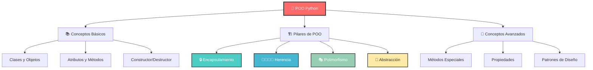
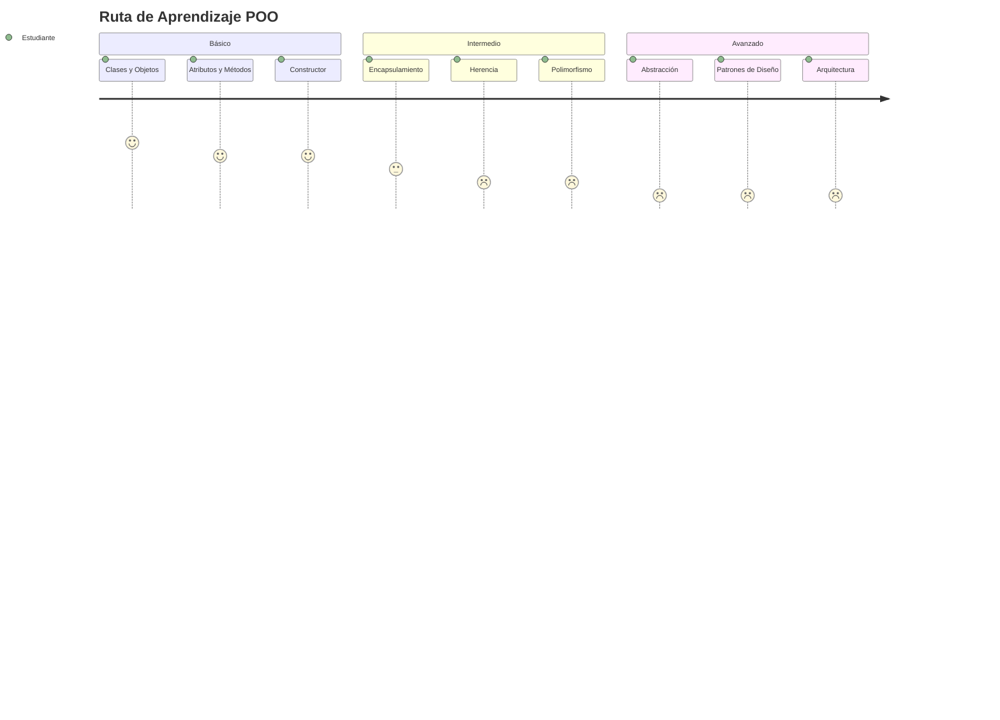
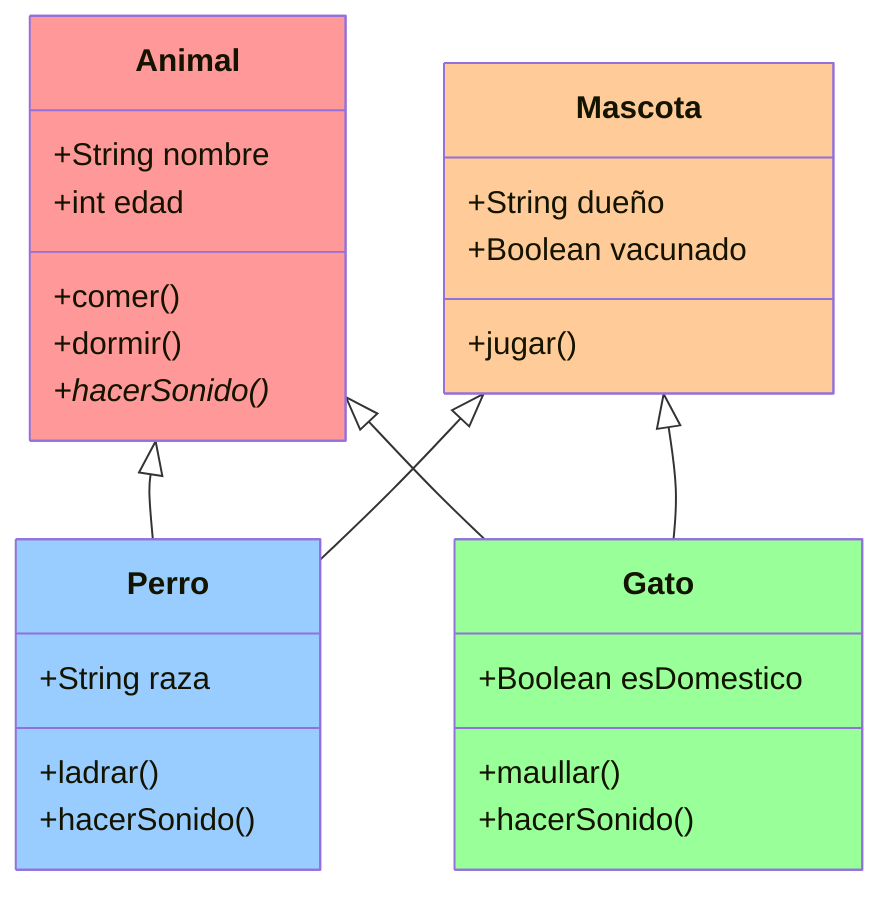
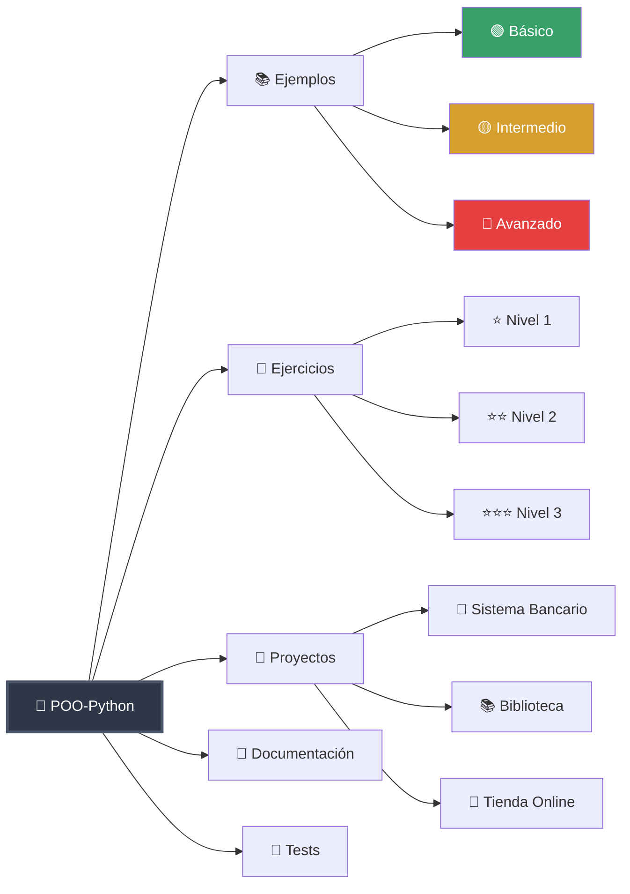
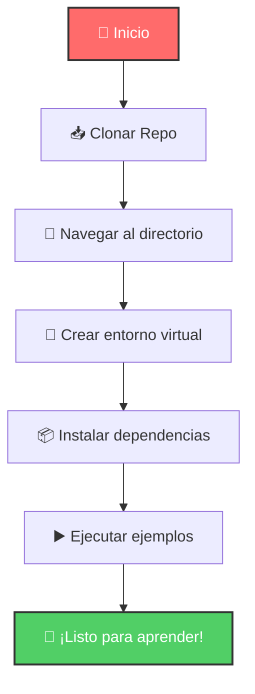
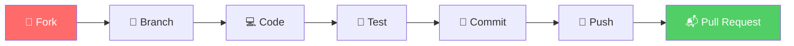
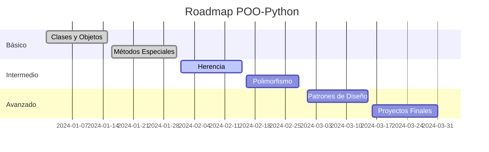
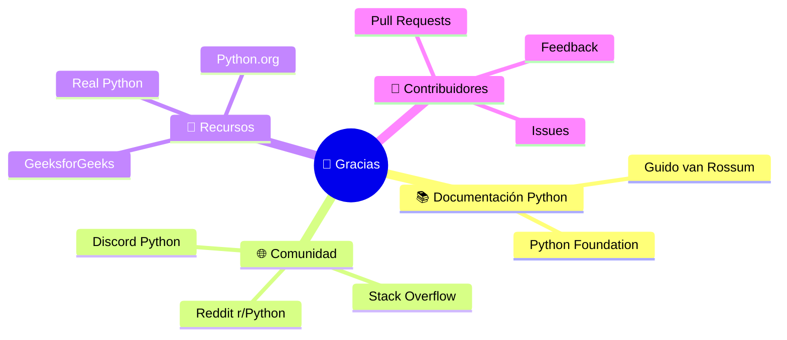

# POO-Python 🐍

<div align="center">


[](https://www.python.org/)
[](LICENSE)
[]()
[](https://github.com/Arkanabytes/POO-Python/stargazers)

</div>

## 📋 Descripción

Este repositorio contiene ejemplos, ejercicios y proyectos relacionados con la **Programación Orientada a Objetos (POO)** en Python. Está diseñado como material de estudio y práctica para comprender los conceptos fundamentales de la POO y su implementación en Python.

<div align="center">



</div>

## 🎯 Objetivos

<table>
<tr>
<td width="50%">

### 🏗️ Fundamentos
- ✅ Comprender los pilares de la POO
- ✅ Implementar clases y objetos
- ✅ Aplicar herencia y polimorfismo
- ✅ Dominar el encapsulamiento

</td>
<td width="50%">

### 🚀 Avanzado
- 🔥 Patrones de diseño
- 🔥 Arquitectura orientada a objetos
- 🔥 Testing y debugging
- 🔥 Mejores prácticas

</td>
</tr>
</table>

## 📊 Progreso del Curso

<div align="center">


</div>

### Niveles de Aprendizaje



## 🏗️ Arquitectura POO

<div align="center">



</div>

## 📚 Contenido del Repositorio

<div align="center">



</div>

### 🛠️ Prerequisitos

<div align="center">

| Requisito | Versión | Estado |
|-----------|---------|--------|
|  | 3.7+ | ✅ |
|  | Latest | ✅ |
|  | Any | ✅ |

</div>

## 🚀 Quick Start

<div align="center">



</div>

```bash
# 1️⃣ Clona el repositorio
git clone https://github.com/Arkanabytes/POO-Python.git

# 2️⃣ Navega al directorio
cd POO-Python

# 3️⃣ Crea entorno virtual
python -m venv venv

# 4️⃣ Activa el entorno
# Windows:
venv\Scripts\activate
# Linux/Mac:
source venv/bin/activate

# 5️⃣ Instala dependencias
pip install -r requirements.txt

# 6️⃣ ¡Empieza a aprender!
python ejemplos/basico/mi_primera_clase.py
```

## 📖 Ejemplos Interactivos

### 🟢 Clase Básica
```python
class Persona:
    def __init__(self, nombre, edad):
        self._nombre = nombre  # Atributo protegido
        self._edad = edad
    
    @property
    def nombre(self):
        return self._nombre
    
    def saludar(self):
        return f"👋 Hola, soy {self._nombre} y tengo {self._edad} años"

# 🎯 Uso
persona = Persona("Juan", 25)
print(persona.saludar())  # 👋 Hola, soy Juan y tengo 25 años
```

### 🟡 Herencia y Polimorfismo
```python
class Vehiculo:
    def __init__(self, marca, modelo):
        self.marca = marca
        self.modelo = modelo
    
    def acelerar(self):
        return "🚗 Acelerando..."

class Auto(Vehiculo):
    def acelerar(self):
        return f"🏎️ El {self.marca} {self.modelo} acelera suavemente"

class Moto(Vehiculo):
    def acelerar(self):
        return f"🏍️ La {self.marca} {self.modelo} acelera rápidamente"
```

### 🔴 Patrón Singleton
```python
class DatabaseConnection:
    _instance = None
    _connection = None
    
    def __new__(cls):
        if cls._instance is None:
            cls._instance = super().__new__(cls)
        return cls._instance
    
    def connect(self):
        if not self._connection:
            self._connection = "🔗 Conectado a la base de datos"
        return self._connection
```

## 📊 Estadísticas del Proyecto

<div align="center">


</div>

### 📈 Métricas de Aprendizaje

```mermaid
gitgraph
    commit id: "📚 Conceptos Básicos"
    commit id: "🏗️ Clases y Objetos"
    branch herencia
    checkout herencia
    commit id: "👨‍👩‍👧‍👦 Herencia Simple"
    commit id: "🔄 Herencia Multiple"
    checkout main
    merge herencia
    commit id: "🎭 Polimorfismo"
    branch avanzado
    checkout avanzado
    commit id: "🎨 Patrones de Diseño"
    commit id: "🏛️ Arquitectura"
    checkout main
    merge avanzado
    commit id: "🚀 Proyecto Final"
```

## 🎮 Proyectos Incluidos

<div align="center">

| Proyecto | Nivel | Tecnologías | Demo |
|----------|-------|-------------|------|
| 🏦 Sistema Bancario | ⭐⭐ | Python, SQLite | [▶️ Ver Demo](#) |
| 📚 Biblioteca Digital | ⭐⭐⭐ | Python, JSON, GUI | [▶️ Ver Demo](#) |
| 🛒 E-commerce | ⭐⭐⭐ | Python, API, DB | [▶️ Ver Demo](#) |

</div>

### 🏦 Sistema Bancario - Arquitectura

```mermaid
classDiagram
    class Banco {
        +String nombre
        +List~Cuenta~ cuentas
        +crearCuenta()
        +buscarCuenta()
    }
    
    class Cuenta {
        +String numero
        +float saldo
        +Cliente titular
        +depositar()
        +retirar()
        +transferir()
    }
    
    class CuentaAhorro {
        +float tasaInteres
        +calcularInteres()
    }
    
    class CuentaCorriente {
        +float sobregiro
        +verificarSobregiro()
    }
    
    class Cliente {
        +String nombre
        +String documento
        +String telefono
    }
    
    Banco ||--o{ Cuenta : contiene
    Cuenta ||-- Cliente : pertenece
    Cuenta <|-- CuentaAhorro
    Cuenta <|-- CuentaCorriente
```

## 🧪 Testing y Calidad

<div align="center">


</div>

```bash
# 🧪 Ejecutar todas las pruebas
pytest tests/ -v --cov=src

# 📊 Reporte de cobertura
pytest --cov=src --cov-report=html

# 🔍 Análisis de calidad de código
pylint src/
flake8 src/
```

## 🤝 Contribuir

<div align="center">



</div>

### 📋 Proceso de Contribución

1. **🍴 Fork** el repositorio
2. **🌿 Crea** tu rama (`git checkout -b feature/AmazingFeature`)
3. **💻 Desarrolla** tu contribución
4. **🧪 Ejecuta** los tests
5. **📝 Commit** tus cambios (`git commit -m 'Add: Amazing Feature'`)
6. **🚀 Push** a la rama (`git push origin feature/AmazingFeature`)
7. **📬 Abre** un Pull Request

## 🗓️ Roadmap



## 📄 Licencia

<div align="center">

[](https://opensource.org/licenses/MIT)

</div>

Este proyecto está bajo la **Licencia MIT** - mira el archivo [LICENSE](LICENSE) para más detalles.

## 👨‍💻 Autor

<div align="center">


**Arkanabytes**

[](https://github.com/Arkanabytes)
[](mailto:tu-email@ejemplo.com)

</div>

## 🌟 Agradecimientos

<div align="center">



</div>

## 📚 Recursos Adicionales

<div align="center">

| Tipo | Recurso | Link |
|------|---------|------|
| 📖 | Python Docs | [](https://docs.python.org/3/) |
| 🎓 | Real Python | [](https://realpython.com/) |
| 📺 | YouTube | [](https://youtube.com/results?search_query=python+oop) |
| 💬 | Discord | [](https://discord.gg/python) |

</div>

---

<div align="center">


⭐ **¡Si este proyecto te resultó útil, no olvides darle una estrella!** ⭐

[](https://github.com/Arkanabytes/POO-Python/stargazers)
[](https://github.com/Arkanabytes/POO-Python/network)
[](https://github.com/Arkanabytes/POO-Python/watchers)

</div>
